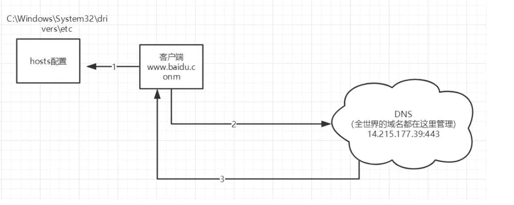

# 一. java基础

## 1.  java基础文件内容

### 2. liuhui.com.oop.a1 a2 a3 day1

```java
// 1. a1
Person  Test  简单实例化类

// 2. a2
一个景区根据游人的年龄收取不同价格的门票 根据年龄段收取
Test   Bill  User	简单的面向对象	

// 3. a3
简单的创建学生类数组 添加5个学生  然后根据学生姓名在某个区间内查询这个学生
Student StudentServer Test 

// 4. day 1
1. 插入一个学员的成绩 并且保持降序
2. 插入一个学员的成绩 并且保持升序
3. 冒泡排序
4. Arrays类常用
    
```

### 3. liuhui.com.oop.作用域问题

```
1. 一个类在两个包都有 怎么解决

2. 测试 public private 默认修饰符 protected 访问权限
```

### 4. liuhui.com.oop.继承

```
Animal Dog Cat Test 简单的实现继承
```

### 5. liuhui.com.oop.static内容

```
1.satic 修饰属性, 代码块, 方法问题 各种情况的简单练习
```

### 6. liuhui.com.oop.static选民投票

```
	模拟实现选民投票过程：
 * 有四个候选人，每个选民只允许投一次票，并且有三分之一的概率不投或者弃权
 * 并且当投票总数达到100时，就停止投票 输出总投票数 以及候选人的票数 以及结果
```

### 7. liuhui.com.oop.static测试类

```1.
一个类只能new 10次怎么办
```

### 8. liuhui.com.oop.多态

```
1. 简单的实现了多态   2.向上转型 向下转型  
2. 写了个overload 尝试了下重载  
3. Master 模拟多态
```

### 9. liuhui.com.oop.抽象类和接口

```
1. 抽象类和接口
Ⅳ个类 usb连接等

2. 抽象类和接口2
用户买机票的接口练习

3. 抽象类和接口3
打印机的一个接口 Ⅳ个类

```

### 10. liuhui.com.oop.异常

```
6个类 自定义异常等
```


### 11. liuhui.com.高级特性.集合

```
ArrayList linkedList HashSet HashMap lambda表达式 泛型等等
```


### 12. liuhui.com.高级特性.IO

```
1. 文件的操作
2. io 字节流  读写   (对象形式不一样)
3. io 字符流  读写	(对象形式不一样)
```

### 13. liuhui.com.高级特性.反射与注解

```
反射: Person personDemo

注解: 注解小用途, 6个文件
```

### 14. liuhui.com.高级特性.线程

```
Thread 类
Runable 接口  简单的练习
```

### 15. liuhui.com.高级特性.枚举包装类

```
八大类型的一些方法  random date 等等
```

### 16. liuhui.com.高级特性.Json

```
json的转换 引入 fastJson工具类 导入
```


# 二. Java基础

## 1.面向对象

### 1.继承

**继承是Java中实现代码重用的重要手段之一。Java中只支持单继承，即一个类只能有一个直接父类**

```java
		一 .子类访问父类的问题?
 *      
 		1.访问父类构造方法   super();   super(name)
 *      2.访问父类属性   	  super.name;   
 		3.访问父类方法      super.print();

 *      (1)使用super关键字,super代表父类对象
 *      (2)在子类构造方法中调用且必须是第一句
 		(3)不可以访问父类中定义为private的属性和方法
 
 *		二 .继承条件下的构造方法

 *          1. 子类构造方法没有通过super显式调用父类的有参构造方法，也没通过this显式调用自身其他构造方法
 *             注意 :系统默认调用父类的无参构造方法
 
 *          2. 子类构造方法通过super显式调用父类的有参构造方法
 *             注意: 执行父类相应构造方法，而不执行父类无参构造方法
 
 *          3. 子类构造方法通过this显式调用自身的其他构造方法，在相应构造方法中应用以上两条规则
 *
		三 .子类继承父类的什么？
 *          
 *          1. 继承public和protected修饰的属性和方法，不管子类和父类是否在同一个包里
 *          2. 继承默认权限修饰符修饰的属性和方法，但子类和父类必须在同一个包里
 
 *		四 .子类可以继承父类的所有资源吗?
 *          
 *          1. private修饰的成员
 *          2.子类与父类不在同包，并且使用默认访问权限的成员
 *          3.构造方法

```

### 2. 修饰符 与 作用域问题

```java
 一个类在两个包都有 那么就得用   liuhui.com.oop.作用域问题.Student stu2=new liuhui.com.oop.作用域问题.Student()形式
```

```java

*  scope/修饰符     当前类中    同一个包中   子类中     任何地方

*  private          √             X        X           X
*  默认修饰符         √             √        X           X
*  protected        √             √        √           X
*  public           √             √        √           √
```

### 3. static

```java
static可以用来修饰

1. 成员变量  静态变量，可以直接通过类名访问
2. 成员方法  静态方法，可以直接通过类名访问
3. 代码块    静态代码块，当Java虚拟机加载类时，就会执行该代码块

JVM加载类时，加载静态代码块
    1. 如果有多个静态块，按顺序加载
    2. 每个静态代码块只会被执行一次


1. static变量（静态变量 或者类变量）
        1.被static修饰的变量在内存中只有一个拷贝，
        2.类内部，可在任何方法内直接访问静态变量，
        3.其他类中，可以直接通过类名访问
        
        
        
2. 实例变量
		1.每创建一个实例，就会为实例变量分配一次内存，实例变量可以在内存中有多个拷贝，互不影响
		
 static变量的作用：
（1）能被类的所有实例共享，可作为实例之间进行交流的共享数据
（2）如果类的所有实例都包含一个相同的常量属性，可把这个属性定义为静态常量类型，从而节省内存空间


static修饰符  
    1. 静态方法：
    	1. 可直接通过类名访问
    	2. 静态方法中不能使用this和super
    
    	3. 只能访问类的 静态变量和静态方法
    	4. 静态方法必须被实现(就是要有方法体)
    
    2. 实例方法
    	1. 可以访问 静态变量、静态方法
    

```

### 4. 重写 重载 多态 上下转型

```java
1. 重写
	子类重写父类方法注意事项

(1) 静态修饰符必须一致
(2) 方法名 参数列表 必须一致
(3) 访问权限不能严于父类
(4) 构造方法不能重写
(5) 父类的私有方法不能被子类覆盖-看不见
(6) 返回值类型必须是父类 或者是其子类
(7) 抛出的异常不能多于父类

2. 重载
 主要是跟返回值类型 无关 


2.重载跟重写 VS

比较项		 位置	  方法名	参数表	    返回值	           访问修饰符
 
方法重写	子类	  相同	相同	     相同或是其子类	 不能比父类更严格

方法重载	同类	  相同	不相同	    无关	            无关


3. 多态  
父类的引用指向子类 实现多态
	形式 
 	// 使用父类作为方法的返回值，也是Java中实现和使用多态的主要方式
    // 使用父类作为方法的形参， 是Java中实现和使用多态的主要方式


4. 向上转型 自动转换
   向下转型 需要强转  (如果需要调用子类特有的方法 必须进行转换)


```

### 5. 抽象类和接口

```java
												抽象类
// 抽象类VS普通类

1. 抽象类不能被实例化
2. 但可以创建一个引用变量，其类型是一个抽象类，指向非抽象的子类实例 Pet dog=new Dog();
3. 普通类可以被实例化

// 抽象方法VS普通方法

1. 有无方法体


二.
抽象类与抽象方法的使用
1. 抽象类中可以没有抽象方法，但包含了抽象方法的类必须被定义为抽象类
2. 如果子类没有实现父类的所有抽象方法，子类必须被定义为抽象类
3. 没有抽象构造方法，也没有抽象静态方法
4. 抽象类中可以有非抽象的构造方法，创建子类的实例时可能调用


												接口

抽象类和抽象法约束了继承了自己的子类必须要实现的方法

问题：子类中需要自己定义的方法无法进行有效的约束
接口：约束实现接口的类需要必须实现的功能。

1. 抽象类多用于实体类的继承处理
2. 接口多用于定义一组需要实现的功能


										接口的使用
										
1. 接口中的成员变量默认都是public static final的，必须显式初始化
2. 接口中的方法默认都是public abstract的
3. 接口没有构造方法，不能被实例化 
4. 一个接口不能实现另一个接口，但可以继承多个其他接口
5.一个子类必须实现接口的抽象方法（implements），除非这个类也是抽象类


									抽象类和接口的区别
相同点:

1. 代表系统的抽象层
2. 都不能被实例化
3. 都能包含抽象方法
4. 用于描述系统提供的服务，不必提供具体实现

不同点

1. 在抽象类中可以为部分方法提供默认实现，而接口中只能包含抽象方法
2. 抽象类便于复用，接口便于代码维护
3. 一个类只能继承一个直接的父类，但可以实现多个接口

									接口和抽象类的使用原则


1. 接口做系统与外界交互的窗口
2. 接口提供服务
3. 接口本身一旦制定，就不允许随意修改
4. 抽象类可完成部分功能实现，还有部分功能可作为系统的扩展点

									面向对象设计原则
									
1. 多用组合，少用继承
2. 针对接口编程
3. 针对扩展开放，针对改变关闭


									接口总结
									
Java中的接口
1. 属性全都是全局静态常量
2. 方法都是全局抽象方法
3. 无构造方法
4. 一个类可以实现多个接口，非抽象类实现接口时必须实现接口中的全部方法
5. 抽象类利于代码复用，接口利于代码维护

```


## 2 . 常用类

### 1. Object

```java
Object类被子类经常重写的方法

toString()	返回当前对象本身的有关信息，按字符串对象返回
equals()	比较两个对象是否是同一个对象，是则返回true
hashCode()	返回该对象的哈希代码值
getClass()	获取当前对象所属的类信息，返回Class对象

```

### 2. Arrays

```java
Arrays 工具类的使用
        
* 1. boolean equals(array1,array2) 比较两个数组是否相等
* 2. void sort(array)              对数组的元素进行升序排列
* 3. String toString(array)        将一个数组元素转换成字符串
* 4. void fill(array,val)          将数组所有元素赋值为val
* 5. copyOf(array,length)          把数组array复制成一个长度为length的新数组 返回类型与复制数组一致
* 6. int binarySearch(array,val)   查询元素值val在数组中的下标 (要求数组中元素已经按升序排列)
```

### 3. ArrayList & LinkedList

```java
1. ArrayList

boolean add(Object o)	在列表的末尾顺序添加元素，起始索引位置从0开始
void add(int index,Object o)	在指定的索引位置添加元素。索引位置必须介于0和列表中元素个数之间
int size()	返回列表中的元素个数
Object get(int index)	返回指定索引位置处的元素。取出的元素是Object类型，使用前需要进行强制类型转换
boolean contains(Object o)	判断列表中是否存在指定元素
boolean remove(Object o)	从列表中删除元素
Object remove(int index)	从列表中删除指定位置元素，起始索引位置从0开始

Collection接口常用通用方法还有：clear()、isEmpty()、iterator()、toArray()


2. LinkedList
void  addFirst(Object o)	在列表的首部添加元素
void  addLast(Object o)	在列表的末尾添加元素
Object  getFirst()	返回列表中的第一个元素
Object  getLast()	返回列表中的最后一个元素
Object  removeFirst()	删除并返回列表中的第一个元素
Object  removeLast()	删除并返回列表中的最后一个元素
```

### 4. Map

```java
Object put(Object key, Object val)	以“键-值”对的方式进行存储
Object get(Object key)	根据键返回相关联的值，如果不存在指定的键，返回null
Object remove(Object key)	删除由指定的键映射的“键-值对”
int size()	返回元素个数
Set keySet()	返回键的集合
Collection values()	返回值的集合
boolean containsKey(Object key)	如果存在由指定的键映射的“键-值对”，返回true
```

### 5. Date

```java
new Date().getTime()  //获取毫秒数

```

### 6.String

```java
xxx.equalsIgnoreCase(xxx): 忽略大小写

```


## 3. 高级特性

### 1. File类

#### 1.1 概述

**java.io.File** 类是文件和目录路径名的抽象表示,主要用于文件和目录的创建、查找和删除等操作

```java
/**
 *  java.io.File类
 *  文件和目录的抽象表示
 *  java把电脑中的文件和文件夹(目录)封装成了一个File类,我们可以使用File类对文件和文件夹进行操作
 *  我们可以使用File的方法
 *      创建一个文件/文件夹
 *      删除一个文件/文件夹
 *      判断文件/文件夹是否存在
 *      对文件夹进行遍历
 *      获取文件的大小
 *  File类是一个与系统无关的类,任何操作系统都可以使用这个类中的方法
 *
 *  重点: 记住三个单词
 *      file: 文件
 *      directory: 文件夹/目录
 *      path: 路径
 */
```


#### 1.2 构造方法

* public File(String pathname): 通过给定的<span style="color:red">**路径名字符串**</span>转换为抽象路径名来创建新的 File实例
* public File(String parent,String child): 从<span style="color:red">**父路径名字符串 和 子路径名字符串**</span>创建新的 File实例
* public File(File parent,String child): 从<span style="color:red">**父抽象路径名 和 子路径名字符串**</span>创建新的 File实例

```java

/**
 * 绝对路径: 是一个完整的路径
 * 		以盘符(c: d:)开始的路径	C:\Users\刘先生\Desktop\java-Md\testDirectory\aa.txt
 * 		
 * 相对路径: 是一个简化的路径
 * 		相当于当前项目的根目录(.\testDirectory\aa.txt)
 * 注意:
 * 1. 路径不区分大小写
 * 2. 路径中的文件名称分隔符windows使用反斜杠,反斜杠是转义字符,两个反斜杠表示一个普通的反斜杠
 */
@SuppressWarnings("all")
public class FileDemo2 {
    public static void main(String[] args) {
		// show1();
        // show2("c:","a.txt");
        // show2("d:","a.txt");   // d:\a.txt
        show3();
    }

    public static void show1() {
        /* public File(String pathname): 通过给定的路径名字符串转换为抽象路径名来创建新的 File实例
        参数:
            1.String pathname: 字符拆的路径名称
            2.路径可以是以文件结尾,也可以是以文件夹结尾
            3.路径可以是相对路径,也可以是绝对路径
            4.路径可以是存在的,也可以是不存在的
            5.创建File对象,只是把字符串路径封装为File对象,不考虑路径的真假情况
            
      */
        String pathName = "C:\\Users\\刘先生\\Desktop\\java-Md\\javaSE\\a.txt";	// 不存在a.txt 
        File file = new File(pathName);
        System.out.println(file);   	// C:\Users\刘先生\Desktop\java-Md\javaSE\a.txt


        String pathName2 = "C:\\Users\\刘先生\\Desktop\\java-Md\\javaSE"; 			// 项目根路径 
        File file2 = new File(pathName2);
        System.out.println(file2); 		// C:\Users\刘先生\Desktop\java-Md\javaSE


        String pathName3 = "b.txt"; 											  // 相对路径
        File file3 = new File(pathName3);
        System.out.println(file3);  	// b.txt

    }

    public static void show2(String parent, String child) {
    /*
        File(String parent,String child): 从父路径名字符串 和 子路径名字符串创建新的 File实例
        参数: 把路径分成了两部分
            String parent: 父路径
            String child:  子路径
        好处:
            父路径和子路径,可以单独的书写,用起来非常的灵活,父路径和子路径都可以变化

     */
        File file = new File(parent, child);
        System.out.println(file);
    }

    public static void show3() {
    /*
        File(File parent,String child): 根据parent抽象路径名 和 child路径名字符串创建新的 File实例
        参数: 把路径分成了两部分
            File parent: parent抽象路径名
            String child:  子路径
        好处:
            父路径和子路径,可以单独的书写,用起来非常的灵活,父路径和子路径都可以变化
            父路径是file类型,可以使用File的方法对路径进行一些操作,在使用路径创建对象
     */
        File parent = new File("c:\\");
        File file = new File(parent, "hello.java");
        System.out.println(file);   // c:\hello.java
    }

}

```

#### 1.3 File类的静态方法

```java
 /*
        static String pathSeparator      与系统相关的路径分隔符字符，为方便起见，表示为字符串。
        static char pathSeparatorChar    与系统相关的路径分隔符。

        static String separator          与系统相关的默认名称 - 分隔符字符，以方便的方式表示为字符串。
        static char separatorChar        与系统相关的默认名称分隔符。

        1. 操作路径: 路径不能写死
            c:\develop\a\a.txt                windows操作系统这样写
            c:/develop/a/a.txt                linux操作系统这样西
            全部替换成 File.separator 动态的
            ”c:”+File.separator+“develop”+File.separator+“a”+File.separator+“a.txt“
    */

        String pathSeparator = File.pathSeparator;  // 路径分隔符 window: 分号;  linux: 冒号
        System.out.println(pathSeparator);          // ;

        String separator = File.separator;          // 文件名称分隔符 window: 反斜杠\   linux:正斜杠/
        System.out.println(separator);              // \

```


#### 1.4 获取功能的方法:

* public String getAbsolutePath(): 返回File的绝对路径名字符串
* public String getPath(): 将File转换为路径名字符串

 *  public String getName(): 返回由此File表示的文件或者目录的名称
 *  public long length(); 返回由此File表示的文件的长度

​	   方法演示,代码如下

```java
-000 ；public class FileGet {
    public static void main(String[] args) {
    /*
         public String getAbsolutePath(): 返回File的绝对路径名字符串
         public String getPath(): 将File转换为路径名字符串
         public String getName(): 返回由此File表示的文件或者目录的名称
         public long length(); 返回由此File表示的文件的长度

    */
        show4();
    }

    public static void show1() {
    /*
         public String getAbsolutePath(): 返回File的绝对路径名字符串
         1.获取构造方法中传递的路径
         2.无论是 绝对路径 还是 相对路径,getAbsolutePath()返回的都是绝对路径

     */

        File file = new File("C:\\Users\\刘先生\\Desktop\\java-Md\\javaSE\\a.txt");
        System.out.println(file.getAbsolutePath());     //C:\Users\刘先生\Desktop\java-Md\javaSE\a.txt

        File file2 = new File("a.txt");
        System.out.println(file2.getAbsolutePath());     //C:\Users\刘先生\Desktop\java-Md\javaSE\a.txt


    }

    public static void show2() {
    /*
          public String getPath(): 将File转换为路径名字符串
          1.获取构造方法中传递的路径
          2.相对的返回相对的,绝对的返回绝对的,是什么就返回什么
          3.toString()方法调用的就是getPath()方法
          源码:
            public String toString() {
                return getPath();
            }

     */

        File file = new File("C:\\Users\\刘先生\\Desktop\\java-Md\\javaSE\\a.txt");
        System.out.println(file.getPath());     // C:\Users\刘先生\Desktop\java-Md\javaSE\a.txt

        File file2 = new File("a.txt");
        System.out.println(file2.getPath());    // a.txt

        // 测试toString()方法
        System.out.println(file.toString());    // C:\Users\刘先生\Desktop\java-Md\javaSE\a.txt
        System.out.println(file2.toString());   // a.txt

    }

    public static void show3() {
    /*
          public String getName(): 返回由此File表示的文件或者目录的名称
          获取的是构造方法传递路径的结尾部分(文件/文件夹)

    */

        File file = new File("C:\\Users\\刘先生\\Desktop\\java-Md\\javaSE\\a.txt");
        System.out.println(file.getName());      // a.txt

        File file2 = new File("C:\\Users\\刘先生\\Desktop\\java-Md\\javaSE");
        System.out.println(file2.getName());     // javaSE


    }

    public static void show4() {
    /*
          public long length(); 返回由此File表示的文件的长度
          获取的是构造方法指定的文件的大小,以字节为单位
          注意:
            1.文件夹是没有大小概念的,不能获取文件夹的大小
            2.如果构造方法中给出的路径不存在,那么返回0

     */

        File file = new File("C:\\Users\\刘先生\\Desktop\\1.jpg");
        System.out.println(file.length());  // 1,040,672 字节

        // 不存咋的图片
        File file2 = new File("C:\\Users\\刘先生\\Desktop\\2.jpg");
        System.out.println(file2.length());  // 0

        // 文件夹
        File file3 = new File("C:\\Users\\刘先生\\Desktop\\java-Md");
        System.out.println(file3.length());  // 4096

    }
}

```


#### 1.5 判断功能的方法:

public boolean exists(); 此File表示的文件或目录是否实际存在。

public boolean isDirectory(): 此File表示的是否是目录

public boolean ifFile(): 此File表示的是否是文件

```java
public class FileDemo3 {
    public static void main(String[] args) {
    /*
         public boolean exists(); 此File表示的文件或目录是否实际存在。
         public boolean isDirectory(): 此File表示的是否是目录
         public boolean ifFile(): 此File表示的是否是文件

    */
        show2();
    }

    public static void show1() {
    /*
        public boolean exists(); 此File表示的文件或目录是否实际存在。
        1.用户判断构造方法中的路径是否存在
            存在: true
            不存在: false
     */

        File file = new File("C:\\Users\\刘先生\\Desktop\\java-Md\\javaSE");
        System.out.println(file.exists());      // true

        // 相对路径 相对于项目的根路径 相当于C:\\Users\\刘先生\\Desktop\\java-Md\\javaSE\\java基础.iml
        File file2 = new File("java基础.iml");
        System.out.println(file2.exists());     // true

        // 不存在的相对路径 相对于项目的根路径
        File file3 = new File("java基础2.iml");
        System.out.println(file3.exists());     // false

    }

    public static void show2() {
    /*
         public boolean isDirectory(): 此File表示的是否是目录
         public boolean ifFile(): 此File表示的是否是文件
         注意:
            1.用之前最好用exists判断一下,不存在就不用判断了
            2.这两个方法是互斥的 因为电脑中要么是文件夹要么是文件
     */
        
        String pathName="C:\\Users\\刘先生\\Desktop\\java-Md\\javaSE";	// 绝对路径
        String pathName2="java基础.iml";  // 相对路径

        File file = new File(pathName);
        if(file.exists()){  // 不存在就没有必要获取
            System.out.println("file "+file.isDirectory());     // true
            System.out.println("file "+file.isFile());          // false
        }

        File file2 = new File(pathName2);
        if(file2.exists()){
            System.out.println("file2 "+file2.isDirectory());   // false
            System.out.println("file2 "+file2.isFile());        // true
        }
    }
}
```

#### 1.4 创建和删除功能的方法:

* public boolean createNewFile();当且仅当具有该名称的文件不存在时,创建一个新的文件
* public boolean delete(); 删除由此File表示的文件或目录
* public boolean mkdir(); 创建由此File表示的目录
* public boolean mkdirs();创建由此File表示的目录, 包括任何必须但不存在的目录

​	   方法演示,代码如下

```java

public class FileDemo4 {
    public static void main(String[] args) throws IOException {
        
        show3();
    }

    public static void show1() throws IOException {
    /*
        public boolean createNewFile();当且仅当具有该名称的文件不存在时,创建一个新的文件夹
        创建文件的路径和名称在构造方法中给出(构造方法的参数)
        返回值:boolean
            true:文件不存在,创建文件,返回true
            false:文件存在,不会创建,返回false
        注意:
            1.此方法只能创建文件,不能创建文件夹
            2.创建文件的路径必须存在,否则会抛出异常

     */

        File file = new File("C:\\Users\\刘先生\\Desktop\\java-Md\\javaSE\\test.txt");
        boolean newFile = file.createNewFile();
        System.out.println(newFile);      // true


        File file2 = new File("src\\test.txt");     // 相对路径  相对于项目根路径
        boolean newFile2 = file2.createNewFile();
        System.out.println(newFile2);      // true


    }

    public static void show2() {
    /*
        public boolean mkdir(); 创建单级文件夹
        public boolean mkdirs();创建单极文件夹和创建多级文件夹
        返回值:boolean
            true:文件夹不存在,创建文件夹,返回true
            false:文件夹存在,不会创建,返回false
        注意:
            1.此方法只能创建文件夹,不能创建文件
            2.创建文件夹的路径必须存在,否则会抛出异常

     */

        String pathName = "aaa";		  // 相对于项目根路径
        File file = new File(pathName);
        if (!file.isDirectory()) {        // 判断文件夹是否存在然后再创建文件夹
            System.out.println("file " + file.mkdir());            // true
        }

        String pathName2 = "1\\2\\3"; 	  // 创建多级目录
        File file2 = new File(pathName2);
        if (!file2.isDirectory()) {
            System.out.println("file " + file2.mkdirs());          // true
        }
    }

    public static void show3() {
    /*
        public boolean delete(); 删除由此File表示的文件或目录
        返回值:boolean
            true:文件/文件夹删除成功,返回true
            false: 文件夹中由内容,不会直接删除 返回false,路径不能存在返回false
        注意:
            delete方法是直接在硬盘删除文件/文件夹,不走回收站,删除谨慎
     */

        File file = new File("test.txt");
        if (file.exists()) {						 // 只有文件存在才删除
            System.out.println(file.delete());       // true
        }

        File file2 = new File("1");
        if (file2.isDirectory()) {
            System.out.println(file2.delete());     // false 因为文件夹非空 所以删除不成功
        }
    }
}

```

#### 1.5 目录的遍历

* public String[] list(); 返回一个String数组,表示该File目录中的所有子文件或目录
* public File[] listFiles(); 返回一个File数组,表示该File目录中的所有子文件或目录

```java

public class FileDemo5 {
    public static void main(String[] args) throws IOException {
     
        show1();
    }

    public static void show1() throws IOException {
    /*
        public String[] list(); 返回一个String数组,表示该File目录中的所有子文件或目录 
        public File[] listFiles(); 返回一个File数组,表示该File目录中的所有子文件或目录
        注意:
            1.list方法和listFiles方法遍历的是构造方法中给出的目录
            2.如果构造方法中给出的目录路径不存在,会抛出空指针
            3.如果构造方法中给出的不是一个目录, 也会抛出空指针
            4.能遍历成隐藏的文件夹
     */

        String pathName="C:\\Users\\刘先生\\Desktop\\java-Md\\javaSE";
        File file = new File(pathName);
        String[] str = file.list();
        System.out.println(Arrays.toString(str)); // [.idea, bug.txt, java基础.iml, lib, out, src, test2.txt]


        String pathName2="C:\\Users\\刘先生\\Desktop\\java-Md\\javaSE";
        File file2 = new File(pathName2);
        File [] listFiles = file2.listFiles();
        System.out.println(Arrays.toString(listFiles));  //[C:\Users\刘先生\Desktop\java-Md\javaSE\.idea,...]
    }
}

```


### 2. 线程

#### 1. 线程简介

<span style="color:red">**任务**</span>	<span style="color:red">**进程**</span>	<span style="color:red">**线程**</span>	<span style="color:red">**多线程**</span>

**多任务**:

* 现实中太多同时做多见事情的例子,看起来是多个任务都在做,其本质上我们的大脑同一时间依旧只能做一件事情

**进程(Process):**

* 一个进程可以有多个线程,如视频中同时听声音,看图像 看弹幕，等等

1. 说起进程,就不得不说下 **程序**。程序是指令和数据的有序集合，其本质没有任何运行的意义，是一个静态的概念

2. 而 **进程** 则是执行程序的一次执行过程,他是一个动态的概念.是系统资源分配的单位

3. 通常在一个进程中包含若干个 **线程** ,当然一个进程中至少有一个线程,不然没有存在的意义.线程是CPU调度和执行的单位

==注意: 很多多线程是模拟出来的,真正的多线程是指有多个cpu，即多核,如服务器,如果是模拟出来的多线程,即在一个cup的情况下,在同一时间点,cup只能执行一个代码, 因为切换的很快,所以就有同时执行的错觉==

**线程(Thread):**

* 线程是独立的执行路径
* 在程序运行时,即使自己没有创建线程，后台也会有多个线程，如主线程,gc线程；
* main() 称之为主线程,为系统的入口，用于执行整个程序
* 在一个进程中,如果开辟了多个线程,线程的运行由调度器安排调度，调度器是与操作系统紧密相关的,先后顺序是不能人为干预的

* 对统一资源操作时,会存在资源抢夺的问题,需要加入并发控制
* 线程会带来额外的开销,如cpu调度时间,并发控制开销
* 每个线程在自己的工作内存交互,内存控制不当会造成数据不一致


**多线程:**


#### 2. 线程实现 ( 重点 )

**1. 继承Thread类**		 **2. 实现Runnable接口**		 **3. 实现Callable接口**

##### 1. 继承Thread类


code实现:

```java
// 创建线程方式一:  继承Thread类,重写run方法,调用start开启线程
public class TestThread1 extends Thread {
    @Override
    public void run() {
        for (int i = 0; i < 200; i++) {
            System.out.println("其他线程");
        }
    }

    // main线程 主线程
    public static void main(String[] args) {
        // 创建一个线程对象
        TestThread1 testThread1 = new TestThread1();
        // 调用start方法 开启线程
        testThread1.start();

        for (int i = 0; i < 200; i++) {
            System.out.println("main main main线程");
        }
    }
}

```

##### 2. 多线程下载图片

```java

// 多线程同步下载多张图片
public class TestThread2 extends Thread {
    private final String url;     // 网络图片地址
    private final String name;    // 保存的文件名

    public TestThread2(String url, String name) {
        this.url = url;
        this.name = name;
    }

    // 下载图片线程的执行体
    @Override
    public void run() {
        WebDownLoader webDownLoader = new WebDownLoader();
        webDownLoader.downLoader(url, name);
        System.out.println("下载了文件名称为:"+name);

    }

    // 主线程
    public static void main(String[] args) {
        String url1 = "https://img.alicdn.com/imgextra/i3/O1CN01ehZW7N1iOcbw8s5v3_!!6000000004403-2-tps-209-75.png";
        String url2 = "https://img.alicdn.com/imgextra/i3/O1CN01i1Mqim1QPOBzu6eXo_!!6000000001968-2-tps-209-75.png";
        String url3 = "https://img.alicdn.com/imgextra/i1/O1CN01fp595K2483pyve6ns_!!6000000007345-2-tps-209-75.png";
        
        TestThread2 t1 = new TestThread2(url1,"apache1.jpg");
        TestThread2 t2 = new TestThread2(url2,"apache2.jpg");
        TestThread2 t3 = new TestThread2(url3,"apache3.jpg");

        t1.start();
        t2.start();
        t3.start();
    }
}

// 下载器
class WebDownLoader {
    // 下载的方法
    public void downLoader(String url, String name) {
        try {
            FileUtils.copyURLToFile(new URL(url),new File(name));
        } catch (IOException e) {
            e.printStackTrace();
            System.out.println("Io异常,downLoader方法出现异常");
        }
    }
}

```


##### 3. 实现Runnable接口


code实现：

```java
// 线程的实现方式二  实现Runnable接口

public class TestThread3 implements Runnable {
    @Override
    public void run() {
        for (int i = 0; i < 200; i++) {
            System.out.println("Thread3333");
        }
    }

    public static void main(String[] args) {
        
        // 创建Runnable接口的实现类对象
        TestThread3 testThread3 = new TestThread3();
        Thread1 thread1 = new Thread1();
        Thread2 thread2 = new Thread2();

        // 创建线程对象 并通过线程对象开启线程,代理
        new Thread(testThread3).start();
        new Thread(thread1).start();
        new Thread(thread2).start();

        for (int i = 0; i < 200; i++) {
            System.out.println("main444 ");
        }
    }
}

class Thread1 implements Runnable {

    @Override
    public void run() {
        for (int i = 0; i < 200; i++) {
            System.out.println("Thread1111111111");
        }
    }
}

class Thread2 implements Runnable {

    @Override
    public void run() {
        for (int i = 0; i < 200; i++) {
            System.out.println("Thread2222222222222222222222222222");
        }
    }
}

```


##### 4. 多个线程同时操作一个对象

```java

// 多个线程同时操作一个对象
// 买火车票的例子


// 发现一个问题: 多个线程同时操作一个资源的情况下,线程不安全,数据混乱
public class TestThread4 implements Runnable {

    // 票数
    private int tickerNums = 10;

    @Override
    public void run() {
        while (true) {
            if (tickerNums <= 0)break; 
            try {
                Thread.sleep(500);      // 模拟延迟 毫秒
            } catch (InterruptedException e) {
                e.printStackTrace();
            }
            System.out.println(Thread.currentThread().getName()+ "拿到了第" + tickerNums-- + "张票");
        }
    }

    public static void main(String[] args) {
        TestThread4 testThread4 = new TestThread4();
        new Thread(testThread4,"小明").start();
        new Thread(testThread4,"老师").start();
        new Thread(testThread4,"黄牛").start();

    }
}

```

##### 5. 龟兔赛跑

```java

// 模拟龟兔赛跑 - Race

/**
 * 1.首先来个赛道距离,然后要离终点越来越近
 * 2.判断比赛是否结束
 * 3.打印出胜利者
 * 4.龟兔赛跑开始
 * 5.故事中是乌龟赢的,兔子需要睡觉,所以我们来模拟兔子睡觉
 * 6.终于乌龟赢了比赛
 */


public class TestThread5 implements Runnable {

    // 胜利者
    private static String winner;

    @Override
    public void run() {
      
        for (int i = 0; i <= 100; i++) {

            // 模拟兔子休息
            if ("兔子".equals(Thread.currentThread().getName()) && i % 10 == 0) {
                try {
                    Thread.sleep(1);
                } catch (InterruptedException e) {
                    e.printStackTrace();
                }
            }
           
            if (gameOver(i))break;
           		 System.out.println(Thread.currentThread().getName() + "--> 跑了" + i + "步");	     						 
    	}
    }
        
    // 是否完成比赛
    private boolean gameOver(int steps) {
        // 判断是否有胜利者
        if (winner != null) return true;

        // 看谁先到100步
        if (steps >= 100) {
            winner = Thread.currentThread().getName();
            System.out.println("Winner is" + winner);
            return true;
        }
        return false;
    }

    public static void main(String[] args) {
        TestThread5 testThread5 = new TestThread5();
        new Thread(testThread5, "兔子").start();
        new Thread(testThread5, "乌龟").start();

    }
}


package liuhui.com.高级特性.线程.new线程;

// 模拟龟兔赛跑 - Race

/**
 * 1.首先来个赛道距离,然后要离终点越来越近
 * 2.判断比赛是否结束
 * 3.打印出胜利者
 * 4.龟兔赛跑开始
 * 5.故事中是乌龟赢的,兔子需要睡觉,所以我们来模拟兔子睡觉
 * 6.终于乌龟赢了比赛
 */


public class _05RacePet implements Runnable {

    private String winner;
    private int loser;
    @Override
    public void run() {
        boolean flag;

        for (int i = 1; i <= 10000; i++) {
            if ("兔子".equals(Thread.currentThread().getName()) && i % 3000 == 0) {
                try {
                    Thread.sleep(1);
                } catch (InterruptedException e) {
                    e.printStackTrace();
                }
            }
            if("兔子".equals(Thread.currentThread().getName())){
                loser = i;
            }
            flag = gaveOver(i);
            if (flag) return;
            System.out.println(Thread.currentThread().getName() + "跑了" + i + "步");
        }

    }

    public static void main(String[] args) {
        _05RacePet racePet = new _05RacePet();
        new Thread(racePet, "兔子").start();
        new Thread(racePet, "胖子").start();
    }

    private boolean gaveOver(int steps) {
        if (winner != null) return true;
        if (steps >= 10000) {
            winner = Thread.currentThread().getName();
            System.out.println("获胜者" + winner);
            System.out.println("失败者跑了"+loser);

            return true;
        }
        return false;
    }


    
改版的:
package liuhui.com.高级特性.线程.new线程;

// 模拟龟兔赛跑 - Race

/**
 * 1.首先来个赛道距离,然后要离终点越来越近
 * 2.判断比赛是否结束
 * 3.打印出胜利者
 * 4.龟兔赛跑开始
 * 5.故事中是乌龟赢的,兔子需要睡觉,所以我们来模拟兔子睡觉
 * 6.终于乌龟赢了比赛
 */


public class _05RacePet implements Runnable {

    private String winner;
    private int loser;
    @Override
    public void run() {
        boolean flag;

        for (int i = 1; i <= 10000; i++) {
            if ("兔子".equals(Thread.currentThread().getName()) && i % 3000 == 0) {
                try {
                    Thread.sleep(1);
                } catch (InterruptedException e) {
                    e.printStackTrace();
                }
            }
            if("兔子".equals(Thread.currentThread().getName())){
                loser = i;
            }
            flag = gaveOver(i);
            if (flag) return;
            System.out.println(Thread.currentThread().getName() + "跑了" + i + "步");
        }

    }

    public static void main(String[] args) {
        _05RacePet racePet = new _05RacePet();
        new Thread(racePet, "兔子").start();
        new Thread(racePet, "胖子").start();
    }

    private boolean gaveOver(int steps) {
        if (winner != null) return true;
        if (steps >= 10000) {
            winner = Thread.currentThread().getName();
            System.out.println("获胜者" + winner);
            System.out.println("失败者跑了"+loser);

            return true;
        }
        return false;
    }
    
}


```


##### 6. 实现Callable接口 ( 了解即可 )


code实现:

```java
package liuhui.com.高级特性.线程.new线程;

/**
 * 用callable接口改造图片下载
 * callable好处
 * 1. 可以定义返回值
 * 2. 可以抛出异常
 */

import org.apache.commons.io.FileUtils;

import java.io.File;
import java.io.IOException;
import java.net.URL;
import java.util.concurrent.*;

// 多线程同步下载多张图片
public class TestThread6 implements Callable<Boolean> {
    private String url;     // 网络图片地址
    private String name;    // 保存的文件名

    public TestThread6(String url, String name) {
        this.url = url;
        this.name = name;
    }


    // 主线程
    public static void main(String[] args) throws ExecutionException, InterruptedException {
        String url1 = "https://img.alicdn.com/imgextra/i3/O1CN01ehZW7N1iOcbw8s5v3_!!6000000004403-2-tps-209-75.png";
        String url2 = "https://img.alicdn.com/imgextra/i3/O1CN01i1Mqim1QPOBzu6eXo_!!6000000001968-2-tps-209-75.png";
        String url3 = "https://img.alicdn.com/imgextra/i1/O1CN01fp595K2483pyve6ns_!!6000000007345-2-tps-209-75.png";

        TestThread6 t1 = new TestThread6(url1, "apache1.jpg");
        TestThread6 t2 = new TestThread6(url2, "apache2.jpg");
        TestThread6 t3 = new TestThread6(url3, "apache3.jpg");

        // 创建执行服务
        ExecutorService executorService = Executors.newFixedThreadPool(3);
        // 提交执行:
        Future<Boolean> r1 = executorService.submit(t1);
        Future<Boolean> r2 = executorService.submit(t2);
        Future<Boolean> r3 = executorService.submit(t3);
        // 获取结果
        boolean rs1 = r1.get();
        boolean rs2 = r2.get();
        boolean rs3 = r3.get();
        // 关闭服务
        executorService.shutdownNow();
    }

    @Override
    public Boolean call() throws IOException {
        WebDownLoader2 webDownLoader = new WebDownLoader2();
        webDownLoader.downLoader(url, name);
        System.out.println("下载的文件名字为" + name);
        return true;
    }
}

// 下载器
class WebDownLoader2 {
    // 下载的方法
    public void downLoader(String url, String name) throws IOException {
        FileUtils.copyURLToFile(new URL(url), new File(name));
    }
}

```

##### 7. 静态代理


code:

```java
package liuhui.com.高级特性.线程.new线程2;

/*
 *  静态代理模式总结:
 *  1. 真实对象 和 代理对象 都要实现同一个接口
 *  2. 代理对象要代理真实角色
 *  好处:
 *   // 代理对象可以做很多真实对象做不了的事情
 *   // 真实对象专注做自己的事情
 *
 * */
public class _01StaticProxy {
    public static void main(String[] args) {
        You you = new You();

        // new Thread(()->System.out.println("我爱你")).start();  // lambda表达式 跟本案例没关系

        new WeddingCompany(you).happyMarry();   // 传入目标对象

    }
}

// 结婚
interface Merry {
    void happyMarry();
}

// 真实角色: 你去结婚
class You implements Merry {

    @Override
    public void happyMarry() {
        System.out.println("结婚了");
    }
}

// 代理角色: 帮助你结婚
class WeddingCompany implements Merry {

    private Merry target;

    public WeddingCompany(Merry target) {
        this.target = target;
    }

    @Override
    public void happyMarry() {
        this.before();
        this.target.happyMarry();
        this.after();
    }

    private void before() {
        System.out.println("结婚之前喜气洋洋");
    }

    private void after() {
        System.out.println("结婚之后愁眉苦脸");
    }
}
// 我爱你
// 结婚之前喜气洋洋
// 结婚了
// 结婚之后愁眉苦脸

```


##### 8. Lamda表达式


* **为什么要用lambda表达式**
  * 避免匿名内部类定义过多
  * 可以让你的代码看起来更简洁
  * 去掉一堆没有意义的代码,只留下核心的逻辑

* **理解Functional Interface (函数式接口) 是学习 java8 lambda表达式的关键所在**

* **函数式接口的定义:**

  * 任何接口: 如果只包含唯一一个抽象方法,那么它就是一个函数式接口

    public interface Runnable{

    ​			public abstract void run(); 

    }

  * 对于函数式接口,我们可以通过lambda表达式来创建该接口的对象

code:

```java
package liuhui.com.高级特性.线程.new线程2;

/*
 * lambda表达式的初体验
 *
 *
 *
 * */

public class _02LambdaDemo1 {
    // 3. 静态内部类
    static class Like2 implements ILike {
        @Override
        public void lambda() {
            System.out.println("I like lambda 静态内部类");
        }
    }


    public static void main(String[] args) {
        // 4. 局部内部类
        class Like3 implements ILike {
            @Override
            public void lambda() {
                System.out.println("I like lambda 局部内部类");
            }
        }

//        5. 匿名内部类 没有类的名称，必须借助接口或者接口
//        ILike iLike = new ILike() {
//            @Override
//            public void lambda() {
//                System.out.println("I like lambda 匿名内部类");
//            }
//        };
//        iLike.lambda();

        // 6. 用lambda简化
        ILike iLike = () -> System.out.println("i like lambda 真正的表达式");
        iLike.lambda();
        
        //经典: 因为Runnable接口只有一个方法, 中间的过程你细品
        new Thread(()->System.out.println("我爱你")).start();  // lambda表达式

    }
}


// 1. 定义一个函数式接口
interface ILike {
    void lambda();
}

// 2. 实现类
class Like implements ILike {

    @Override
    public void lambda() {
        System.out.println("I like lambda");
    }
}


```


#### 3. 线程状态 ( 5大状态 )


##### 1. 线程方法

| 方法                           | 说明                                       |
| ------------------------------ | ------------------------------------------ |
| setPriority(int newPriority)   | 更改线程优先级                             |
| static void sleep(long millis) | 在指定的毫秒数内让当前正在执行的线程休眠   |
| void join()                    | 等待该线程终止                             |
| static void yield()            | 暂停当前正在执行的线程对象，并执行其他线程 |
| void interrupt()   X           | 中断线程，别用这个方式                     |
| boolean isAlive()              | 测试线程是否处于活动状态                   |


##### 2. 线程停止

* 不推荐使用JDK提供的stop() 、destroy() 方法。【已废弃】
* 推荐线程自己停下来
* 建议使用一个标志位进行终止变量 当flag = false,则终止线程运行

```java
package liuhui.com.高级特性.线程.new线程2;

// 测试stop
// 1. 建议线程正常停止-->利用次数,不建议死循环
// 2. 建议使用标志位-->设置一个标志位
// 3. 不要使用stop或者destroy等过时或者jdk不建议使用的方法

public class _04ThreadStopDemo1 implements Runnable {

    private static boolean flag = true;

    @Override
    public void run() {
        int i = 0;
        while (flag) {
            System.out.println("run....Thread" + i++);
        }
    }

    // 设置一个公开的方法停止线程,转换标志位
    public void stop() {
        flag = false;
    }

    public static void main(String[] args) {
        _04ThreadStopDemo1 threadStopDemo1 = new _04ThreadStopDemo1();
        new Thread(threadStopDemo1).start();

        for (int i = 0; i < 1000; i++) {
            System.out.println("main" + i);
            if (i == 997) {
                // 调用stop方法切换标志位,让线程停止
                threadStopDemo1.stop();
                System.out.println("线程停止了");
            }
        }
    }
}

```

##### 3. 线程休眠

* sleep ( 时间 ) 指定当前线程阻塞的毫秒数
* sleep 存在异常 interruptedException;
* sleep时间达到后线程进入就绪状态
* sleep可以模拟网络延迟,倒计时等
* <span style="color:red">**每一个对象都有一个锁,sleep不会释放锁**</span>

```java

/**
 * sleep ,
 * (1) 模拟网路延迟  (比如买火车票那个问题)
 * (2) 模拟倒计时
 */
public class _05ThreadSleep {

    public static void main(String[] args) throws InterruptedException {
        timer();

    }

    // 模拟倒计时
    public static void tenDown() throws InterruptedException {
        int num = 10;
        while (true) {
            Thread.sleep(1000);
            System.out.println(num--);
            if (num <= 0) {
                break;
            }
        }
    }

    // 打印当前时间
    public static void timer() throws InterruptedException {
        Date startTime = new Date(System.currentTimeMillis()); //获取系统当前时间

        while (true) {
            Thread.sleep(1000);
            System.out.println(new SimpleDateFormat("HH:mm:ss").format(startTime));
            startTime = new Date(System.currentTimeMillis()); //更新系统当前时间

        }
    }
}

```


##### 4. 线程礼让

* **礼让线程,让当前正在执行的线程停止,但不阻塞**
* **将线程从运行状态转为就绪状态**
* **让cpu重新调度,礼让不一定成功! 看cpu心情**

```java

/*
 *  线程礼让 yield
 *
 * */
public class _06ThreadYield {

    public static void main(String[] args) {
        MyYield myYield = new MyYield();
        new Thread(myYield, "a").start();
        new Thread(myYield, "b").start();
    }
}

class MyYield implements Runnable {

    @Override
    public void run() {
        System.out.println(Thread.currentThread().getName() + "线程开始执行");
        Thread.yield();//礼让
        System.out.println(Thread.currentThread().getName() + "线程停止执行");
    }
}

```


##### 5. 线程合并

* Join合并线程, 待此线程执行完成后, 在执行其他线程,其他线程阻塞
* 可以想象成插队

```java

/*
* join  线程插队
*
*

* */
public class _07ThreadJoin implements Runnable {
    @Override
    public void run() {
        for (int i = 0; i < 1000; i++) {
            try {
                Thread.sleep(1);
            } catch (InterruptedException e) {
                e.printStackTrace();
            }
            System.out.println("主线程vip来了"+i);
        }

    }

    public static void main(String[] args) throws InterruptedException {
        _07ThreadJoin threadJoin = new _07ThreadJoin();
        Thread thread = new Thread(threadJoin);
        thread.start();

        // 主线程
        for (int i = 0; i < 500; i++) {
            Thread.sleep(1);
            if(i==200){
                thread.join();
            }
            System.out.println("main线程"+i);
        }
    }
}


扩展: 线程插队

    主线程到200,子线程执行 ，其实执行的是孙线程 因为子线程中 也让子线程插了队


public class _07ThreadJoin implements Runnable {
    @Override
    public void run() {
        for (int i = 0; i < 1000; i++) {

            if(i==200){
                Thread thread = new Thread(() -> {
                    try {
                        Thread.sleep(1);
                    } catch (InterruptedException e) {
                        e.printStackTrace();
                    }
                    for (int i1 = 0; i1 < 300; i1++) {
                        System.out.println("第三线程来了" + i1);
                    }
                });
                thread.start();

                try {
                    thread.join();
                } catch (InterruptedException e) {
                    e.printStackTrace();
                }

            }
            try {
                Thread.sleep(1);
            } catch (InterruptedException e) {
                e.printStackTrace();
            }
            System.out.println("主线程vip来了"+i);
        }

    }

    public static void main(String[] args) throws InterruptedException {
        _07ThreadJoin threadJoin = new _07ThreadJoin();
        Thread thread = new Thread(threadJoin);
        thread.start();


        // 主线程
        for (int i = 0; i < 500; i++) {
            Thread.sleep(1);
            if(i==200){
                thread.join();
            }
            System.out.println("main线程"+i);
        }
    }
}

```


##### 6. 线程状态观测

* Thread.State

  ```
  public static enum Thread.State
  extends Enum<Thread.State>
  ```

  线程状态。线程可以处于以下状态之一：

  - [`NEW`](../../java/lang/Thread.State.html#NEW)  
    尚未启动的线程处于此状态。 
  - [`RUNNABLE`](../../java/lang/Thread.State.html#RUNNABLE)  
    在Java虚拟机中执行的线程处于此状态。 
  - [`BLOCKED`](../../java/lang/Thread.State.html#BLOCKED)  
    被阻塞等待监视器锁定的线程处于此状态。 
  - [`WAITING`](../../java/lang/Thread.State.html#WAITING)  
    正在等待另一个线程执行特定动作的线程处于此状态。 
  - [`TIMED_WAITING`](../../java/lang/Thread.State.html#TIMED_WAITING)  
    正在等待另一个线程执行动作达到指定等待时间的线程处于此状态。 
  - [`TERMINATED`](../../java/lang/Thread.State.html#TERMINATED)  
    已退出的线程处于此状态。 

  <span style="color:red">**一个线程可以在给定时间点处于一个状态。 这些状态是不反映任何操作系统线程状态的虚拟机状态。 **</span>

**code :**

```java

/*
 * 测试线程状态
 *
 **/

public class _08ThreadState {

    public static void main(String[] args) throws InterruptedException {

        Thread thread = new Thread(() -> {
            for (int i = 0; i < 5; i++) {
                try {
                    Thread.sleep(100);
                } catch (InterruptedException e) {
                    e.printStackTrace();
                }
                System.out.println(Thread.currentThread().getName());
            } 
        }, "线程一");

        // 观察线程状态
        Thread.State state = ;
        System.out.println(state);		// NEW

        // 观察启动后
        thread.start();
        state = thread.getState();		// RUNNABLE 

        while (state != Thread.State.TERMINATED) { // 只要线程不终止 就一直执行
            Thread.sleep(100);
            // 更新线程状态
            state = thread.getState();
            System.out.println(state);	

        }

    }

}

NEW
线程一
TIMED_WAITING		// 线程等待
线程一
RUNNABLE
线程一
RUNNABLE
TIMED_WAITING
线程一
线程一
RUNNABLE
TERMINATED


```


#### 4. 线程优先级

* java提供了一个线程调度器来监控程序中启动后进入就绪状态的所有线程,线程调度器按照优先级决定应该调度哪个线程来执行.
* 线程优先级用数字表示, 范围 1～10
  * Thread.MIN_PRIORITY = 1;
  * Thread.MAX_PRIORITY = 10;
  * Thread.NORM_PRIORITY = 5;
* 可以使用以下方式改变或获取优先级
  * getPriority().	setPriority(int xxx)

<span style="color:red">**注意 : 优先级低并不意味着获得调度的概率低,并不是优先级低就不会被调用,这都是看cpu调度**</span>

**code : **

```java

public class _09ThreadPriority {
    public static void main(String[] args) {
        // 主线程默认优先级  5
        System.out.println(Thread.currentThread().getName() + "   ->" + 			 Thread.currentThread().getPriority());

        MyPriority myPriority = new MyPriority();

        Thread t1 = new Thread(myPriority,"t1");
        Thread t2 = new Thread(myPriority,"t2");
        Thread t3 = new Thread(myPriority,"t3");
        Thread t4 = new Thread(myPriority,"t4");
        Thread t5 = new Thread(myPriority,"t5");
        Thread t6 = new Thread(myPriority,"t6");

        t1.start();

        t2.setPriority(2);
        t2.start();

        t3.setPriority(3);
        t3.start();

        t4.setPriority(4);
        t4.start();

        t5.setPriority(5);
        t5.start();

        t6.setPriority(Thread.MAX_PRIORITY);
        t6.start();


    }
}

class MyPriority implements Runnable {

    @Override
    public void run() {
       
        System.out.println(Thread.currentThread().getName() + "   ->" + Thread.currentThread().getPriority());
    }
}


main   ->5
t1   ->5
t2   ->2
t5   ->5
t6   ->10
t3   ->3
t4   ->4

    
```


#### 5. 守护( daemon )线程

* 线程分为 <span style="color:red">**用户线程**</span> 和 <span style="color:red">**守护线程**</span> 
* 虚拟机必须保证用户线程执行完毕
* 虚拟机不用等待守护线程执行完毕
* 如,后台记录操作日志,监控内存,垃圾回收等待 ...

**code : **

```java


public class _01ThreadDaemon {
    public static void main(String[] args) {
        // 上帝 守护线程
        Thread god = new Thread(() -> {
            while (true) {
                System.out.println("上帝保佑着你");
            }
        });
        god.setDaemon(true);        // false表示是用户线程 true表示守护线程 正常的线程都是用户线程
        god.start();

        
        // 你 用户线程
        new Thread(() -> {
            for (int i = 0; i < 100; i++) {
                System.out.println("你开心的活着");
            }
            System.out.println("good bye");
        }).start();
    }
}


```

#### 6. 线程同步

**并发** : <span style="color:red">**同一个对象 **</span>被 <span style="color:red">**多个线程 **</span><span style="color:blue">**同时操作**</span>


现实生活中,我们都会遇到"同一个资源,多个人都想使用"的问题,比如，食堂排队打饭,每个人都想吃饭,最天然的解决办法就是,排队一个一个来。


处理多线程问题时,多个线程访问同一个对象，并且某些线程还想修改这个对象,这时候我们就需要线程同步,线程同步其实就是一种等待机制,多个需要同时访问此对象的线程进入这个<span style="color:red">**对象的等待池** </span> 形成队列,等待前面线程使用完毕,下一个线程再使用


由于同一进程的多个线程共享同一块存储空间,再带来方便的同时，也带来了访问冲突问题,为了保证数据在方法种被访问时的正确性,再访问时加入 <span style="color:red">**锁机制 synchronized**</span> ,当一个线程获得对象的排他锁,独占资源,其他线程必须等待, 使用后释放锁即可，存在以下问题:

* 一个线程持有锁会导致其他所有需要此锁的线程挂起；
* 在多线程竞争下,加锁，释放锁会导致比较多的上下文切换和 调度延迟,引起性能问题;
* 如果一个优先级高的线程等待一个优先级低的线程释放锁,会导致优先级倒置,引起性能问题.

**队列和锁**


**三大不安全案列**

##### 1. Arraaylist

```java
package liuhui.com.高级特性.线程.线程同步;

import java.util.ArrayList;

public class _01UnsafeArrayList {
    public static void main(String[] args)  {
        ArrayList<String> list = new ArrayList<>();
        for (int i = 0; i < 10000; i++) {
            new Thread(()->{
                list.add(Thread.currentThread().getName());
            }).start();

//            try {
//                Thread.sleep(1);
//            } catch (InterruptedException e) {
//                e.printStackTrace();
//            }
        }
        System.out.println(list.size());
        list.forEach(System.out::println);

    }
}

// 不是10000个
```


##### 2. 买火车票

```java
package liuhui.com.高级特性.线程.线程同步;

// 不安全的买票
// 线程不安全,有负数
public class _02UnsafeTicket {

    public static void main(String[] args) {
        buyTicket unsafeTicket = new buyTicket();

        new Thread(unsafeTicket, "老师").start();
        new Thread(unsafeTicket, "我").start();
        new Thread(unsafeTicket, "黄牛党").start();

    }

}

class buyTicket implements Runnable {
    int ticketNums = 10;
    boolean flag = true;

    @Override
    public void run() {
        while (flag) buy();
    }

    public void buy() {
        if (ticketNums < 0) {
            flag = false;
            return;
        }
        try {
            Thread.sleep(100);
        } catch (InterruptedException e) {
            e.printStackTrace();
        }
        System.out.println(Thread.currentThread().getName() + "拿到了第" + ticketNums-- + "张票");
    }
}

```

**同步方法**

```java
package liuhui.com.高级特性.线程.线程同步;


// 线程同步 不管多少个线程 最后总票数不变
public class _02UnsafeTicket {

    public static void main(String[] args) {
        buyTicket unsafeTicket = new buyTicket();

        new Thread(unsafeTicket, "老师").start();
        new Thread(unsafeTicket, "我").start();
        new Thread(unsafeTicket, "黄牛党").start();
        new Thread(unsafeTicket, "同事").start();
        new Thread(unsafeTicket, "老板").start();
        new Thread(unsafeTicket, "鲁迅").start();

    }

}

class buyTicket implements Runnable {
    int ticketNums = 10000;
    boolean flag = true;

    int a,b,c,d,e,f;

    @Override
    public void run() {
        while (flag) buy();
    }

    // synchronized 同步方法 锁的是this
    public synchronized void buy() {
        if (ticketNums <= 0) {
            flag = false;
            System.out.println("老师"+a);
            System.out.println("我"+b);
            System.out.println("黄牛党"+c);
            System.out.println("同时"+d);
            System.out.println("老板"+e);
            System.out.println("鲁迅"+f);
            return;
        }
        if(Thread.currentThread().getName().equals("老师")){
            a++;
        }
        if(Thread.currentThread().getName().equals("我")){
            b++;
        }
        if(Thread.currentThread().getName().equals("黄牛党")){
            c++;
        }
        if(Thread.currentThread().getName().equals("同事")){
            d++;
        }
        if(Thread.currentThread().getName().equals("老板")){
            e++;
        }
        if(Thread.currentThread().getName().equals("鲁迅")){
            f++;
        }

        try {
            Thread.sleep(1);
        } catch (InterruptedException e) {
            e.printStackTrace();
        }
        System.out.println(Thread.currentThread().getName() + "拿到了第" + ticketNums-- + "张票");

    }
}

```


##### 3. 取钱

```java
package liuhui.com.高级特性.线程.线程同步;

// 不安全的取钱
// 两个人去银行取钱,账户

public class _03UnSafeBank {
    public static void main(String[] args) {
        Account account = new Account(100,"结婚基金");
        Drawing you = new Drawing(account,50,"you");
        Drawing girlFriend = new Drawing(account,100,"girlFriend");

        you.start();
        girlFriend.start();

    }
}

// 账户
class Account {
    int money; //余额
    String name; // 卡名

    public Account(int money, String name) {
        this.money = money;
        this.name = name;
    }
}

// 银行: 模拟
class Drawing extends Thread {

    Account account;
    int drawingMoney;   // 取的钱
    int nowMoney;       // 现在的钱

    public Drawing(Account account, int drawingMoney, String name) {
        super(name);
        this.account = account;
        this.drawingMoney = drawingMoney;
    }

    // 取钱
    @Override
    public void run() {
        // 判断有没有钱
        if (account.money - drawingMoney < 0) {
            System.out.println(this.getName() + "钱不够，取不了");
            return;
        }
        try {
            Thread.sleep(1000);
        } catch (InterruptedException e) {
            e.printStackTrace();
        }
        // 卡内余额
        account.money = account.money - drawingMoney;
        // 你手里的钱
        nowMoney = nowMoney + drawingMoney;
        System.out.println(account.name + "余额为" + account.money);
        // 因为继承了thread 所以相当于 Thread.currentThread().getName()
        System.out.println(this.getName() + "手里的钱为" + nowMoney);  
    }
}


```

**同步方法**

```java
package liuhui.com.高级特性.线程.线程同步;

// 锁的是银行中账户

public class _03UnSafeBank {
    public static void main(String[] args) {
        Account account = new Account(1000, "结婚基金");
        Drawing you = new Drawing(account, 50, "you");
        Drawing girlFriend = new Drawing(account, 100, "girlFriend");

        you.start();
        girlFriend.start();

    }
}

// 账户
class Account {
    int money; //余额
    String name; // 卡名

    public Account(int money, String name) {
        this.money = money;
        this.name = name;
    }
}

// 银行: 模拟
class Drawing extends Thread {

    Account account;
    int drawingMoney;   // 取的钱
    int nowMoney;       // 现在的钱

    public Drawing(Account account, int drawingMoney, String name) {
        super(name);
        this.account = account;
        this.drawingMoney = drawingMoney;
    }

    // 取钱
    @Override
    public void run() {
        synchronized (account) {
            // 判断有没有钱
            if (account.money - drawingMoney < 0) {
                System.out.println(this.getName() + "钱不够，取不了");
                return;
            }
            try {
                Thread.sleep(1000);
            } catch (InterruptedException e) {
                e.printStackTrace();
            }
            // 卡内余额
            account.money = account.money - drawingMoney;
            // 你手里的钱
            nowMoney = nowMoney + drawingMoney;
             // 因为继承了thread 所以相当于有Thread.currentThread().getName()
            System.out.println(this.getName() + "手里的钱为" + nowMoney); 
            System.out.println(account.name + "余额为" + account.money);
        }
    }
}

```


##### 4. 同步方法

* 由于我们可以通过private 关键字来保证数据对象只能被方法访问,所以我们只需要针对方法提出一套机制,这套机制就是synchronized

​		关键字，它包括两种用法: synchronized 方法 和synchronized 块.

​		**同步方法: public synchronized void method(int args){}**

* synchronized 方法控制"对象"的访问,每个对象对应一把锁,每个synchronized方法都必须获得调用该方法的对象的锁才能执行,否则线程会阻塞，方法一旦执行,就独占该锁,直到该方法返回才能释放锁,后面被阻塞的线程才能获得这个锁，继续执行

​		**缺陷: 若将一个大的方法申明为synchronized 将会影响效率**


##### 5. 同步块

* 同步块 ：synchronized (Obj){}
* <span style="color:red">**OBj**</span> 称之为 **同步监视器**
  * **obj** 可以是任何对象 ,但是推荐使用共享资源作为同步监视器
  * 同步方法中无需指定同步监视器, 因为同步方法的同步监视器就是this，就是这个对象本身,或者是 class [反射中讲解]

* 同步监视器的执行过程

  1. 第一个线程访问, 锁定同步监视器,执行其中代码

  2. 第二个线程访问，发现同步监视器被锁定，无法访问。

  3. 第一个线程访问完毕，解锁同步监视器

  4. 第二个线程访问，发现同步监视器没有锁，然后锁定访问

     

##### 6. CopyOnWriteArrayList

```java
CopyOnWriteArrayList 线程安全的类*-

import java.util.concurrent.CopyOnWriteArrayList;

public class _04JUCArraylist {
    public static void main(String[] args) {


        CopyOnWriteArrayList<String> list = new CopyOnWriteArrayList<>();
        for (int i = 0; i < 10000; i++) {
            new Thread(()->{
                list.add(Thread.currentThread().getName());
            }).start();
        }
        try {
            Thread.sleep(100);
        } catch (InterruptedException e) {
            e.printStackTrace();
        }
        System.out.println(list.size());
    }
}

```

#### 7. 死锁

* 多个线程各自占有一些共享资源，并且互相等待其他线程占有的资源才能运行，而导致两个或者多个线程都在等待对方释放资源，都停止执行的情形，某一个同步块同时拥有"**两个以上对象的锁**"时，就可能发生 死锁 的问题

**死锁避免的方法**

* 产生死锁的四个必要条件
  1. 互斥条件，一个资源只能被一个进程使用。
  2. 请求与保持条件: 一个进程因请求资源而阻塞时，对已获得的资源保持开发。
  3. 不剥夺条件: 进程已经获得资源，在未使用完之前，不能强行剥夺
  4. 循环等待条件: 若干个进程之间形成一种头尾相接的循环等待资源关系

```java


```


### 3. 集合

```java
Java集合框架提供了一套性能优良、使用方便的接口和类，它们位于java.util包中

Collection 接口

LIst    	和 		Set																		Map

ArrayList  linkedList  HashSet  TreeSet						 HashMap   TreeMap


具体类算法  Collections 提供了对集合进行排序 遍历等多种算法实现


1. Collection 接口存储一组不唯一 无须的对象

2. List 接口存储一组不唯一，有序（插入顺序）的对象

3. Set 接口存储一组唯一 无序的对象

4. Map接口存储一组键值对象 提供key到Value的映射


// ArrayList 和 LinkedList 比较

1. ArrayList实现了长度可变的数组，在内存中分配连续的空间，遍历元素和随机访问元素的效率比较高

2. LinkedList采用链表存储方式，插入、删除元素时效率比较高
3. 


// Set 

1. Set接口存储一组唯一，无序的对象
   HashSet是Set接口常用的实现类
   Set中存放对象的引用


2. Set接口如何判断加入对象是否已经存在呢？
   采用对象的equals()方法比较两个对象是否相等

3. Set接口不存在get()方法


4. 如何遍历Set集合呢？

方法1：通过迭代器Iterator实现遍历 
获取Iterator ：Collection 接口的iterator()方法
Iterator的方法
boolean hasNext(): 判断是否存在另一个可访问的元素 
Object next(): 返回要访问的下一个元素
方法2：增强型for循环

方法3: lambda 表达式


// 泛型集合

泛型集合可以约束集合内的元素类型 
典型泛型集合ArrayList<E>、HashMap<K,V>
<E>、<K,V>表示该泛型集合中的元素类型
泛型集合中的数据不再转换为Object


// Collections

Collections 算法类

Java集合框架将针对不同数据结构算法的实现都保存在工具类中
Collections类定义了一系列用于操作集合的静态方法


Collections类常用方法

Collections和Collection不同，前者是集合的操作类，后者是集合接口
Collections提供的常用静态方法
sort():排序
binarySearch()：查找
max()\min():查找最大\最小值


Collections类可以对集合进行排序、查找和替换操作
实现一个类的对象之间比较大小，该类要实现Comparable接口
重写compareTo()方法


```


### 4. IO

```java
文件的读写

1. 写入流
1. (字节流) FileInputStream    InputStream

   (字符流) InputStreamReader   Reader 
   
   
                // 缓冲的字符流-
   				//1. 创建 FileInputStream
                InputStream is = new FileInputStream(path);
                //2. 创建 InputStreamReader
                Reader reader = new InputStreamReader(is);
                //3. 创建 BufferedReader
                BufferedReader bd = new BufferedReader(reader);   （配合 StringBuilder）
   
   
2. StringBuffer   sb.append((char) i); 一般只能一个一个存储
   
   StringBuilder  sb.append(str)	
   
   
   
   
2. 输出流

FileOutputStream  (字节流)        		  OutputStream(父类型)   				 write(byte [])

FileWriter(path, isAppend)(字符流)       OutputStreamWriter(父类型)    		 write(str)   

// 字符流 输出
BufferedWriter bw = new BufferedWriter(new FileWriter(path, isAppend))

 对象的写入
// 使用文件输出流创建对象输出
  ObjectOutput oos = new ObjectOutputStream( new FileOutputStream(path) )
  对象 需要序列化   Alt +enter 生成一个序列化


```

### 5. 反射

```
/**
 * 反射: 框架设计的灵魂
 * * 框架: 半成品软件,可以在框架的基础上进行软件开发，简化编码
 * * 反射: 将类的各个组成部分封装成其他对象,这就是反射机制
 * * 好处:
 * 		1. 可以在程序运行的过程中,操作这些对象
 * 		2. 可以解耦,提高程序的可扩展性
 *		
 *	获取Class对象的方式:
 *		1. source源代码阶段  	Class.forName("全类名");   
 * 		2. Class类对象阶段	 	类名的.class
 *		3. Runtime运行时阶段 	对象.class	getClass()方法在Object类上	
 *		* 结论:同一个字节码文件(*.class)在一次程序运行过程中 只会被加载一次 不论通过哪一种方式获取的Class都是同一个
 */
 
 * Class 对象功能
 	* 获取功能
 		1. 获取成员变量们
        	* Field[] getFields()   获取所有public修饰的成员变量
        	* Field   getField()    获取指定名称的 public修饰的成员变量
        	
        	* Field[] getDeclaredFields()  获取所有成员变量,不考虑修饰符
 			* Field getDeclaredField(String name)
 			
 			
 			
 		2. 获取构造方法们
 			* Constructor<?>[] getConstructors(); 获取所有的public修饰的构造方法
 			* Constructor<T> getConstructor(类<?>... parameterTypes); 
 			
 			* Constructor<?>[] getDeclaredConstructors(); 获取所有的构造方法 不考虑修饰符
 			* Constructor<T>getDeclaredConstructor(类<?>... parameterTypes); 
 		
 		
 		
 		3. 获取成员方法们
 			* Method<?>[] getMethods(); 获取所有的public修饰的成员方法 包括父类的
 			* Method<T> getMethod(string name, 类<?>... parameterTypes); 获取特定成员方法
 			
 			* Method<?>[] getDeclaredMethods(); 获取所有的成员方法 不考虑修饰符
 			* Method<T>getDeclaredMethod(类<?>... parameterTypes);
 		
 		4. 获取类的名字
 			 forName()
 			
 		
 		
 		* Field :成员变量
 			* 操作:
 				1. 设置值
 					* void set(Object obj,Object value)
 				2. 获取值
 					* get(Object obj)
 				3. 忽略访问权限修饰符的安全检查
 					* setAccessible(true): 暴力反射
 					
 		* Constructor: 构造方法
 			* 创建对象
 				* T newInstance(Object... initargs)
 				* 如果使用空参的方式创建对象 操作可以简化:Class对象的newInstance方法
 				* 忽略访问权限修饰符的安全检查 
 					* setAccessible(true): 暴力反射
 		
 		* Method : 方法对象
 			* 执行方法
 				* Object invoke(Object obj,Object...  args)
 			* 获取方法名称
 				* String getName: 获取方法名
 			* 忽略访问权限修饰符的安全检查
            	* setAccessible(true): 暴力反射
                		
```


### 6. 注解

```
/**
 * 注解: 用文字描述对象的,给程序员看的
 * 定义: (Annotation) 也叫元数据.一种代码级别的说明，与类 接口 枚举在同一个层次,它可以声明在包 类 字段 方法 局部变量 
 *       方法参数等的前面 用来对这些元素进行说明.注释
 *	
 *  * 概念描述
 		* JDK1.5版本周的新特性
 		* 说明程序的
 		* 使用注解: @注解名称
 		
 *  * 作用分类:
 *		* 编写文档: 通过代码里的元数据生成文档(生成文档doc文档)
 * 		* 代码分析: 通过代码里标识的元数据对代码进行分析(使用反射)
 * 		* 编译检查: 通过代码里的元数据让编译器能够实现基本的编译检查
 *
 *	* JDK中预定义的一些注解
 *		* @Override:检测被该注解标注的方法是否继承自父类
 *		* @Deprecated:该注解标注的内容已经过时
 *		* @SuppressWarnings:压制警告
 
  
 	* 自定义注解
 		* 格式:(元注解)
 			* public @interface 注解名称{}
 		* 本质: 注解本质就是 shi一个接口 该接口默认继承自Annotation接口
        	* public interface MyAnno extends java.lang.annotation.Annotation {}
		
        * 属性: 接口中的抽象方法
        	* 要求:
        		1. 属性的返回值有下列取值范围
        			* 基本数据类性
        			* String	
        			* 枚举
        			* 注解
        			* 以上类型的数组
        		2. 定义了属性,在使用是需要给属性赋值的注意事项
        			1. 如果定义了属性时,可以使用default关键字给属性默认初始化值
        			2. 如果只有一个属性需要赋值,并且属性的名称是value,则value可以省略,直接定义值即可
        			3. 数组赋值时,值需要使用{}包裹,如果数组中只有一个值,则{}可以省略
        * 元注解(用于描述注解的注解)
        	* Target: 描述注解能够作用的位置
        		* ElementType 取值
        			* TYPE:作用于类上
        			* METHOD: 作用于方法上
        			* FIELD: 作用域成员变量上
        	* Retention: 描述注解被保留的阶段
        		* Retention(RetentionPolicy.RUNTIME) 运行时后生效
        	* Documented: 描述注解是否被抽取到api文档中
        	* inherited: 描述注解是否被子类继承
        
        			
        			
 	* 在程序使用(解析)注解
 		1. 获取注解定义的位置的对象 (Class,Method,Field)
 		2. 获取指定的注解
 			* getAnnotation(Class)
 		3. 调用注解中的抽象方法获取配置的属性值
 		
 		
 		
 	* 小结:
 		1. 以后大多时候 我们会使用注解 而不是自定义注解
 		2. 注解给谁用
 			1. 编译器
 			2. 给解析程序用
 		3. 注解不是程序的一部分，可以理解为一个标签
 	
 */
```

### 7. JDBC

```
* 概念 : 数据库连接的操作语言
* JDBC 本质: 官方定义的一套操作所有数据库的规则 即接口 各个数据库厂商去实现这个接口 提供数据库驱动的jar包 ，我们可以使用这套接				口编程,真正执行的是驱动jar中的实现类 


```

## 4. 数据结构

### 1. 递归

概述:

* 递归: 值在当前方法内调用自己
* 递归的分类:
  * 递归分为两种: **直接递归** 和 **间接递归**
  * 直接递归: 方法自身调用自己
  * 间接递归: 可以A方法调用B方法,B方法调用C方法,C方法调用A方法
* 注意事项:

  * 递归一定要有条件限定,保证递归能够停止下来,否则会发生栈内存溢出
  * 在递归中虽然有限定条件,但是递归次数不能太多,否则也会发生栈内存溢出
  * 构造方法禁止递归
* 递归的使用前提

  * 当方法调用的时候,方法的主体不变，每次调用方法的参数不同,可以使用递归


#### 1. n - -

```java
public class recursionDemo1 {
    public static void main(String[] args) {
        a(5);
        System.out.println("执行完毕");
    }

    public static void a(int i) {
        // 递归一定要有限定条件 否则会发生栈内存溢出
        System.out.println(i);
        if (i <= 0) {
            return;
        }
        a(--i);
    }
}
// 5 4 3 2 1 执行完毕

```

**执行的内存图**


#### 2. 1 - n 之间的和

```java
package liuhui.com.数据结构.递归;

/**
 * 使用递归实现 1 - n 之间的和
 * 比如 n=5  则 1+2+3+4+5
 * n+(n-1)+(n-2)+(n-3)+(n-4)
 */

public class recursionDemo2 {
    public static void main(String[] args) {

    /*
        已知:
            最大值: n
            最小值: 1
        使用递归必须明确:
            1.递归的结束条件
                获取到1结束
            2.递归的目的
                获取下一个被加的数字(n-1)
    */
        System.out.println(a(5));
    }

    public static int a(int n) {
        if (n == 1) return 1;
        return n + a(n - 1);
    }
     public static int b(int n) {
        // 要求: 5*4*3*2*1
        if (n == 1) return 1;

        return n * b(n - 1);
    }
}
```

**内存图**


#### 3. 递归打印多级目录

```java
 public  void getAllFile(String str) {
        File newFile = new File(str);
        File[] files = newFile.listFiles();		// 获取文件的file集合
        for (File file : files) {
            if (file.isDirectory()) {			// 判断如果是文件夹 那么继续递归它 
                System.out.println(file.getName());
                getAllFile(file.getPath());		// 输入文件夹的名字
            } else {
                System.out.println(file.getName());
            }
        }
    }

```


#### 4. 递归删除文件目录

```java
public static void delLinked(File file) {

    File[] chFiles = file.listFiles();
    if (chFiles == null || chFiles.length == 0) {
        file.delete();
        return;
    }

    for (File chFile : chFiles) {
        System.out.println(chFile);
        delLinked(chFile);
    }
    file.delete();         // 如果文件夹为空 那么可以直接删除的
}
```


# 三. Mysql

## 安装

**1. 复制my.ini文件并修改**

```ini
# my.ini配置文件放到各个安装目录下
[mysql]
# 设置mysql客户端默认字符集
default-character-set=utf8 

[mysqld]
#设置端口  有多个数据库时配置需要不一样
port = 3306

# 设置mysql的安装目录 
basedir=D:\Application\mysql-8.0.23-winx64

# 设置mysql数据库的数据的存放目录
datadir=D:\Application\mysql-8.0.23-winx64\data

# 允许最大连接数
max_connections=200

# 服务端使用的字符集默认为8比特编码的latin1字符集
character-set-server=utf8

# 创建新表时将使用的默认存储引擎-用来处理数据的程序INNODB(新)  MYISM（效率很高，功能很少）
default-storage-engine=INNODB

# 调整加密方式为5.x方式
default_authentication_plugin=mysql_native_password
```

**2. 初始化并完成安装**

```bash
# 通过管理员启动cmd
# 进入安装路径-bin


# 初始化mysql安装配置
# --defaults-file默认配置文件路径  --initialize初始化 --console 将信息打印到控制台
mysqld --defaults-file=D:\Application\mysql-8.0.23-winx64\my.ini --initialize --console

# 复制密码
 Yvr)mrENT684

# 安装mysql到服务
mysqld install mysql --defaults-file=D:\Application\mysql-8.0.23-winx64\my.ini

### 常见命令
# 启动服务
sc start mysql1    

# 停止服务
sc stop mysql1

# 删除服务
sc delete mysql1
```

**3 . 简单的操作**

**MySQL服务的开启和关闭 以及扩展**

```sql
net start mysql (服务的名称)  开启服务
net stop  mysql (服务的名称)	 关闭服务

// 删除mysql服务名称 
sc delete 服务名称
// 修改 mysql服务名
mysqld --install 新服务名称 
// mysql服务启动
	cmd ==> services.msc打开服务的窗口
	
mysqld --remove mysql  //删除服务
```

**MySQL的登录与退出**

```
登录: mysql -u用户名 -p密码
退出: exit
```

**数据库的备份与还原**

```
备份: mysqldump -u用户名 -p密码 数据库名> 保存的路径  f://a.sql
还原: 1.登录 2.创建一个数据库 3.使用数据库 4.执行文件(source 文件路径)   
```

**SQL分类**

```sql
SQL分类
	1) DDL数据库定义语 
		* 用来定义数据库对象: 数据库 表 列 关键字: create drop alter 等
	2) DML数据操作语言
		* 对数据库中表的数据进行增删改 关键字: insert delete update 等
	3) DQL数据查询语言
		* 用来查询数据库中表的记录 关键字: select where 等
	4) DCL数据库控制语言
		* 用来定义数据库的访问权限和安全级别,以及创建用户 关键字: GRANT REVOKE 等
```

## 1. DDL: 用来定义数据库和表对象

```
------------------------------------------------- 操作数据库

		1.C(Create)创建
			* 创建数据库:
				* create database db;
			* 创建数据库,判断不存在,在创建
				* create database if not exists db;
            * 创建数据库,指定字符集
            	* create database if not exists db character set gbk;
            	
            	
         2.R(Retrieve)查询
         	* 查询所有的数据库名称
         		* show databases;
         	* 查询某个数据库的创建语句
         		* show create database db;
         		
         		
         3.U(Update)修改
         	* 修改数据库的字符集
         		* alter database db character set 字符集名称;
         		
         		
         4.D(Delete)删除
         	* 删除数据库
         		* drop database db;
         	* 判断数据库存在, 存在则删除
         		* drop database if exists db;
         		
         		
         5.使用数据库
         	* 使用数据库
         		* use db;
         	* 查询当前使用的数据名称
         		* select database();
         		
         		
         		
   ----------------------------------------------------------- 操作表      		
         		
         		
		1.C(Create)创建
			* 创建表:
				* create if not exists table tb(
					列名1 数据类型1,
					列名2 数据类型2,
					...
					列名n 数据类型n  * 注意: 最后一列不需要加,
				);
				
				
			* 数据类型:
            	1. int: 整数类型
            		* age int
            	2. double: 小数类型
           			* score double(5,2) 小数点一共有5位 保留两位
            	3. date: 日期类型,只包含年月日 yyyy-MM-dd
            	4. datetime: 日期类型,包含年月日时分秒 yyyy-MM-dd HH:mm:ss
            	5. timestamp: 时间戳类型,包含年月日时分秒 yyyy-MM-dd HH:mm:ss  
            		* 如果将来不给这个字段赋值,或者赋值为null,则默认使用当前的系统时间来自动赋值
            				timestamp DEFAULT(CURRENT_TIMESTAMP)  -- 默认的让获取系统时间
            				
            	6. varchar: 字符串类型
            		* name varchar(20) 最大20个字符
			
			* 复制一份表
            	create table  stu(复制的表) like student;
            	
		
         2.R(Retrieve)查询
         	* 查询表结构
         		* desc tb;
         	* 查询表的创建语句
         		* show create table students;
         		
         	
         3.U(Update)修改
         	* 修改表名称
         		* alter table tb rename to newdb;
         	* 修改表字符集
         		* alter table tb character set 字符集名称;
         	* 添加一列
         		* alter table tb add 列名 类型;
         	* 修改列名称 类型
         		* alter table tb change 列名 新列名 新类型;
				* alter table tb modify 列名 新类型;
         	* 删除列
         		* alter table tb drop 列名;
         		
         		
         4.D(Delete)删除
         	* 删除表
         		* drop table tb;
         	* 判断表是否存在, 存在则删除
         		* drop table if exists db;
         		         		
```

## 2. DML: 增删改数据

```sqlite
1. 添加数据:
	* insert into tb(列名1,列名2,...列名n)values(值1,值2...值n);
	* insert into tb(列名1,列名2,...列名n)values(值1,值2...值n),(值1,值2...值n)... // 添加多条
	* 注意:
		1. 列名和值要一一对应
		2.如果表名之后,不定义列名,则默认给所有的列添加
			* insert into tb values(值1,值2,...值3); 即便是有的列有默认值 也不许把位置占了 
		3. 除了数字类型 其他类型都必须用引号引起来 
		
2. 删除数据:
	* delete from tb;  // 有多少记录就删除多少次,效率比较慢
	* delete from tb where(条件);  // 根据条件删除
	* truncate table tb;  // 一次性删除所有数据 并且生成一个新表的结构(推荐使用 效率更高)

3. 修改数据:
	* update  tb set 列名1 = 值2,列名2 = 值2,...(where 条件);
	* 注意: 如果不加 where 则会将表中所有的数据更改
```

## 3. DQL: 查询语句 

```sql

	1. 排序查询
		* 语法: order by 子句
			* order by 排序字段1 排序方式, 排序字段2,排序方式2 ...
			* 例子: select * from student ORDER BY math DESC,english desc;
		* 排序方式
			* asc : 升序 默认的
			* desc: 降序
		* 注意:
			* 如果有多个排序条件,则当前的值一样时, 才会判断第二个条件

	2. 聚合查询: 将一列数据作为一个整体,进行纵向的计算
		* count: 计算个数
		* Max/Min: 计算最大值与最小值
		* sum:	求和
		* avg:  平局值
		* 注意: 
			1. 所有的聚合函数都是排除了null值的
				* 解决方案:
					1. 选择不为空的列进行计算
					2. ifnull函数  ifnull(exp1,exp2) 如果exp1为null则替换成 exp2
			2. 聚合查询不能跟普通字段混在一起 报错
				* 比如 select count(distinct age) ,name from student;	
	3. 分组查询
		* 语法: group by 分组字段;
		* 注意:
			* 分组查询之后的字段: 要么是分组字段 要么是聚合函数
			* where 和 having 的区别 ?
				* where 在分组之前进行限定,如果不满足条件则不参与分组
				* having 在分组之后进行限定,如果不满足结果则不会被查询出来
				* where 之后不可以跟聚合函数 而having可以
				
	4. 分页查询 
		* 语法: limit 开始的索引,每页查询的条数
		* 公式: 开始的索引 = (当前页码 - 1 ) * 每页条数
		* 例子: 每页显示三条
			* select * from student limit 0,3;
			* select * from student limit 3,3;
			* select * from student limit 6,3;
			
			
			
    5.完整语法:  
    	*  		select 
                    字段名称 
                 from 
                    表名
                 where 
                    条件列表 
                 group by 
                    分组字段 
                 having 
                    分组之后的条件 
                 order by
                    排序
                 limit
                    分页		              
    6. 基础查询:
    	1. 多个字段的查询
    		* select 字段名1,字段名2,字段名3... from 表名
    		* 注意: 查询所有可以使用 * 代替 但是不建议使用
    	2. 去除重复
    		* distinct  
            	* select distinct age from student;        年龄去重
            	* select count(distinct age) from student; 年龄去重之后计算总人数
    	3. 计算列
    		* 一般可以使用四则运算来计算列的值(数值型)
    		* ifnull(exp1,exp2)  如果exp1为null则替换成 exp2
    	4. 起别名
    		* as(也可以省略)
    7. 条件查询
    	1. where 子句后面跟条件
    	2. 运算符: 
    		* <  >  <=  >=  =  [<> != ](不等于)
    		* between ?(包含) and ?(包含) 在什么之间  
    		* in(集合)    (1,2,3) 在 1 2 3 之间的
    		* like 模糊查询
    			* 占位符:
    				* _:单个任意字符
    				* %:多个任意字符
    		* [is null]  or [is not null]      // 为null或者不为null
    		* and 或者 &&
    		* or 或者 ||
    		* not 或者 !

```

## 4. DCL: 数据库控制语言

```


```

## 5. 约束

```sql
    		
    8. 约束
    	* 概念: 对表中的数据进行约束,保证数据的正确性,有效性和完成性
    	* 分类:
    		1. 主键约束: primary key
    		2. 非空约束: not null
    		3. 唯一约束: unique
    		4. 外键约束: foreign key
    		
    	* 非空约束: not null
    		1. 创建表时添加约束
    			create table tb(
    				id int,
    				name varchar(20) not null 
    			);
    		2. 创建完成之后 添加非空约束
    			alter table tb modify name varchar(20) not null;
    			
    		3. 删除name的非空约束 使用修改方式
    			alter table tb modify name varchar(20);
    			
    		* 注意: 如果表中已经有了数据 而且为那一列值为null  那么不能修改为null ,必须把那一列null的数据删除 才能保存
 
    	* 唯一约束: unique (不能重复)
    	
    		* 注意:mysql中 唯一约束限定的值可以有多个null /如果表中已经有重复的数据  则不能保存
    		1. 删除唯一约束 
    			* alter table tb drop index 列名
            2. 在创建表后添加唯一约束
            	* alter table tb modify name varchar(20) unique;
    	
    	* 主键约束 : primay key
    		1. 注意:
    			1. 含义: 非空不唯一
    			2. 一张表只能有一个字段为主键
    			3. 主键就是表中记录的唯一标识
    			
    		2. 删除主键 和 添加主键
    			* ALTER TABLE tb DROP PRIMARY KEY;
    			* alter table tb modify int primary key;
    		3. 主键的自动增长
    			* 如果某一列为数值类型 ,使用auto_increment 可以用来自动增长
    			* 添加自动增长
    	  			* alter table stu modify id int auto_increment;
    			* 删除自动增长
    	  			* alter table stu modify id int;
    	  			
    	  * 外键约束 
    	  	1.创建表时,可以添加外键
    	  		* 语法
    	  			create table tb(
    	  				dep_id;
    	  				constraint 外键名称 foreign key(dep_id) references 引用的表(id)
    	  			)
    	  	2.删除外键约束
            	* ALTER TABLE employee DROP FOREIGN KEY emp_dep_fk ;
            3.添加外键
            	* ALTER TABLE employee add CONSTRAINT emp_dep_fk FOREIGN KEY(dep_id) REFERENCES 		department(id);
            	
            4.级联操作	
            	*添加外键 设置级联更新 级联删除
				ALTER TABLE employee add CONSTRAINT emp_dep_fk FOREIGN KEY(dep_id) REFERENCES department(id)
				ON UPDATE CASCADE ON DELETE CASCADE;
```

## 6. 表的设计

```
	表的对应关系
			1. 一对一		一个学生对应一个身份证 一个身份证对应一个学生
			2. 一对多(多对一)	一个员工对应一个部门 一个部门对应多个员工
			3. 多对多		一个学生可以学多门课程 一个课程可以有多个学生学习
			
		2. 实现关系
			* 一对多(多对一)
				* 部门和员工
				* 在多的一方建立外键 指向一的一方的主键
			* 多对多
				* 学生和课程
				* 借助第三方表 至少包含两个字段 这两个字段作为第三张表的外键 分别指向两张表的主键
		
```

## 7. 多表查询

```sql
* 多表查询的分类
	1. 内连接查询
		1. 隐式内连接	
			* 使用where条件消除无用数据
			* select    t1.a,  t2.b    from    t1,t2     where    t1.id = t2.id
		2. 显式内连接
			* select    t1.a,  t2.b    from    t1 [inner]可选 join t2   on     t1.id = t2.id
       	3. 思路:  
       		* 从那些表中查数据
       		* 条件式什么
       		* 查询哪些字段
	2. 外连接查询
		1. 左外连接 查询的式左表所有数据以及其交集部分  (左表跟右表换个位置就相当于右外)
			语法:  select    t1.a,  t2.b    from    t1 left [outer] join t2   on     t1.id = t2.id
		2. 右外连接
			语法:  select    t1.a,  t2.b    from    t1 right [outer] join t2   on     t1.id = t2.id
		
	3. 子查询 (嵌套 根据结果查询)
		* 子查询的结果式单行单列的 可以使用 运算符 > >= < <= =
		* 子查询的结果式多行单列的 可以使用 in
		* 子查询的结果式多行多列的 可以作为一张虚拟表来参与查询
	
	4. 多对多如何 左外连接
			三张表: user role  user_role   (两个连续的left join)
    	例子:	select u.uid, u.username, r.rname
				from tab_route r
         			left join user_role ur on r.rid = ur.rid
         			left join tab_user u on u.uid = ur.uid;
       
         
	
	
	
	
```

## 8. 事务

```
1. 事务的基本介绍
	1. 概念
		* 如果一个包含多个步骤的业务操作 被事务管理 那么这些操作要么同时成功 要么同时失败
	2. 操作
		1. 开启事务: start transaction
		2. 回滚: rollback
		3. 提交: commit
2. 事务的四大特征
3. 事务的隔离级别(了解)
```


## 9. 额外

```mysql
1. mysql dos 中清屏

system.cls;
```


# 四. JavaWeb


## 1. web相关的概念

```java
1. 软件架构
    1. c/s: 客户端/服务器端
    2. b/s: 浏览器/服务器端
     
2. 资源分类
     1. 静态资源:所有用户访问后，得到的结果都是一样的,称为静态资源,静态资源可以直接被浏览器解析
         * 如: html,css,javascript 等
     2. 动态资源:每个用户访问相同资源后,得到的结果可能不一样.称为动态资源，动态资源被访问后，需要转换为静态资源,在返回浏览器
		 * 如: servlet/jsp,php,asp...

3. 网络通信三要素
     1. IP: 电子设备(计算机)在网络中的唯一标识
     2. 端口: (应用程序在计算机的唯一标识)。 0~65536
     3. 传输协议 :规定了数据传输的规则
         * 基础协议:
			1. tcp:安全协议,三次握手,速度较快
            2. udp:不安全协议.速度快     
             
```

**下图说明上述的关系**


## 2. web服务器软件

### 1. 简介

```
* 服务器: 安装了服务器软件的计算机
* 服务器软件: 接收用户的请求,处理请求，做出响应
* web服务器软件: 接收用户的请求,处理请求，做出响应
	* 在web服务器软件中,可以部署web项目,让用户通过浏览器来访问这些项目
	* web容器
	
* 常见的java相关的web服务器软件
	* webLogic:  oracle公司,  大型的JavaEE服务器,支持所有的javaEE规则,收费的 
    * webSphere: IBM公司,     大型的JavaEE服务器,支持所有的javaEE规则,收费的
    * JBOSS:     JBOSS公司的, 大型的JavaEE服务器,支持所有的javaEE规则,收费的
    * Tomcat:	 Apache基金组织，中小型的JavEE服务器,仅仅支持少量的JavaEE规范servlet/jsp。开源的，免费的
	
* JavaEE: java语言在企业级开发中使用的技术规范的总和,一共规定了13项大的规范
	* javaSE(java基础)	javaEE(java企业版)		javaME(java迷你版)
    
* Tomcat: web服务器软件
```


### 2. Tomcat

```java
 	1. 下载: https://tomcat.apache.org/
	
	2. 安装: 解压压缩包即可: 
		* 注意: 安装目录建议不要有中文或者空格
    
    3. 文件结构
        * bin:  可执行文件  里面的.sh是linux系统中的
        * conf: 配置文件
		* lib:  依赖的jar的包
        * logs: 日志文件
        * temp: 临时文件
        * webapps: 存放web项目
        * worK: 存放运行时的一些数据	
            
	4. 启动: 
		* bin\startup.bat
            
        * 访问: 浏览器输入: http://localhost:8080 或者cmd >ipconfig  http://192.168.1.6:8080 别人就可以访问我了    		
		* 可能遇到的问题:
			1. 黑窗体一闪而过:
				* 没有正确配置JAVA_HOME环境变量
            2. 启动报错:
				1. 暴力: 去找到占用的端口号,并且找到对应的进程,杀死该进程
                   * cmd> netstat -ano 
                2. 温柔: 修改自身端口号
                   * config\server.xml
                   * <Connector port="8080" 
                                protocol="HTTP/1.1" 
                                connectionTimeout="20000"
                                redirectPort="8443" 
                                />
               		
               	   * 一般会将tomcat默认端口号修改为80. 80端口号是http协议的默认端口号(在访问时,就不用输入端口号了)
            
	5. 关闭:
		1. 正常关闭:
			* bin\shutdown.bat   或者 ctrl + c
	    2. 强制关闭:
			* 点击启动窗口的 X
	
	6. 配置:
		* 部署项目的方式:
			1. 直接将项目放到webapps目录下即可。
				* /hello: 项目的访问路径 === 虚拟目录
				* 简单部署: 先将项目打成一个war包， 在把war包放置到webapps下 war包会自动的解压缩

			2. 在config\Catalina\locathost创建任意名称的xml文件,在文件中编写 例子:liuhui.xml
				  <Context docBase="E:\hello" />
            	* 虚拟目录: xml文件的名称  例子: http://localhost:8080/liuhui/hello.html
            
         * 静态项目和动态项目
			* 目录结构
				* java动态项目的目录结构
					-- 项目的根目录
						-- WEB-INF目录:
							-- web.xml: web项目的核心配置文件
							-- classes目录: 放置字节码文件的目录
							-- lib目录: 放置依赖的jar包

 
		 * 将tomcat继承到idea中，并且创建JavaEE的项目,部署项目
		 		* 热部署: on update action : update resource
					 xxxxxxxxxxxxxx   : update resource


	7. 如何修改 tomcat 端口号
		* 默认主机名称为 localhsot --> 127.0.0.1
 		* 默认网站应用存放的位置为: webapps
		* 在windows stystem32为中 搜索drivers ==> ets 把hosts修改为www.liuhui.com
			<Host name="www.liuhui.com"
                  appBase="webapps" 
                  unpackWARs="true" 
                  autoDeploy="true">
           
                
    8. tomcat乱码解决 config > logging.properties 修改为后面的  java.util.logging.ConsoleHandler.encoding = GBK
```

### 3. 高难度面试题   

**请你谈谈网站是如何进行访问的 ?**

1. 输入一个域名: 回车

2. 检查本机的 C:\Windows\System32\drivers\etc\hosts配置文件下有没有这个域名的映射

   * 有: 直接返回对应的ip地址 这个地址中 有我们需要的web程序 可以直接访问
   * 没有: 去DNS服务器找 找的就返回 找不到就返回找不到 





## 2. HTTP

### 1. 简要概述

**什么是http ?**

* HTTP:超文本传输协议
* 可以传输 html, 图片 音乐 视频 定位 地图...等     
* 端口: 80
* https: 它是安全的 端口: 443  

**两个时代**

* HTTP/1.0 客户端可以与web服务器连接后,每次连接都会建立一个连接 
* http/1.1 客户端可以与web服务器连接后,复用连接


### 2. 请求格式

```java

	1. 请求行(包含一下信息) 
    	* 请求方式		请求url		   请求协议版本
       		GET		 /login.html		HTTP/1.1
       		
        * Http协议中有7中请求方式,常用的有2种
            * GET:
                1. 请求参数在请求体中,在URL后
                2. 请求的URL长度有限制
                3. 不太安全
                4. 上传功能做不了
                5. get不会出现中文乱码
            * Post
                1. 请求参数在请求体中
                2. 请求的url长度没有限制
                3. 相对安全
                4. 因为数据是在请求体中 上传可以做
                5. post会出现中文乱码
       
            
    2. 请求头 (客户端告诉服务器端一些信息)
        * 请求名称: 请求头值
        * 常见的请求头:
            1. User-Agent: 浏览器告诉服务器,我访问你使用的浏览器版本信息
                * 可以在服务器端获取该头的信息,解决浏览器的兼容问题
                
            2. Referer: http:/localhost/login.html 参考下图: x
                * 告诉服务器,我(当前请求)从哪里来
                * 作用:  1. 防盗链  2. 统计工作
                    
            3. 常用的        
                Accept: text/html							// 告诉浏览器 它支持的数据类型
                Accept-Encoding: gzip, deflate, br			// 支持的编码格式 GBK UTF-8 GB2312 ISO8559-1
                Accept-Language: zh-CN,zh;q=0.9,en;q=0.8	// 告诉浏览器 他的语言环境
                Cache-Control: max-age=0					// 缓存控制
                Connection: keep-alive						// 告诉浏览器请是否保持连接
                       
                       
    3. 请求空行
        * 用来分隔请求头和请求体的
        
    4. 请求体(正文)
        * 封装Post请求消息的请求参数的
        * 字符串格式:
            POST/login.html     HTTP/1.1
            Host: localhost
            ...
            
    5. 特点
        1. 基于TCP/IP的高级协议
        2. 默认端口号:80
        3. 基于请求/响应模型的: 一次请求对应一个响应
        4. 无状态的: 每次请求之间相互独立,不能交互数据
            
            
```

**浏览器的Referer是什么 x**


### 3. 响应格式

```java
	* 响应行
		1. 组成: 协议/版本	响应状态码	状态码的描述
            
		2. 响应的状态码: 服务器告诉客户端浏览器本次请求和响应的一个状态
            
            * 状态吗都是三位数字, 分了5类
            
            * 1xx: 服务器接收客户端消息,但没有接收完成,等待一段时间后,发送1xx状态码
                
            * 2xx: 成功			  代表: 200
                
            * 3xx: 重定向			 代表: 302(重定向) 参考下图:x  304(访问缓存) 参考下图:y		
                
            * 4xx: 客户端错误		代表: 404 (请求路径没有对应的资源) 
                						 405(请求方式没有对应的doxx()方法)
                                         400 (错误的请求) 由于被认为是客户端对错误（例如：畸形的请求语法、无效的请求											信息帧或者虚拟的请求路由），服务器无法或不会处理当前请求。 参数错误
                                       * 不满足headers属性,此时页面也显示404


            * 5xx: 服务器端错误	  代表: 500 服务器内部出现异常

	* 响应头
        1. 格式: 头名称:值
        2. 常见的响应头:
            * Context-type: 服务器告诉客户端本次响应体数据的格式以及编码格式
            * context-length: 字节的个数
            * Date:	日期
            * Content-disposition: 服务器告诉客户端以什么样的格式打开响应体数据 
                * in-line: 默认值,在当前页面内打开
                * attachment: 以附件形式打开响应体(文件下载)
                 response.setHeader("content-disposition", "attachment;filename=" + filename);	 
            
    * 响应体
        Accept: text/html							// 告诉浏览器 它支持的数据类型
        Accept-Encoding: gzip, deflate, br			// 支持的编码格式 GBK UTF-8 GB2312 ISO8559-1
        Accept-Language: zh-CN,zh;q=0.9,en;q=0.8	// 告诉浏览器 他的语言环境
        Cache-Control: max-age=0					// 缓存控制
        Connection: keep-alive						// 告诉浏览器请是否保持连接
        HOST :    主机 
        Reflush : 告诉浏览器多久刷新一次
        Location : 让网页重新定位
           
            
     例子: 响应的字符串格式
        HTTP/1.1 	 200	 OK					-- 响应行

        Context-Type: text/html;charset=UTF-8   -- 响应头
        context-length: 101
        Date: Wed, 06 Jun 2018 07:08:42 GMT
                                                -- 响应空行
            
        <html>									-- 响应体
            <head>
                <title>$Title$</title>
            </head>
            <body>
                hello, response
            </body>
        </html>

```

**x: 重定向**


**访问缓存: y**


## 3. Servlet

**全称: Servlet applet**

* 概念: 运行在服务器端口的小程序 
    * Servlet 就是一个接口,定义了java类被浏览器访问到(tomcat识别)的规则
    * 将来我们自定义一个类,实现servlet接口,复写方法


### 1. 快速入门

```xml

	1. 创建一个javaEE项目
    2. 定义一个类 必须实现servlet的接口
    3. 配置一下servlet  在web.xml中
       
    <!--配置Servlet  -->
    <servlet>
        <servlet-name>demo1</servlet-name>
        <servlet-class>com.liuhui.javaweb01.HelloServlet</servlet-class>
    </servlet>
    <!--  配置servlet的映射  -->
    <servlet-mapping>
        <servlet-name>demo1</servlet-name>
        <url-pattern>/</url-pattern>
    </servlet-mapping>

```


### 2. 执行原理

1. **当服务器接收到客户端浏览器的请求后,会解析请求的url路径,获取访问的Servlet的资源路径**
2. **查找web.xml文件,是否有对应的<url-pattern></url-pattern>的标签体内容**
3. **如果有,则在找到对应的<servlet-class></servlet-class> 全类名**
4. **tomcat会将字节码文件加载进内存，创建其对象**
5. **调用方法。**


### 3. servlet生命周期

```xml

	1. 被创建	     执行init方法 		只执行一次

		* servlet什么时候被创建
			* 默认情况下,第一次访问时，servlet被创建
			* 可以配置执行servlet的创建时间 参考下列配置 y

		* Servlet的init方法，只执行一次,说明一个servlet在内存中只存在一个对象,则servlet是单例的
			* 多个用户访问时候，可能存在线程安全问题
			   解决: 尽量不要在servlet中声明成员变量 即使定义了成员变量 也不要对它修改值 
		

	2. 提供服务		执行service方法      执行多次
		 

	3. 被销毁		 执行disroty 		 只执行一次
		* 只有服务器正常关闭时,才会执行destroy方法


<servlet>
        <servlet-name>demo2</servlet-name>
        <servlet-class>com.liuhui.javaweb01.HelloServlet2</servlet-class>
<!--        指定servlet的创建时机
                * 负数: 第一次被访问时候创建
                * 正数或者0: 服务器启动的时候创建
                默认的是 -1
-->
        <load-on-startup>1</load-on-startup>
    </servlet>

```


### 4. servlet 3.0

```java
1. 好处:
	* 支持注解配置,可以不需要web.xml
2. 步骤:
	1. 创建javaEE项目,选择servlet3.0以上的版本,可以不创建web.xml
    2. 定义一个类,实现serlvet接口
    3. 复写方法
    4. 在类的上面进行@WebServlet注解配置
        @WebServlet("/资源路径")  //相当于url-pattern
        public class HelloServlet extends HttpServlet {}

3. IDEA与Tomcat的相关配置
    1. IDEA会为每一个tomcat部署的项目单独建立一份配置文件
    	* 查看控制台的 log: Using CATALINA_BASE:  
	   		* C:\Users\刘先生\AppData\Local\JetBrains\IntelliJIdea2021.3\tomcat
    
    2. 工作空间项目  和  tomcat部署的web项目
    	* tomcat真正访问的是"tomcat部署的web项目","tomcat部署的web项目"对应着"工作空间项目"的web目录下的所有资源
        * WEB-INF 目录下的资源不能被浏览器直接访问
        * 断点调试: 使用"小虫子"启动 debug启动
       
        
            
4. Servlet的体系结构
            
   Servlet			-- 接口 
       ↓     
   GenericServlet	-- 抽象类
   	   ↓	
   HttpServlet	    -- 抽象类
        * GenericServlet: 将servelt接口中其他方法做了默认实现,只有service()方法是抽象的
            * 将来定义Servlet类时,可以继承GenericServlet,实现Service()方法即可
            
        * HttpServlet:对http协议的一种封装，简化操作
            * 定义类继承HttpServlet
            * 复写doPost()/doGet()方法
        
5. Servlet相关配置
 	1. urlPattern:Servlet访问路径
        1. 一个Servlet可以定义多个访问路径: @WebServlet({"/d1","/d2"}) 
			* 注意多个Servlet上面的路径不能冲突否则报错 服务器都启动不起来
                比如:
                    @WebServlet({"/demo1","/demo2"})
                    public class HelloServlet1 implements Servlet {}
                    @WebServlet({"/demo1","/demo2"})
                    public class HelloServlet2 implements Servlet {}
		2. 路径的定义规则
            * /xxx
            * /xxx/xxx 简化: /xxx/星  通配符写法(优先级最低)
            * *.自定义名字   *.do
            	例如: 
        			 @WebServlet("*.liuhui")
                	 public class HelloServlet2 implements Servlet {}
					 访问的时候是: /虚拟目录/xxx.liuhui

6. 快速生成doGet doPost模板
    * setting > 搜索 code template >找到　file and code template> 右侧选择other >选择web> java code templates> 	  Servlet Annotated class.java

```


## 4. Request对象

1. **request 和 response 对象是由服务器创建的，我们来使用它**
2. **request 对象用来获取请求消息,response对象用来设置响应消息**


### 1. request对象继承体系的结构

```java
	ServletRequest			--接口
		↓		继承
    HttpServletRequest		--接口
    	↓		实现
   	org.apache.catalina.connector.RequestFacade 类(tomcat)
```


### 2. 获取请求行消息

```java
* GET	/day14/demo1?name=zhangsan	  HTTP/1.1   (请求行)
* 方法:
    1. String getMethod()  		// 获取请求方式: GET 
    2. String getContextPath()  // 获取虚拟目录: /day14 
    3. String getServletPath()  // 获取Servlet路径: /demo1 
    4. String getQueryString()  // 获取请求参数: name=zhangsan  
    5. 获取请求的uri: 
        * String getRequestURI() ==> /day14/demo1
        * StringBuffer getRequestURL() ==> http://localhost:8080/day14/demo1		
    6. String getProtocal()  // 获取协议和版本 HTTP/1.1		
    7. String getRemoteAddr()  // 获取客户机的ip地址  0:0:0:0:0:0:0:1	
```


### 3. 获取请求头

```java
* String getHeader(String name): 通过请求头的名称获取请求的值
* Enumeration<String> getHeaderNames(): 获取所有请求头的名称 Enumeration接口实现了迭代器

request.getHeader("user-agent").contains(".36");	// true
request.getHeader("accept") 						// 请求特定的请求头
```


### 4. 获取请求体

```java
* 请求体: 只有post请求方式,才有请求体,在请求体中封装了Post请求的请求参数
* 步骤:
    1. 获取流对象
        * BufferedReader getReader(): 获取字符输入流，只能操作字符数据
        * ServletInputStream getInputStream(): 获取字节流 可以操作所有类型数据
        * 在文件上传知识点后讲解
            BufferedReader br = request.getReader();	 // 1. 获取字符流
            String line = br.readLine(); // 2.读取数据 username=aa&password=bb&hobby=boll&hobby=book

    2. 再从流对象中拿数据
```


### 5. 通用方式(get post)

```java

获取请求参数通用方式(不论是get还是post请求方式都可以使用下了方法来获取请求):

    1. String getParameter(String name): 根据参数名称获取参数值 username=zs&password=123
    2. String getParameterValues(String name): 根据参数名称获取参数值的数组 hobby=xx&&hobby=name
    3. Enumeration<String> getParameterNames(): 获取所有请求的参数名称
    4. Map<String,String[]> getParameterMap(): 获取所有参数的map集合
        
        
        
        
http://localhost:8080/javaweb-02/loginServlet?username=aa&password=bb&hobby=boll&hobby=book

1. request.getParameter("username")  // 根据参数名称获取参数值  aa
    
2. String[] hobby = request.getParameterValues("hobby");  // 根据参数名称获取参数值的数组 [boll,book]

// 获取所有请求的参数名称 这种方式获取的数组	只有一个值
3. Enumeration<String> parameterNames = request.getParameterNames();
   while (parameterNames.hasMoreElements()) {
       String name = parameterNames.nextElement();
       String value = request.getParameter(name);
       System.out.println(name+":   "+value);
       System.out.println("=========================");
   }
        username:   aa
        =========================
        password:   bb
        =========================
        hobby:      boll
            
  
 // 获取所有参数的map集合
4.  Map<String, String[]> parameterMap = request.getParameterMap();
        // 遍历
        Set<String> keySet = parameterMap.keySet();
        keySet.forEach(v -> {
            // 根据键获取值
            String[] values = parameterMap.get(v);
            System.out.println(v + ":   " + Arrays.toString(values));
        }); 

		username:   [aa]
		password:   [bb]
		hobby:      [boll, book]
 
    
```


### 6. post中文乱码

```java

get方式: comcat8 已经将get方式乱码的问题解决了
    
post方式: 会乱码:
	request.setCharacterEncoding("utf-8") // 在获取参数前 设置流的编码方式 解决post中文乱码;
    
```


### 7. 请求转发

```java
1. 步骤:
    1. 通过request对象获取请求转发器对象: RequestDispatcher getRequestDispatcher(String path) 
    2. 使用RequestDispatcher对象来进行转发: forward(request, response)
        * request.getRequestDispatcher("/requestDemo3").forward(request, response)
        
2. 特点:
    1. 浏览器地址栏路径没有发生变化
    2. 只能转发到当前服务器内部的资源中
    3. 转发是一次请求,服务器只响应了一次
```

**转发 : **


**转发2：**


### 8. 共享数据

```java

* 域对象: 一个有作用范围的对象，可以在范围内共享数据
    
* request域: 代表一次请求的范围,一般用于请求转发的多个资源中共享数据
    
* 方法:
    1. void setAttribute(String name,Object obj):存储数据
    2. Object getAttribute(String name): 通过键获取值
    3. void removeAttribute(String name): 通过键移除值
```


### 9. request和resposne原理


### 10. 小案列( 登录注册 )

```java
小案例:用户登录(demo1)
    1. 编写login.html登录页面
    2. 使用Druid数据库连接池技术 操作mysql
    3. 使用jdbcTemplate技术封装JDBC
    4. 登录成功跳转到SuccessServlet展示: 登录成功:xxx欢迎你
    5. 登录失败跳转到failServlet展示:  登录失败:用户名或密码错误
        
    code: javaWEB\javaweb-02\com\example\小案例
```

**小案例分析**


## 5. Response


### 1. 设置响应行

```java
* 格式: HTTP/1.1		200		OK
* 设置状态码: setStatus(int sc)
    
```


### 2. 设置响应头

```java

setHeader(String name,String value)
    
```


### 3. 设置响应体

```java

1. 获取输出流( 2种方式 )
    * 字符输出流: PrintWriter getWriter()  // 只能输出字符
    * 字节输出流: ServletOutputStream getOutputStream()	// 可以输出任意数据
        
2. 使用输出流,将数据输出到客户端浏览器中 

    // 1.字符流 简单的形式,设置编码,在取流之前设置
    response.setContentType("text/html;charset=utf-8")
    response.getWriter().write("你好")

    // 2.字节流
    response.setContentType("text/html;charset=utf-8")
    // 获取字节输出流
    ServletOutputStream servletOutputStream = response.getOutputStream();
    // 输出数据
    servletOutputStream.write("好的".getBytes("utf-8"));


```


### 4. 重定向

```java

* code实现 一:
    1. 设置状态码为 302
        response.setStatus(302);
    2. 设置响应头为location
        response.setHeader("location","/responseDemo2");

* code实现 二:
        response.sendRedirect("/responseDemo2");

* 重定向的特点:
    * 地址栏发生了变化
    * 重定向可以访问其他站点(服务器)的资源 比如: response.sendRedirect("http://www.baidu.com");
    * 重定向是两次请求 一个302 一个xxx 因为是两个response对象 所以不能共享数据


* 路径的写法:        
    * 路径的分类(相对路径和绝对路径)
    * 相对路径: 通过相对路径不可以确定唯一资源
        * 如:   ./index.html
        * 规则: 找到当前资源和目标资源之间的相对位置关系
    * 绝对路径:
        * 通过绝对路径可以确定唯一的资源 
            * http://localhost/javaWeb-02/responseDemo2			C://web/aa/a.txt
            * 以/开头的路径称为绝对路径
     * 规则: 判断定义的路径是给谁用的?判断请求从哪里来
         * 给客户端浏览器使用: 需要添加虚拟目录(项目的访问路径)
            * 建议虚拟目录动态获取:  request.getContextPath();
            * <a>,<form> 重定向...
         * 给服务器使用: 不需要添加虚拟目录 
            * 转发路径


```


## 6. ServletContext对象

 **代表了整个web应用,可以和程序的容器(服务器)来通信**


### 1. 获取

```java

1. 通过request对象获取
    * request.getServletContext();

2. 通过HttpServlet获取
    * this.getServletContext();

3. 通过HttpSession 获取
    * httpSession.getServletContext()

ServletContext servletContext1 = request.getServletContext();
ServletContext servletContext2 = this.getServletContext();
System.out.println(servletContext1 == servletContext2);  // true

```


### 2. 功能

```java

1. 获取MIME类型  (tomcat config web.xml)
    * MIME类型: 在互联网通信过程中定义的一种文件类型
        * 格式: 大类型/小类型 		text/html 		image/jpeg
    * 获取: String getMimeType(String file)
        
2. 域对象:共享数据
    
    * setAttribute(String name,Object value)
    * getAttribute(String name);
    * removeAttribue(String name);

    * ServletContext对象范围: 所有用户所有请求的数据
        class ServletContextDemo1 {servletContext2.setAttribute("user","张三");}
        class ServletContextDemo2 {servletContext2.getAttribute("user")}   // 张三
        换个浏览器也是如此

3. 获取文件的真实(服务器)路径
    1. 方法: String getRealPath(String path);
         String realPathC = servletContext.getRealPath("/c.txt"); // 获取的是webapp下的c.txt
         String realPathB = servletContext.getRealPath("/WEB-INF/b.txt"); // 获取的是WEB-INF下的b.txt
         String realPathA = servletContext.getRealPath("/WEB-INF/classes/a.txt"); // 获取的是src下的txt


```


### 3. 文件下载

```java
 * 文件下载需求
    	1. 页面显示超链接
    	2. 点击超链接之后弹出下载提示框
    	3. 完成图片文件下载
    * 分析
    	1. 超链接指向的资源如果能被浏览器解析,则在浏览器中显示,如果不能解析,则弹出下载提示框,不满足需求
    	2. 任何资源都必须弹出下载提示框
    	3. 任何响应头设置资源的打开方式:
			* context-disposition：attachment;filename=xxx
                
    * 步骤:
		1. 定义页面,编辑超链接href属性,指向Servlet,传递资源名称filename
    	2. 定义servlet
            1. 获取文件名称
            2. 使用字节输入流加载文件进内存
            3. 指定response的响应头; content-disposition:attachment;filename=xxx
            4. 将数据写到response输出流
	
     * 问题:
		* 中文文件问题
            * 结局思路
            	1. 获取客户端使用的浏览器版本信息
            	2. 根据不同的版本信息,是指fileName的编码方式不同
                    // 解决中文文件名问题
                    // 1. 获取user-agent请求头
                    String agent = request.getHeader("user-agent");
                    // 2. 使用工具类方法编码文件名即可  DownLoadUtils(工具类)
                    filename = DownLoadUtils.getFileName(agent, filename);


   		// 1. 获取文件名称
        String filename = request.getParameter("fileName");
        

        // 2. 使用字节输入流加载文件进内存 
        ServletContext servletContext = this.getServletContext();
        String realPath = servletContext.getRealPath("/images/" + filename);


        // 3. 用字节流文件关联
        FileInputStream fis = new FileInputStream(realPath);

        // 设置response的响应头
        // 3.1 设置响应头类型
        String mimetype = servletContext.getMimeType("filename");
        response.setHeader("content-type", mimetype);
        // 3.2设置响应头打开方式:context-disposition

        // 解决中文文件名问题
        // 1. 获取user-agent浏览器信息
        String agent = request.getHeader("user-agent");
        // 2. 使用工具类方法编码文件名即可
        filename = DownLoadUtils.getFileName(agent, filename);
        
        response.setHeader("content-disposition", "attachment;filename=" + filename);

        
        // 将输入流的数据写出到输出流中
        ServletOutputStream sos = response.getOutputStream();
        byte[] buff = new byte[1024 * 8];
        int len = 0;
        while ((len = fis.read(buff)) != -1) {
            sos.write(buff, 0, len);
        }
        fis.close();

```


## 7. 会话技术

 **会话 : 一次会话中包含多次请求和响应**

**一次会话 :  浏览器第一次给服务器资源发送请求,会话建立,直到一方断开为止**

* **功能 : 在一次会话的范围内的多次请求间, 共享数据**

* **方式:**
	
  **1. 客户端会话技术 : Cookie**
  
  **2. 服务器端会话技术 : Session**


### 1. Cookie

#### 1. 使用步骤:

```java

1. 创建Cookie对象,绑定数据
    * new Cookie(String name,String value)
2. 发送Cookie对象
    * response,addCookie(Cookie cookie)
3. 获取Cookie,拿到数据
    * Cookie [] request.getCookies()
    
```


#### 2. cookie原理

```java

基于响应头set-cookie和请求头cookie实现
    
```

**cookie原理**


#### 3. 一次发送多个cookie?

```java
可以:

Cookie cookie1 = new Cookie("msg2", "hello2");
Cookie cookie2 = new Cookie("msg3", "hello3");
//2. 发送cookie
response.addCookie(cookie1);
response.addCookie(cookie2);


```


#### 4. 在浏览器中保存多长时间?

```java

1. 默认情况下，当浏览器关闭后，cookie数据被销毁
2. 持久化存储:
    * setMaxAge(int seconds){
        1. 正数: 将cookie数据写入到硬盘文件中，持久化存储 cookie存活时间
        2. 负数: 默认值 -1
        3. 零:   删除cookie信息
    }
    cookie1.setMaxAge(30);		//存活30秒		
```


#### 5. cookie能不能存储中文

```java

* 在Tomcat8之前 cookie不能直接存储中文数据
* 在Tomcat8之后 cookie支持中文数据。但是对于特殊字符还是不支持，建议使用url编码存储，url解码解析 
    * URLEncoder.encode(xxx, "utf-8"); url编码
      URLDecoder.decode(xxx, "utf-8"); rul解码


```


#### 6.  cookie获取的范围是多大

```java

1. 假设在一个Tomcat服务器中,部署了多个web项目,那么这些web项目中cookie能不能共享
    * 默认情况下cookie不能共享
    * setPath(String path):设置cookie的获取范围,默认情况下,设置当前的虚拟目录
    * 如果要共享,则可以将path设置为"/"
        Cookie cookie = new Cookie("msg2", "setMaxAge");
        cookie.setMaxAge(300);   // 在客户端存活300秒
        cookie.setPath("/");
        response.addCookie(cookie);
    * 一个服务启动两个项目  只需要在添加项目哪里 多添加一个 

2. 不同Tomcat服务器间cookie共享问题?
    * setDomain(String path): 如果一级域名相同，那么多个服务器之间cookie可以共享
    * setDomain(".baidu.com"),那么tieba.baidu.com 和 new.badiu.com中cookie可以共享 


```


#### 7. cookie的特点和作用

```java

1. cookie存储数据在客户端浏览器
2. 浏览器对于单个cookie的大小有限制(4KB),已经对同一域名下的总cookie数量也有限制(20个以内)

* cookie的作用
    1. cookie一般用于存储少量不太敏感的数据
    2. 在不登录的情况下，完成服务器对客户端身份的识别    
    
```


#### 8. 案例: 记住上一次访问的时间

```java

 需求:
    1. 访问一个servelt,如果是第一次访问则提示; 你好，欢迎你首次访问
    2. 如果不是第一次访问,则提示:欢迎回来,你上次的访问时间为: 显示时间字符串

  response.setContentType("text/html;charset=utf-8");
        Cookie[] cookies = request.getCookies();

        boolean flag = false;

        if (cookies != null && cookies.length > 0) {
            for (Cookie cookie : cookies) {
                if ("lastname".equals(cookie.getName())) {
                    flag = true;
                    Date date = new Date();
                    SimpleDateFormat simpleDateFormat = new SimpleDateFormat("yyyy年MM月dd日 : HH:mm:ss");

                    // URL编码
                    String str_date = URLEncoder.encode(simpleDateFormat.format(date), "utf-8");

                    // 重新设置cookie的值
                    cookie.setValue(str_date);
                    cookie.setMaxAge(60 * 60 * 24 * 30);
                    response.addCookie(cookie);

                    // URL解码
                    String value = URLDecoder.decode(cookie.getValue(), "utf-8");
                    response.getWriter().write("<h1>欢迎回来,你上次的访问时间是:" + value + "<h1>");
                    break;
                }
            }
        }
        if (cookies == null || cookies.length == 0 || flag == false) {
            Date date = new Date();
            SimpleDateFormat simpleDateFormat = new SimpleDateFormat("yyyy年MM月dd日 : HH:mm:ss");


            // URL编码  (为社么用url编码 因为有空格 阿斯克码是32)
            String str_date = URLEncoder.encode(simpleDateFormat.format(date), "utf-8");

            Cookie cookie = new Cookie("lastname", str_date);
            cookie.setMaxAge(60 * 60 * 24 * 30);
            response.addCookie(cookie);

            response.getWriter().write("<h1>欢迎你首次访问<h1>");
       
            
```


### 2. Session

**概念: 服务器端会话技术,再一次会话的多次请求之间共享数据,将数据保存在服务器端的对象中,HTTPSession**


#### 1. 快速入门

```java

* 获取HttpSession对象:
    HttpSession session = request.getSession();

* 使用HttpSession对象:
    Object getAttribute(String name)
    void   setAttribute(String name,Object value);
    void   removeAttribute(String name);	

```


#### 2. 原理

```java

  * session的实现是依赖与cookie的 请求头和响应头中
  * 和cookie一样 session的字符串在cookie中拼接着   
      
```

**session 原理图**


#### 3. 获取的session是否为一个细节

```java
1. 当客户端关闭后,服务器不关闭,两次获取的session是否为一个
    
 * 默认情况下 不是
 * 如果需要相同，则可以创建Cookie,键为JSESSIONID,设置最大存活时间,让cookie持久化存储
    Cookie cookie = new Cookie("sessionId", httpSession.getId());
    cookie.setMaxAge(60 * 60);
    response.addCookie(cookie);


2. 当客户端不关闭后,服务器关闭,两次获取的session是否为一个
    
	* 不是同一个,但是要却被数据不丢失
        1. session的钝化
            * 在服务器正常关闭之前,将session对象序列化到硬盘上
        2. session的活化
            * 在服务器启动之后,将session文件转化为内存中的session对象即可

        注意: tomcat自动的执行钝化 活化 但是idea不会
            * 步骤: idea打成war包


```


#### 4. session的失效时间

```java

1. 服务器关闭
2. session对象调用一个方法(invalidate())
3. session默认的失效时间是30分钟
    * 选择性配置修改  Tomcat >conf> web.xml>  <session-config>30</session-config>

```


#### 5. session的特点

```java
1. session用于一次会话的多次请求的数据，存在服务器端
2. session可以存储任意类型，任意大小的数据

* session与cookie的区别
    1. session存储在服务端 cookie在客户端
    2. session没有数据大小限制,cookie有
    3. session数据安全，cookie相对于不安全


```


#### 6. 验证码

```java
	// 案例需求:
    1. 访问带有验证码的登录页面demo2.html
    2. 用户输入用户名,密码以及验证码
        * 如果username 和password输入错误，跳转到登录页面，提示：username和 passowrd错误
        * 如果验证码输入有误,跳转到登录页面 提示：验证码错误
        * 如果全部输入正确，则跳转到success.jsp显示: xxx，欢迎你

         思路: 图片存入session中 就行了
              int piccode = (int) request.getSession().getAttribute("result"); // 从session中获取图片

```

**案例分析**


## 8. Filter


**web中的过滤器 : 当访问服务器资源的时候,过滤器可以将请求拦截下来，完成一些特殊的功能**

**过滤器的作用 : 一般用于完成通过的操作,如: 登陆验证、统一编码处理、敏感字符的过滤 .....**


**图示例**


### 1. 快速入门 (注解方式)

```java
package com.liuhui.filter;

import javax.servlet.*;
import javax.servlet.annotation.WebFilter;
import java.io.IOException;

@WebFilter("/*")  // 访问服务器的所有资源 都会被过滤
public class FilterDemo1 implements Filter {
    @Override
    public void init(FilterConfig filterConfig) throws ServletException {

    }

    @Override
    public void doFilter(ServletRequest servletRequest, ServletResponse servletResponse, FilterChain filterChain) throws IOException, ServletException {
        System.out.println("过滤了");
    }

    @Override
    public void destroy() {

    }
}

```


### 2. web.xml配置

```xml
 	<filter>
        <filter-name>demo1</filter-name>
        <filter-class>com.liuhui.filter.FilterDemo1</filter-class>
    </filter>
    <filter-mapping>
        <filter-name>demo1</filter-name>
     // 拦截路径   
        <url-pattern>/*</url-pattern>
      
    </filter-mapping>

```


### 3. 过滤器执行流程

**1. 执行过滤器**

**2. 执行放行后的资源**

**3. 回来执行过滤器放行代码下边的代码**

```java

@WebFilter("/*")
public class FilterDemo2 implements Filter {
    public void init(FilterConfig config) throws ServletException {}

    public void destroy() {}
    
    @Override
    public void doFilter(ServletRequest request, ServletResponse response, FilterChain chain) throws ServletException, IOException {
        // 对request对象请求消息增强
        System.out.println("filterDemo2执行了");

        // 放行 执行servlet
        chain.doFilter(request, response); 

        // 对response对象的响应消息增强
        System.out.println("filterDemo2回来了");
    }
}
```


### 4. 过滤器生命周期

* **init** : **服务器初始化的时候会执行一次 用于加载资源**
* **doFilter **: **每一次请求被过滤时 会执行** 
* **destroy** : **在服务器正常关闭后，filter对象会被销毁,如果服务器正常关闭,则会执行destroy方法.只执行一次,用于释放资源**


### 5. 过滤器配置详解

```xml

一，拦截路径配置
	1. 具体资源路径: /index.jsp	只有访问index.jsp资源时,过滤器才会被执行
	2. 拦截目录: /user/*	 访问/user下所有的资源时,过滤器都会被执行
	3. 后缀名拦截: /*jsp		 访问所有后缀名为jsp资源时,过滤器都会执行
	4. 拦截所有目录: /*		访问所有资源时,过滤器都会被执行

二. 拦截方式配置,资源被访问的方式
	* 注解配置:
		* 设置dispatcherTypes
			1. REQUEST: 默认值 浏览器直接请求资源
			2. FORWARD: 转发访问资源
			3. INCLUDE: 包含的访问资源
			4. ERROR: 	错误跳转资源
			5. ASYNC:	异步访问资源
			
	* web.xml配置
	<filter>
        <filter-name>demo1</filter-name>
        <filter-class>com.liuhui.filter.FilterDemo1</filter-class>
    </filter>
    <filter-mapping>
        <filter-name>demo1</filter-name>
        <url-pattern>/*</url-pattern>
        <dispatcher>五个取值</dispatcher>
    </filter-mapping>

```


### 6. 过滤器链 ( 配置多个过滤器 )

* 执行顺序: 如果有多个过滤器，比如过滤器1和过滤器2
  * 过滤器1
  * 过滤器2
  * 资源执行
  * 过滤器2
  * 过滤器1
* 过滤器先后顺序问题:
  * 注解配置: 按照类名的字符串规则比较,值小的先执行
    * 如: AFilter 和BFilter,AFilter就先执行了.
  * web.xml配置: <filter-mapping>谁定义在上边，谁先执行


## 9.监听器

* 概念: web的三大组件之一

  * 事件监听机制
    * 事件: 一件事情
    * 事件源: 事件发生的地方
    * 监听器: 一个对象
    * 注册监听: 将事件,事件源，监听器绑定在一起,当事件源上发生某件事情后,执行监听器代码

  * interface servletContextLinstener ：监听servletContextLinstener对象的创建和销毁
    * void contextDestroyed(ServletContextEvent sce)： ServletContext对象被销毁之前会执行该方法
    * void contextInitialized( ServletContextEvent sce)：ServletContext 对象创建后会调用该方法

* 配置web.xml

```xml
	<!--配置监听器-->
	<listener>
		<listener-class>监听器全类名</listener-class>
	</listener>
```

* 注解配置监听器   **@WebListener**

  


# 五. Spring5框架

```java
内容:
1. spring 框架概述 
2. IOC容器 (控制反转)
   * IOC底层原理
   * IOC接口（BeanFectory）
   * IOC操作Bean管理(基于Xml)
   * IOC操作bean管理(基于注解)
3. AOP
4. JdbcTemplate
5. 事务管理
6. Spring5新特性
 
```

## 1. IOC

```java
1. 什么是IOC
	* 控制反转 把对象创建和对象之间的调用过程,交给Spring进行管理,
	* 使用IOC目的 为了耦合度降低
2. IOC底层原理
    * xml解析 、工厂模式  、反射
3. IOC接口
    * IOC思想基于IOC容器完成,IOC容器底层就是对象工厂
	* Spring提供了IOC容器实现的两种方式(2个接口) BeanFactory   ApplicationContext
        * BeanFactory： IOC容器基本实现,是Spring内部的使用接口,不提供开发人员使用	
		* ApplicationContext:   接口的子接口,提供更多强大的功能,一般由开发人员进行使用
            
          补充: 实现类就是下方的 ClassPathXmlApplicationContext
```


## 2. IOC的bean管理

```java
1. 什么是bean管理
 * Bean管理指的是两个操作(spring创建对象和Spring注入属性)(xml和注解2个方式) 
 
 	1. 基于xml配置文件方式实现 
        * 创建对象(创建对象的时候默认执行无参构造方法 完成对象的创建)
            id: 唯一标识
            class: 类全路径
        * 注入属性(依赖注入,就是使用属性注入)
            set方式:
            构造函数方式:

	2. 基于注解方式实现  下方
	   
```

## 3. xml注入普通类型

```xml
 
1. <!--set方式注入属性-->
    <bean id ="user" class="com.company.User">
        <property name="name" value="张三"/>
        <property name="age" value="18"/>
    </bean>
	
	引入命名空间的方式 xmlns:p="http://www.springframework.org/schema/p" 
    <bean id ="user" class="com.company.User" p:name="张三" p:age="21"/>

2. <!--构造函数的方式注入-->
    <bean id ="user" class="com.company.User">
        <constructor-arg name="name" value="李四"/>
        <constructor-arg name="age" value="18"/>
    </bean>


3. 字面量
(1) null
      <property name="name">
      	<null/>
      </property>

(2) 包含特殊字符
 <property name="name">
 	<value><![CDATA[<<南京>>]]></value>
 </property>


4. 注入属性外部bean
(1) 创建两个类service类和dao类
(2) 在sevice调用dao里面的方法

    public class UserDaoImp implements UserDao {
        @Override
        public void update() {
            System.out.println("userDao执行了");
        }
    }

    public class UserService {
        private UserDao userDao;

        public UserService(UserDao userDao) {
            this.userDao = userDao;
        }

        public void add() {
            System.out.println("service add........");
            userDao.update();
        }
    }

    public class test {
        public static void main(String[] args){
            ApplicationContext applicationContext = new ClassPathXmlApplicationContext("bean1.xml");
            UserService userService = applicationContext.getBean("userService", UserService.class);
            userService.add();

            // service add........
            // userDao执行了
        }
    }

  

<!--server和Dao 对象创建-->
<bean id="userService" class="com.company.service.UserService">
    <constructor-arg name="userDao" ref="userDaoImp"/>
</bean>
<bean id="userDaoImp" class="com.company.dao.UserDaoImp"/>


4.2 注入属性 内部bean 和级联赋值
 <bean id="userService" class="com.company.service.UserService">
     <constructor-arg name="userDao">
         <bean class="com.company.dao.UserDaoImp"/>
     </constructor-arg>
 </bean>

```

## 4. xml注入集合类型

```xml
1. 数组类型	
2. 集合类型
3. map类型
4. set类型

* 在集合之中设置对象类型的值
public class Stu {
    private String[] score;
    private List<String> list;
    private Map<String, String> map;
    private Set<String> sets;
    private List<Course> listSub;

   	...set get方法略
    }
}
<bean id="stu" class="com.company.bean2.Stu">
    	
        <property name="score">
            <array>
                <value>张三</value>
                <value>李四</value>
            </array>
        </property>

          
        <property name="list">
            <list>
                <value>张三1</value>
                <value>李四2</value>
            </list>
        </property>

             
        <property name="map">
            <map>
               <entry key="JAVA" value="java"/>
               <entry key="PHP" value="php"/>
            </map>
        </property>

        <property name="sets">
            <set>
                <value>MySQl</value>
                <value>Redis</value>
            </set>
        </property>
    
    	<!-- 注入集合 值是对象-->
        <property name="listSub">
            <list>
                <ref bean="course1"/>
                <ref bean="course2"/>
            </list>
        </property>

  </bean>

<!-- 创建多个Course对象 -->
<bean id="course1" class="com.company.bean2.Course">
    <property name="cname" value="Spring5框架"/>
</bean>

<bean id="course2" class="com.company.bean2.Course">
    <property name="cname" value="Mybatas框架"/>
</bean>


* 把集合注入部分提取出来
(1) 在spring配置文件中引入名称空间util
        
    xmlns:util="http://www.springframework.org/schema/util"
    http://www.springframework.org/schema/util http://www.springframework.org/schema/util/spring-util.xsd
    
   
(2) 使用util标签完成list集合注入提取
    <property name="list" ref="courseList"/>
        
    <util:list id="courseList">
        <value>123</value>
        <value>456</value>
        <value>789</value>
    </util:list>

```

## 5. IOC操作 Bean(FactoryBean)和生命周期

```java
1. FactoryBean
    spring有两种bean，1.普通bean 2.工厂bean（factoryBean）
	
	* 普通bean: 在配置文件中配置类型就是返回类型
		<bean id="userDaoImp" class="com.company.dao.UserDaoImp"/>
         ApplicationContext applicationContext = new ClassPathXmlApplicationContext("bean2.xml");
         UserDaoImp userDaoImp = applicationContext.getBean("userDaoImp", UserDaoImp.class);
	
	* 工厂bean: 在配置文件定义bean类型可以和返回类型不一样
		* 第一步 创建类 让这个类作为工厂bean 实现接口FactoryBean
		* 第二步 实现接口里面的方法，在实现的方法中定义返回的bean类型

        public class Course {
            private String cname;
            public String getCname() {
                return this.cname;
            }

            public void setCname(String cname) {
                this.cname = cname;
            }
		}

		// 工厂bean
		public class MyBeanFactory implements FactoryBean<Course> {
            @Override
            public Course getObject() throws Exception {
                Course course = new Course();
                course.setCname("abc");
                return course;
            }
            
            @Override
            public Class<?> getObjectType() {
                return null;
            }
		}

		// xml配置
		<bean id="myBeanFactory" class="com.company.bean2.MyBeanFactory"/>
        // main方法
 		ClassPathXmlApplicationContext context = new ClassPathXmlApplicationContext("bean2.xml");
        Course course = context.getBean("myBeanFactory",Course.class);
		System.out.println(course.getCname())   // abc
	

		
2. bean作用域	
	在spring中 设置创建bean实例是单实例还是多实例 
	* scope属性的设置: singleton单实例 ,prototype多实例  注意:默认是单实例
		<bean 
			id="myBeanFactory"
          	class="com.company.bean2.MyBeanFactory"
          	scope="prototype"
		 />
		
            ApplicationContext applicationContext=new ClassPathXmlApplicationContext("bean2.xml");
            Course course = applicationContext.getBean("myBeanFactory", Course.class);
            Course course2 = applicationContext.getBean("myBeanFactory", Course.class);
            System.out.println(course);
            System.out.println(course2);
			// 地址输出不一样
		
		
	* singleton 加载spring配置文件的时候就创建了对象  
	* prototype 是调用getbean的时候才创建所以是多实例
		
```


## 6. Bean的生命周期

```java
... 5步 + 2步 
概念: 从对象创建到对象销毁的过程

1. 通过构造器创建的bean实例(无参构造)
2. 为bean的属性设置和其他bean的引用 (调用set方法)
		?? = x	
3. 调用bean的初始化的方法 (需要手动配置初始化的方法)
	    ?? = y		
4. bean就可以使用了(对象获取到了)
5. 当容器关闭的时候调用销毁的方法 (需要手动配置销毁的方法)

   后者处理器的2步
x: 把bean的实例传递给bean前置处理器的方法
y: 把bean的实例传递给bean后置处理器的方法

bean的后置处理器 作用: 全局的bean都会用到,初始化之前(x)和初始化之后(y)
	

// 1.
public class Course {
    private String cname;

    public Course() {
        System.out.println("第一步 执行无参构造创建bean实例");
    }

    public String getCname() {
        return this.cname;
    }

    public void setCname(String cname) {
        this.cname = cname;
        System.out.println("第二步 执行set方法设置值");
    }

    public void initMethod(){
        System.out.println("第三步 调用初始化方法");
    }
    public void destroyMethod(){
        System.out.println("第五步 调用销毁方法");
    }
    
// 2. 写上一个类实现BeanPostProcessor接口  (进入到这个接口中复制两个方法)
public class MyBeanPost implements BeanPostProcessor {
    @Override
    public Object postProcessBeforeInitialization(Object bean, String beanName) throws BeansException {
        System.out.println("前置处理器");
        return bean;
    }

    @Override
    public Object postProcessAfterInitialization(Object bean, String beanName) throws BeansException {
        System.out.println("后置处理器");
        return bean;
    }
}


    
// 3. xml配置
<bean id="course"
    class="com.company.bean2.Course"
    init-method="initMethod"
    destroy-method="destroyMethod">
   			<property name="cname" value="777"/>
</bean>
          
        
        
<!-- 全局处理器: 因为这个bean实现了BeanPostProcessor接口 
     spring自动识别(写了这个bean那么所有配置文件中的bean都会添加这个方法) -->    
    
<bean id="myBeanPost" class="com.company.bean2.MyBeanPost"/>
   
    
// 4.
public static void main(String[] args) {
    ClassPathXmlApplicationContext context=new ClassPathXmlApplicationContext("bean2.xml");
    context.getBean("course",Course.class);
    System.out.println("第四步 获取到bean实例对象");

    // 手动让bean实例销毁
    context.close();
    }
         
     /*
        第一步 执行无参构造创建bean实例
        第二步 执行set方法设置值
        前置处理器(x)
        第三步 调用初始化方法
        后置处理器(y)
        第四步 获取到bean实例对象
        第五步 调用销毁方法
     */
     
    

```


## 7. IOC操作bean管理(xml自动装配)

```jdbc
1. 什么是自动装配
	* 根据指定装配规则 (属性名称或者属性类型) spring自动将匹配的属性值进行注入
	* autowire值的设置:
		* byName: 注意注入的bean的id和类中属性名称一致
	    * byType: 根据属性类型注入


```

```java
// 代码演示
public class Dept {
    private String name;
	// ...set get 略
}
public class Emp {
    private String name;
    private Dept dept; // x
	// 略
}
 // autowire="byName" 根据属性名称自动装配  x和y名称要对应
 <bean id="emp" class="com.company.bean2.autowire.Emp" autowire="byName"/>

 // 同理 byType 根据属性类型自动装配 x和y类型要对应(注意 如果有多个相同类型那么它不能识别 比如把y复制一份id改个名)
 //<bean id="emp" class="com.company.bean2.autowire.Emp" autowire="byType"/> 
     
 
 // y
 <bean id="dept" class="com.company.bean2.autowire.Dept">
      <property name="name" value="开发部"/>
 </bean> 


```


## 8. IOC操作 bean管理 (外部属性文件)

```xml
1. 直接配置数据库信息
	(1) 配置德鲁伊连接池
        <!--配置数据库连接池普通方式-->
        <bean id="dataSource"  class="com.alibaba.druid.pool.DruidDataSource">
            <property name="driverClassName" value="com.mysql.jdbc.Driver"/>
            <property name="url" value="jdbc:mysql://localhost:3306/db"/>
            <property name="username" value="root"/>
            <property name="password" value="root"/>
		</bean>

	(2)引入德鲁伊连接池依赖jar包  druid.jar
		


2. 引入外部属性文件配置数据库连接池(创建jdbc.properties文件)
prop.driverClassName=com.mysql.jdbc.Driver
prop.url=jdbc:mysql://localhost:3306/db
prop.username=root
prop.password=root

// 引入context命名空间

xmlns:context="http://www.springframework.org/schema/context"
http://www.springframework.org/schema/context http://www.springframework.org/schema/context/spring-context.xsd


// 引入外部属性文件
 <context:property-placeholder location="classpath:jdbc.properties"/>
    <!--    配置连接池-->
    <bean id="dataSource" class="com.alibaba.druid.pool.DruidDataSource">
        <property name="driverClassName" value="${prop.driverClassName}"/>
        <property name="url" value="${prop.url}"/>
        <property name="username" value="${prop.username}"/>
        <property name="password" value="${prop.password}"/>
    </bean>
```


## 9. 基于注解方式的bean管理操作

```java
1. 什么是注解
	* 注解是代码特殊标记 格式: @注解名称(属性名称= 属性值,属性名称= 属性值......)
	* 使用注解的目的，简化xml配置
2. Spring针对bean管理创建对象提供注解
	* @Component   // 一般用在普通的组件 	
	* @Service	   // 一般用在业务逻辑层或者service层
	* @Controller  // 一般用在web层
	* @Repository  // 一般用在dao层
    上面四个注解功能是一样的 都是用来创建bean实例

3. 基于注解方式实现bean操作
	第一步: 引入aop依赖 
		* spring-aop.jar
	第二步: 开启组件扫描
		* 如果扫描多个包,多个包使用,隔开
		* 扫描包上层目录
			例:<context:component-scan base-package="com.company.bean5"/>


4. 开启组件扫描中细节的配置

	use-default-filters="false": 表示现在不使用默认filter 而是用我们自己定义的filter
	context:include-filter, 设置扫描哪些内容
	context:exclude-filter, 设置不扫描哪些内容

// 包中所有的类都扫描
<context:component-scan base-package="com.company.bean5"/>


<context:component-scan base-package="com.company.bean5" use-default-filters="false">
    <!-- 扫描 @Component 所在类-->
    <context:include-filter type="annotation" expression="org.springframework.stereotype.Component"/>
</context:component-scan>


<context:component-scan base-package="com.company.bean5" use-default-filters="false">
    <!-- 不扫描 @Component 所在类 -->
    <context:exclude-filter type="annotation" expression="org.springframework.stereotype.Component"/>
</context:component-scan>


5. 基于注解方式实现属性注入
	* @Autowired	根据属性类型注入
	* @Qualifier	根据属性名称注入
	* @Resource		可根据属性名称 可根据类型注入
	····上三个都是根据对象注入
	* @Value		注入普通类型
    
    
    
     1. @Autowired 是单独的没有value属性(根据类型注入有缺陷)
    
     2. @Qualifier 必须配合@Autowired
             @Autowired
             @Qualifier(value="userDaoImpl")
    
     3. @Resource  								// 根据类型注入  
        @Resource(name = "userDaoImpl")         // 根据名称注入
    	
      注意:@Resource是javax扩展包中的  @Autowired和@Qualifier是Spring包中的 spring建议使用两个的组合
     
     4. @Value
           @Value("abc")  完整写法@Value(value="abc")如果只有一个值那么可以省略value
   		   private String name;
```

**1. 基于注解方式实现对象创建**

```java
  
<!--开启组件扫描 bean5包下的所有注解-->
<context:component-scan base-package="com.company.bean5"/>


public interface UserDao {
    void add();
}

@Repository
public class UserDaoImpl implements UserDao{
    @Override
    public void add() {
        System.out.println("userDaoImp....");
    }
}


@Service // 1.完整写法是@Service(value="userService") 2.这个注解相当于<bean id="userService"/>   
public class UserService {
    
    @Value(value = "abc")
    private String name;

    @Autowired   // 根据类型注入
    @Qualifier(value = "userDaoImpl")   // 根据名称注入
    private UserDao userDao;

    public void add() {
        System.out.println("service add..." + name);
        userDao.add();
    }
    
    
   ApplicationContext applicationContext = new ClassPathXmlApplicationContext("bean5.xml");
   UserService userService = applicationContext.getBean("userService", UserService.class);
   userService.add();
	
    // service add...abc
	// userDaoImp....
```

**2. 纯注解开发**

```java
1. 创建配置类,替代xml文件
@Configuration              // 作为配置类,替代xml配置文件
@ComponentScan(basePackages = {"com.company.bean5"})
public class SpringConfig {
}

... 跟上面一样 省略
    
// 加载配置类
ApplicationContext applicationContext = new AnnotationConfigApplicationContext(SpringConfig.class);
UserService userService = applicationContext.getBean("userService", UserService.class);
userService.add();   
    
```

## 10. AOP（概念）

```java
 1.什么是AOP
  	1. 面向切面编程，利用aop可以对业务逻辑的各个部分进行隔离,从而使得业务逻辑各个部分之间的耦合度降低,提高程序的可重用性,同时提高开发的效率
  	2. 通俗描述: 不通过修改源代码的方式,在主干功能里面添加新功能
    3. 使用登录例子说明
```


## 11. Aop底层原理

```
1. Aop底层使用动态代理
	(1) 有两种情况动态代理
	第一种: 有接口的情况下     使用JDK动态代理
	第二种: 没有接口的情况下	使用CGLIB动态代理
```

**1. 创建接口实现类代理对象,增强类中的方法**


**2. 创建子类的代理对象,增强类中的方法**


## 12. Aop(JDK动态代理)

```java
 java.lang.reflect.Proxy

 static object  newProxyInstance(ClassLoader loader, 类<?>[] interfaces, InvocationHandler h) 
                返回指定接口的代理类的实例，该接口将方法调用分派给指定的调用处理程序。
     
 方法有三个参数:
	1. 类加载器
    2. 增强方法所在的类，这个类实现的接口，支持多个接口
    3. 实现InvocationHandler 接口, 创建代理对象，写增强的方法
 1. JDk动态代理代码
    
```

**1. JDK动态代理代码**

```java
(1) 创建接口,定义方法
    public interface UserDao {
        int add(int a, int b);
        String update(String id);
	}
(2) 创建接口实现类,实现方法
    public class UserDaoImpl implements UserDao {

    @Override
    public int add(int a, int b) {
       	System.out.println("调用了add方法");
        return a+b;
    }

    @Override
    public String update(String id) {
        return id;
    }
}
(3) 使用Proxy类创建接口代理对象
    public class JDKProxy {
        public static void main(String[] args) {
            // 创建接口实现类代理类对象
            Class[] interfaces = {UserDao.class};
            UserDaoImpl userDao = new UserDaoImpl();
            // 返回代理对象
            UserDao dao = (UserDao) Proxy.newProxyInstance(JDKProxy.class.getClassLoader(), interfaces 						  		  ,new UserDaoProxy(userDao));
            dao.add(1,2);

        }
}

	// 创建代理对象代码
    @SuppressWarnings("all")
    public class UserDaoProxy implements InvocationHandler {

        // 1.把创建的是谁的对象 把谁传递过来
        private Object obj;

        public UserDaoProxy(Object obj) {
            this.obj = obj;
        }

        // 增强的逻辑
        @Override
        public Object invoke(Object proxy, Method method, Object[] args) throws Throwable {
            // 方法之前
            System.out.println("方法之前执行" + method.getName() + " 创建的参数" + Arrays.toString(args));
            // 当前方法
            Object res = method.invoke(obj, args);
            // 方法之后
            System.out.println("之后执行" + obj);
            return res;
        }
    }

方法之前执行add 创建的参数[1, 2]
调用了add
之后执行com.company.spring5.UserDaoImpl@4b1210ee
```

## 13 . Aop(操作,术语等)

```java
Aop术语:

1. 连接点
    * 类中哪些方法可以被增强,这些方法就被称为连接点
2. 切入点
   	* 实际被增强的方法，称为切入点
3. 通知(增强)
    * 实际被增强的逻辑部分被称为通知
    * 通知有多种类型	
    1. 前置通知    方法之前执行
    2. 后置通知    方法之后执行
    3. 环绕通知	   方法之前和之后都会执行
    4. 异常通知	   方法出来异常会通知
    5. 最终通知	   类似于java中finally	
            
4. 切面
	* 是一个动作
    * 把通知应用到切入点的过程
    
    
/********************************************************************************************/   
    
Aop操作:

1.Spring框架一般都是基于AspectJ实现Aop操作
	(1)什么是AspectJ
    AspectJ不是Spring组成的一部分,独立Aop框架,一般把AspectJ和Spring框架一起使用,进行Aop操作

2. 基于AspectJ实现Aop操作
	(1)基于xml配置文件实现
    (2)基于注解方式实现
    
3. 引入Aop相关的依赖
    spring-aspectjs.jar
    cglib.jar
    aopalliance.jar
    aspectjweave.jar
    
4. 切入点表达式
    (1) 切入点表达式作用: 知道那个类里面的哪个方法进行增强
    (2) 语法结构
    execution([权限修饰符][返回类型][类全路径][方法名称][出来列表])
    
    举例1. 对com.liuhui.dao.book类里面的add方法增强
    	  execution(* com.liuhui.dao.book.add(..))
    
    举例2. 对com.liuhui.dao.book类里面的所有方法增强
    	  execution(* com.liuhui.dao.book.*(..))	
    
    举例3. 对com.liuhui.dao.包里面所有类,类里面所有方法增强
    	  execution(* com.liuhui.dao.*.*(..))	
```

## 14. Aop操作 (Aspect注解）

```java
1. 创建类,在类中定义方法
    
2. 编写增强类  
	* 在增强类里面,创建方法,让不同方法代表不同的通知类型 

3. 进行通知的配置
    * 1. 在spring配置文件中,开启注解扫描
 	* 2. 使用注解创建User和UserProxy对象
    * 3. 在增强类上面添加注解@AspectJ (生成类的代理对象)
    * 4. 在spring配置文件中开启生成代理对象    
 
4. 配置不同类型的通知   
	* 在增强类里面,在作为通知方法上面添加通知类型注释,使用切入点表达式配置
    
5. 抽取相同切入点
    @Pointcut("execution(* com.company.spring5.aopanno.User.add(..))")
    public void pointDemo(){
    } 

6. 有多个增强类对同一个方法进行增强 设置增强类的优先级 
    * 在增强类上面添加注释 @Order(数字类型值),数字类型值越小优先级越高
    @order(1)
	public class UserProxy {}
    
      
// 被增强的类
@Component	// 创建对象,这个注解相当于 <bean id="user"/>
public class User {
    public void add(){
        System.out.println("add.");
    }
}

 
// 增强类 1,
@Component
@Aspect     // 生成代理对象
@order(1)
public class UserProxy {
    
    // 抽取相同切入点 
    @Pointcut("execution(* com.company.spring5.aopanno.User.add(..))")
    public void pointDemo(){
    }  
    
    @Before("pointDemo()")  // .. 参数列表
    public void before() {
        System.out.println("before");
    }

    @After(value="pointDemo()")
    public void after(){
        System.out.println("after");
    }

    // 环绕通知
    @Around(value="pointDemo()")
    public void around(ProceedingJoinPoint proceedingJoinPoint) throws Throwable {
        System.out.println("环绕之前");
        // 被增强的方法执行
        System.out.println("环绕中"+proceedingJoinPoint.proceed());
        System.out.println("环绕之后");
    }

    // 返回通知
    @AfterReturning(value="pointDemo()")
    public void AfterReturning(){
        System.out.println("AfterReturning");
    }

    // 异常通知
    @AfterThrowing(value="pointDemo()")
    public void AfterThrowing(){
        System.out.println("AfterThrowing");
    }
}   
 
// 增强类 2
@Component
@Aspect
@Order(2)
public class PersonProxy {
    // 抽取相同切入点
    @Pointcut("execution(* com.company.spring5.aopanno.User.add(..))")
    public void pointDemo() {}
    
    @Before("pointDemo()")
    public void before() {
        System.out.println("before.. person");
    }
}
    
  ApplicationContext applicationContext = new ClassPathXmlApplicationContext("spring5.xml");
  User user = applicationContext.getBean("user", User.class);
  user.add();   
    
        环绕之前
        before
        before..person
        add...
        AfterReturning
        after
        环绕中null
        环绕之后
    
  // spring5.xml
  xmlns:context="http://www.springframework.org/schema/context"
       xmlns:aop="http://www.springframework.org/schema/aop"    
  http://www.springframework.org/schema/context http://www.springframework.org/schema/context/spring-context.xsd
  http://www.springframework.org/schema/aop http://www.springframework.org/schema/aop/spring-aop.xsd  
    
   <!-- 开启注解扫描 -->
   <context:component-scan base-package="com.company.spring5.aopanno"/>  
   
   <!--开启Aspect生成代理对象-->
   <aop:aspectj-autoproxy/>

```

**完全注解开发**

```java
// 创建配置类 不需要xml配置文件
@Configuration
@ComponentScan(basePackages = {"com.company.spring5.aopanno"})      //替代注解扫描
@EnableAspectJAutoProxy(proxyTargetClass = true)                    // Aspect生成代理对象
public class ConfigAop {
    
}


  ApplicationContext applicationContext=new AnnotationConfigApplicationContext(ConfigAop.class);
  User user= applicationContext.getBean("user",User.class);
  user.add();

    环绕之前
    before
    before.. person
    add...
    AfterReturning
    after
    环绕中null
    环绕之后

```

## 15. jdbcTemplete

```java
1. 什么是jdbcTemplete
    * Spring框架对JDBC进行封装,使用jdbcTemplete方便对数据库的操作
2. 准备工作
	1. 下载包
        1. spring-jdbc
        2. mysql-connection
        3. druid
        4. spring-tx  事务	
        5. spring-orm 整合其他资源的包

	2. 在spring配置中配置数据库连接池
    
        新建jdbc.properties文件
            prop.driverClassName=com.mysql.cj.jdbc.Driver
            prop.url=jdbc:mysql://localhost:3306/db?				       autoReconnect=true&useUnicode=true&createDatabaseIfNotExist=true&characterEncoding=utf8&useSSL=true&serverTimezone=UTC		
            prop.username=root
            prop.password=root
                
                
        //注解扫描
        <context:component-scan base-package="com.jdbc"/>
		// 引入外部属性文件
        <context:property-placeholder location="classpath:jdbc.properties"/>
        // 配置连接池
        <bean id="dataSource" class="com.alibaba.druid.pool.DruidDataSource">
            <property name="driverClassName" value="${prop.driverClassName}"/>
            <property name="url" value="${prop.url}"/>
            <property name="username" value="${prop.username}"/>
            <property name="password" value="${prop.password}"/>
        </bean>  
	
	3. 配置Jdbctemplate模板对象,注入dataSource
        <!--配置jdbcTemplate对象 注入DataSource-->
            
        <bean id="jdbcTemplate" class="org.springframework.jdbc.core.JdbcTemplate">
            <!--注入dataSource-->
            <property name="dataSource" ref="dataSource"/>
        </bean>

	4.创建service类
        @Service
        @SuppressWarnings("all")
        public class UserService {
            // 注入Dao
            @Autowired
            @Qualifier("bookDaoImpl")
            private UserDao userDao;
        }
	

    5. 创建dao 注入jdbcTemplate对象
        @Repository
        @SuppressWarnings("all")
        public class UserDaoImpl implements UesrDao{

            // 注入jdbcTemplate
            @Autowired
            @Qualifier("jdbcTemplate")
            private JdbcTemplate jdbcTemplate;
        }

	6. 创建一个实体类 (实体类用entity这个包)
        public class User {

            private int uid;
            private String userName;
            private String password;
           
            get set 略...
        }
	
	7.编写 dao 和service
        1.在dao进行数据库增删改查操作
        2.调用JDbcTemplate对象里的update方法实现添加操作
        

```

## 16. JdbcTemplate(增删改查)

```sql

1. 增
    		String sql = "insert into tab_user(name,username,password)values(?,?,?)";
            Object[] obj = {user.getName(), user.getUserName(), user.getPassword()};
            int update = jdbcTemplate.update(sql, obj);  // 这个参数是个可变参数
            
2. 删
    		String sql = "delete from tab_user where username =?";
        	int del = jdbcTemplate.update(sql, username);
3. 改
    		String sql="update tab_user set username=?,password=? where uid=?";
            Object [] obj={user.getUserName(),user.getPassword(),user.getUid()};
            int update=jdbcTemplate.update(sql,obj);
4.查询
    		1. 返回某个值,比如查询表中有多少条记录
    		  String sql="select count(*) from tab_user";
       		  return jdbcTemplate.queryForObject(sql,Integer.class);  // 第二个参数是返回值类型的class
    			
			2. 返回对象 根据id查询user信息
              String sql = "select * from tab_user where uid=?";
              return jdbcTemplate.queryForObject(sql, new BeanPropertyRowMapper<User>(User.class), id);
			
			3. 返回集合，分页查询
              String sql = "select * from tab_user";
        	  return jdbcTemplate.query(sql,new BeanPropertyRowMapper<>(User.class));
        	  
        	  分页查询:limit 页数 条数
        	  select * from student limit 0,3
        	  
        	  
5. 批量操作 表中有多条数据的
			  String sql = "insert into tab_user(username,password)values(?,?)";
        	  int[] num = jdbcTemplate.batchUpdate(sql, objects);
        	  System.out.println(Arrays.toString(num));
                          
```

## 17. jdbc事务

```xml
1. 事务概念
    * 事务是数据库操作的基本单元,逻辑上一组操作,要么都成功要么都失败,如果有一个失败那么整个操作都失败
    * 经典场景,银行转账
2. 事务的四个特性(ACID)
    1. 原子性  要么都成功 要么失败
    2. 一致性	操作之前跟操作之后总量不变
    3. 隔离性  多事务操作之下不会产生影响
    4. 持久性  持久化存储
    
3. 事务操作(Spring 事务管理介绍)
    1. 事务添加到JavaEE三层结构中Service层(业务逻辑层)
    2. 在Spring进行事务管理操作
     	* 有两种方式: 编程式事务管理和声明式事务管理 (使用)
 	3. 声明式事务管理
    	(1) 基于注解方式(使用)
        (2) 基于xml配置文件方式
    4. 在Spring进行声明式事务管理，底层使用AOP原理
    5. Spring事务管理API
    	(1) 提供了一个接口，代表事务管理器 整个接口针对不同的框架提供不同的实现类

        <!--创建事务管理器-->
		<bean id="transactionManager"
              class="org.springframework.jdbc.datasource.DataSourceTransactionManager"> 				
        	<!-- 注入数据源-->
        	<property name="dataSource" ref="dataSource"/>
    	</bean>
    	<!--开启事务注解-->
    	<tx:annotation-driven transaction-manager="transactionManager"/>
         
		参考bean3.xml
    
		(2) 在service 类上面(或者service里面方法上面)添加事务注解
            @Transactional
            public class UserService {}
			(1) 在类上面添加，表示整个类里面所有的方法都添加事务
			(2) 在方法上面添加，表示只有整个方法添加事务


```

**1. 声明式事务参数配置**

```java
1. 在service类上面添加注释@Transactional在整个注解里面配置事务相关的参数
   * progagation : 事务传播行为
		(1) 多事务方法之间进行调用,整个过程中事务式如何进行管理的 
   * ioslation : 事务隔离级别
		(1) 事务有个特性 隔离性，多事务操作之间不产生影响,不考虑隔离性产生跟多问题
		(2) 三个读取的问题: 脏读 ,不可重复读, 虚(幻)读
			* 脏读: 一个未提交的事务 读取到另一个未提交事务的数据
			* 不可重复读取: 一个未提交事务读取到另一个提交事务修改的数据
			* 虚读: 一个未提交的事务读取到另一个提交事务添加的数据
			
			// 解决方案:通过设置事务的隔离性就能解决事务 三个读取的问题
   * timeout : 超时时间
		* 事务需要在一定的时间内提交，如果不提交那么就会回滚 ,
		* 事务默认是-1 表示是不超时，设置时间是以秒为单位      
   * readOnly : 是否只读	
        * 默认值是false,表示可以进行增删该查的操作
        * 如果设置成true,表示只能进行查询操作
   * rollbackFor :回滚
        * 设置出现哪些异常进行事务回滚
   * norollbackFor:不归滚
        * 设置出现哪些异常不进行事务回滚
       
       @Transactional(propagation = Propagation.REQUIRED,isolation = Isolation.SERIALIZABLE,timeout = 10,readOnly = true)
       public class UserService{} 
```

**2. 事务传播行为 7种类**


**3. 事务的隔离级别**


## 18. JDBC完全注解开发

```java
1.
@Configuration  // 表示是配置类
@ComponentScan(basePackages = {"com.jdbc"})     // 注解扫描
@EnableTransactionManagement                    // 开启事务
public class ConfigJdbc {
    // 创建数据库连接池
    @Bean
    public DruidDataSource getDruidDataSource() {
        DruidDataSource dataSource = new DruidDataSource();
        dataSource.setDriverClassName("com.mysql.cj.jdbc.Driver");
        dataSource.setUrl("jdbc:mysql://localhost:3306/db?autoReconnect=true&useUnicode=true&createDatabaseIfNotExist=true&characterEncoding=utf8&useSSL=true&serverTimezone=UTC");
        dataSource.setUsername("root");
        dataSource.setPassword("root");
        return dataSource;

    }
    // 创建jdbc模板对象
    @Bean
    public JdbcTemplate getJdbcTemplate(DataSource dataSource) {   //相当于把 DruidDataSource druidDataSource 																		注入了进来
        JdbcTemplate jdbcTemplate = new JdbcTemplate();
        // 注入Datasource
        jdbcTemplate.setDataSource(dataSource);
        return jdbcTemplate;
    }

    // 创建事务管理器
    @Bean
    public DataSourceTransactionManager setDataSourceTransactionManager(DataSource dataSource) {
        DataSourceTransactionManager dataSourceTransactionManager = new DataSourceTransactionManager();
        dataSourceTransactionManager.setDataSource(dataSource);
        return dataSourceTransactionManager;
    }
    
    注意: userServer 中注入jdbcTemplate得用@Resource要匹配
```

## 19 .Spring5框架新功能

```java
1. 整个 Spring5 框架得代码基于Java8，运行时兼容JDK9，许多不建议使用的类和方法咋i代码库中删除，
    
2. spring5.0了通用得日志功能
   (1) Spring5 已经移除了Log4jConfigListener 官方建议使用Log4j2
   (2) spirng5框架整合Log4j2
    
第一步: 引入依赖
    log4j-api.jar
    log4j-core.jar
    log4j-slf4j-impl.jar
    slf4j-api.jar
    
第二步: 创建log4j2.xml配置文件(名字是固定的)
    
    
 
```


# 六. SpringMVC

<hr/>

## 1. SpringMVC简介

**1. 什么是MVC**

```java
MVC是一种软件架构思想,将软件按照模型,试图,控制器来划分
M: model, 模型层，指工程中的javaBean,作用是处理数据
javaBean分为两类:
	* 一类是实体类Bean: 专门存储业务数据的 如student User等
    * 一类是业务处理Bean: 指Service或者 Dao对象 ，专门用来处理业务逻辑和数据访问
V: view ,视图层，指工程中的html或者jsp等页面，作用是与用户交互,展示数据
C: Controller, 控制层 指工程中的servlet 作用是接收请求和相应浏览器

MVC工作流程:
	用户通过视图层发送请求到服务器,在服务器中请求被Controller接收,Controller调用相应的model层处理请求,处理完毕后将结果返回到
    Controller,Controller再根据请求处理的结果找到相应的view试图,渲染数据后最终响应给浏览器
    
 
```

**2. 什么是SpringMVC**    

```
SpringMVC是Spring的一个后续产品,是Spring的一个子项目

SpringMVC是Spring为表现层开发提供的一整套完备的解决方案。在表现层框架经历Struts、WebWork、Struts2等诸多产品的历代更迭之后，目前业界普遍选择了SpringMVC作为javaEE 项目表现层开发的首选方案
	注: 三层架构分为表述层(表现层) 业务逻辑层 数据访问层 表述层表示前台页面和后台servlet
```

**3. SpringMVC的特点**


```java
    * Spring家族原生产品, 与IOC容器等基础设施无缝对接

    * 基于原生的Servlet,通过了功能强大的前端控制器DispatcherServlet, 对请求和响应进行统一处理    

    * 表现层各细分领域需要解决的问题全方位覆盖，提供全面解决方案

    * 代码清晰简洁,大幅度提升开发小略

    * 内部组件化程度高，可插拔式组件即插即用,想要什么功能配置响应组件即可

    * 性能卓越,尤其适合现代大型，超大型互联网项目要求

```

**MVC图谱**


## 2. SpringMVC简单练习

**1. 创建Meven工程**

```xml
a > 添加web模块
	C:\Users\刘先生\Desktop\java-Md\Spring_MVC\springmvc-demo1\src\main\webapp\WEB-INF\web.xml 完整的

b > 打包方式:war  
    
	<!-- pom.xml中添加最后一行 -->
	<groupId>org.example</groupId>
    <artifactId>springmvc-demo1</artifactId>
    <version>1.0-SNAPSHOT</version>
    <packaging>war</packaging>

c > 引入依赖

    <!-- springmvc -->
    <dependency>
        <groupId>org.springframework</groupId>
        <artifactId>spring-webmvc</artifactId>
        <version>5.3.1</version>
    </dependency>
    <!-- 日志 -->
    <dependency>
        <groupId>ch.qos.logback</groupId>
        <artifactId>logback-classic</artifactId>
        <version>1.2.3</version>
    </dependency>

    <!-- servletApi -->
    <dependency>
        <groupId>javax.servlet</groupId>
        <artifactId>javax.servlet-api</artifactId>
        <version>3.1.0</version>
        <scope>provided</scope>
    </dependency>

    <!-- spring5 和Thymeleaf整合包 -->
    <dependency>
        <groupId>org.thymeleaf</groupId>
        <artifactId>thymeleaf-spring5</artifactId>
        <version>3.0.12.RELEASE</version>
    </dependency>

```

**2. 配置web.xml**

```xml
1. 默认配置方式
   此配置作用下，springMVC的配置文件默认位于WEB-INF下,默认名称为<servlet-name>-servlet.xml列如，以下配置所对应springMVC的配置文件位于WEB-INF下，文件名称为springMVC-servlet.xml

<!-- 配置springmvc的前端控制器 对浏览器方式的亲求进行统一处理-->
<servlet>
    <servlet-name>SpringMVC</servlet-name>
    <servlet-class>org.springframework.web.servlet.DispatcherServlet</servlet-class>
</servlet>
<servlet-mapping>
    <servlet-name>SpringMVC</servlet-name>
    <!-- 
		 设置springMVC的核心控制器所能处理的请求的请求路径/所匹配的请求可以是/login .html .js .css 方式的请求路径
 		 但是不能匹配.jsp请求路径的请求
	-->
    <url-pattern>/</url-pattern>
</servlet-mapping>


       
       
2. 扩展配置方式
可通过init-param标签设置SpringMVC配置文件的位置和名称,通过load-startup标签设置SpringMVC前端控制器DispatcherServlet的初始化时间


<!-- 配置springmvc的前端控制器 对浏览器方式的亲求进行统一处理-->
    <servlet>
        <servlet-name>SpringMVC</servlet-name>
        <servlet-class>org.springframework.web.servlet.DispatcherServlet</servlet-class>
<!-- 配置springmvc配置文件的位置和名称-->
        <init-param>
            <!--contextConfigLocation 为固定值 -->
            <param-name>contextConfigLocation</param-name>
            <!--使用classpath：表示从类路径查找配置文件,例如maven工程中的src/main/resources -->
            <param-value>classpath:springMVC.xml</param-value>
        </init-param>
<!--        作为框架的核心组件,在启动过程中有大量的初始化操作
			这些操作放在第一次请求时才会执行会严重影响访问速度
			因此需要通过此标签启动控制DispatcherServlet的初始化时间提前到服务器启动时-->
        <load-on-startup>1</load-on-startup>
    </servlet>
    <servlet-mapping>
        <servlet-name>SpringMVC</servlet-name>
        <url-pattern>/</url-pattern>
    </servlet-mapping>


```

**3. 创建请求控制器**

由于前端控制器对浏览器发送的请求进行了统一的处理,但是具体的请求有不同处理过程,因此需要创建处理具体请求的类，即请求控制器

请求控制器中每一个处理器的请求的方法成为控制器方法

因为SpringMVC的控制器由一个POJO（普通的java类）担任,因此需要通过@Controller注解将其标识为一个控制层组件,交给SpringIOC容器管理,因此SpringMVC能够识别控制器的存在

```java
@Controller
public class HelloContrlloer{
    
}
```

**4. springMVC.xml的配置**

```xml
	<!--注解扫描-->
    <context:component-scan base-package="com.liuhui.mvc.controller"/>

    <!--配置Thymeleaf试图解析器-->
    <bean id="viewResolver" class="org.thymeleaf.spring5.view.ThymeleafViewResolver">
        <property name="order" value="1"/>
        <property name="characterEncoding" value="UTF-8"/>
        <property name="templateEngine">
            <bean class="org.thymeleaf.spring5.SpringTemplateEngine">
                <property name="templateResolver">
                    <bean class="org.thymeleaf.spring5.templateresolver.SpringResourceTemplateResolver">
                        <!--试图前缀-->
                        <property name="prefix" value="/WEB-INF/templates"/>
                        <!--试图后缀-->
                        <property name="suffix" value=".html"/>
                        <property name="characterEncoding" value="UTF_8"/>
                    </bean>
                </property>
            </bean>
        </property>
    </bean>


```

**5. thymeleaf语法跳转**

```java
// html标签中添加这个 支持thymeleaf语法
<html lang="en" xmlns:th="http://www.thymeleaf.org">
    
// thymeleaf语法
<a th:href="@{/target}">访问目标页面target.html</a>

@RequestMapping("/target")
	public String toTarget(){
	return "target";
}
    

```

## 3. RequestMapping注解

```java
 @RequestMapping 
    1. 注解的功能
    	* 从注解名称上我们可以看的,@RequestMappiing注解的作用是将请求和处理请求的控制器方法关联起来，建立映射关系
    	  sprimgMVC 接收到指定的请求，就会来找到在映射关系中对应的控制器方法来处理这个请求
    
    2. 注解的位置
    	* 标识一个类: 设置映射请求路径的初始信息
        * 标识一个方法: 设置映射请求的具体信息
            @Controller					
            @RequestMapping("/test")   
            public class HelloController {			// 访问地址为 localhsot/springmvc/test/target
                
                @RequestMapping("/")
                public String index(){
                    return "index";
                }
                @RequestMapping("/target")
                public String target(){
                    return "target";
                }
              
            } 

    3. value属性 匹配的请求路径
    	value = {"/target", "/target2"}, 匹配任意一个即可
      
    4. method属性: 匹配请求方式   
        method = {RequestMethod.GET,RequestMethod.DELETE},   //匹配这两种请求任意一个就行
		@GetMapping , @PostMapping: 使用方式和@RequestMapping差不多
        注:
            1. 对于处理指定请求方式的控制器方法,SpringMVC中提供了@RequestMapping的派生注解
                * 处理get请求的映射用@GetMapping
                * 处理post请求的映射用@PostMapping
                    ... put delete略

            2. 常用的请求方式有get post put delete
                * 但是目前浏览器只支持get和post,若在form表单提交时,为method设置了其他请求方式的字符串
                 (put或者delete),则按照默认的请求方式get处理
                * 若要发送put或者delete请求,则需要通过spring提供的过滤器HiddenHttpMethodFilter,在
                  restful部分会有笔记
        
	5. params属性:
	   * "param": 匹配的请求必须携带param参数
	   * "!param": 匹配的请求必须不能携带param参数
       * "param=value": 匹配的请求必须携带param参数且值必须为value
	   * "param!=value": 匹配的请求必须携带param参数且值不能为value 
          
       例子: params = {"user","password=1234"},   // 这个必须同时满足

  	6. springMVC支持ant风格的路径
       ?: 表示任意的单个字符
       *: 表示任意0个或者多字符
       **: 表示任意的一层或多层目录
       注意: 在使用**时,只能使用/**/xxx的方式
       
        @GetMapping("/a?a/testAnt")  比如:  aaa/testAnt  	abc/testAnt
        @GetMapping("/a*b/testAnt")	 比如:  aaaaaaab/testAnt	 ab/test/Ant 
        @GetMapping("/**/testAnt")   比如: /a/b/c/testAnt /a/testAnt
        public String testAnt(){
            return "index";
        }
           
           
    7. SpringMVC中支持路径的占位符(重点)
   		* 原始请求方式: /deleteUser?username=123&password=456
     	* rest请求方式: /deleteUser/123/456
            
           @GetMapping ("/testRest/{username}/{password}")
    	   public String testRest(
            					  @PathVariable("username") String username,
                                  @PathVariable("password") String password){
            return "target";
        }
      
总的例子:
    @RequestMapping(
            value = {"/target", "/target2"},
            method = {RequestMethod.GET,RequestMethod.DELETE},   //匹配这两种请求
            params = {"user","password=1234"},   // 这个必须同时满足
            headers = {"host=localhost"}        // 请求头中host的值为localhost:80
    )
    public String toTarget() {
        return "target";
    }


```

## 4. SpringMVC获取请求参数

**1. 通过servletApi获取**

 将HttpServletRequest作为控制器方法的形参,此时HttpServletRequest类型的参数表示封装了当前请求的请求报文对象

```java
  // 通过servletApi获取
    @RequestMapping("/testServletAPI")
    public String testServletAPI(HttpServletRequest req){
        String username= req.getParameter("username");
        String password= req.getParameter("password"); 
        System.out.println(username+"  "+password);
        return "success";
    }
```

**2. 通过控制器方法的形参获取 **

```java
	// 要求请求的参数名和方法的形参对应 
    // 比如请求的url:  localhsot/springmvc/testServletAPI?username=xxx&password=xxx
    @PostMapping("/testServletAPI")
    public String testServletAPI(String username,String password){
        System.out.println(username+"  "+password);
        return "success";
    }


```

**3. @RequestParam  @RequestHeader  @CookieValue ** 

```java
   @RequestParam:  将请求参数和控制器方法的形参创建映射关系 
   @RequestHeader: 将请求头信息和控制器方法的形参创建映射关系 
       * 有个三个属性: value required defaultValue 用法同@RequestParam
   @CookieValue:   将cookie数据和控制器方法的形参创建映射关系 	
       * 有个三个属性: value required defaultValue 用法同@RequestParam
    
    // 如果请求的url为:localhsot/springmvc/testServletAPI?user_name=xxx&pass_word=xxx&hobby=a&hobby=b
    // 那么就不能匹配了 所以借助@RequestParam(value)修改 当然你也可以直接修改String username,但是这样会让代码的
    // 耦合度增加 我们要面向扩展编程
   
    * value: 指定为形参赋值的 请求参数的 参数名 
    * required = false 是否必须 (如果为true 没有传递参数 则为400) 
    * defaultValue 默认值
    @PostMapping("/testServletAPI") 
    public String testServletAPI(
    		@RequestParam(value = "user_name", required = false, defaultValue = "hehe") String username,
            @RequestParam(value = "pass_word", required = false, defaultValue = "hehe") String password,
    		@RequestParam(value = "hobby", 	   required = false, defaultValue = "hehe") String[] hobby,
        	// 取到请求头中host的值 赋值给String host
            @RequestHeader(value = "host",     required = true,  defaultValue = "localhost") String host) {
        	// JESSIONID 是固定值
            @CookieValue(value="JSESSIONID",   required = true,  defaultValue = "xxxxxxxx") String cookie
        System.out.println(username + "  " + password + "  " + Arrays.toString(hobby) + "  " + host);
        return "success";
    }
```

**4. 通过POJO(实体类获取)**

可以在控制器方法形参位置放一个实体类对象, 此时若浏览器传输的请求的所有参数名都匹配suer中的属性名,那么就会为实体类属性赋值

```java
 	@PostMapping("/testServletAPI") 
    public String testServletAPI(User user)
    	
        System.out.println(user);  ==>{id=null,username="",password=""}
        return "success";
    }
```

**5. 获取请求参数乱码的问题**

```xml

    <!--web.xml  过滤器 在服务器启动之前执行 为了解决post中文乱码问题 要注意这个的过滤器的位置
	要放在最前面 否则有些过滤不了
	-->
	
    <filter>
        <filter-name>CharacterEncodingFilter</filter-name>
        <filter-class>org.springframework.web.filter.CharacterEncodingFilter</filter-class>
        <init-param>
            <param-name>encoding</param-name>
            <param-value>UTF-8</param-value>
        </init-param>
        <init-param>
            <param-name>forceRequestEncoding</param-name>
            <param-value>true</param-value>
        </init-param>
    </filter>

    <filter-mapping>
        <filter-name>CharacterEncodingFilter</filter-name>
        <url-pattern>/*</url-pattern>
    </filter-mapping>


```

**6. 响应体乱码问题**

```xml
 springMVC.xml中配置   只能解决@ResponseBody形式的
<!--    解决了中文乱码-->
    <mvc:annotation-driven>
        <mvc:message-converters>
<!--            <bean class="org.springframework.http.converter.json.MappingJacksonHttpMessageConverter"/>-->
            <bean class="org.springframework.http.converter.StringHttpMessageConverter">
                <property name="supportedMediaTypes">
                    <list>
                        <value>text/plain;charset=utf-8</value>
                        <value>text/html;charset=UTF-8</value>
                    </list>
                </property>
            </bean>
        </mvc:message-converters>
    </mvc:annotation-driven>


	@RequestMapping("/testResponse")
    public void testRequestBody(HttpServletResponse response) throws IOException {
        response.setContentType("text/html;charset=utf-8");
        response.getWriter().println("你的你的都是你的");

    }

    @RequestMapping(value="/testResponseBody")
    @ResponseBody
    public String testRequestBody()  {
      return "<h1 style='color:red'>我是一个文本</h1>";
    }
```


## 5. 域对象共享数据

**1. 使用servletAPI向request域对象共享数据**

```java
	@RequestMapping("/success")
    public String testRequestByServletAPI(HttpServletRequest req) {
        req.setAttribute("testRequestScope","hello,servletAPI");
        return "success";
    }


```

**2. 使用ModelAndView向request域对象共享数据**

```java
// 使用servletAPI向request域对象共享数据
// @RequestMapping("/testRequestByServletAPI")

@RequestMapping("/testModelAndView")
public ModelAndView testModelAndView() {
    ModelAndView modelAndView = new ModelAndView();
    // 处理模型数据,即向请求域request共享数据
    modelAndView.addObject("testRequestScope", "hello,testMoadelAndView");
    // 设置视图名称
    modelAndView.setViewName("success");
    return modelAndView;
}


```

**3. 使用Model向request请求域对象共享数据**

```java
// 使用Model向request域对象共享数据
    @RequestMapping("/testModel")
    public String testModelAndView(Model model) {
        model.addAttribute("testRequestScope", "hello,Model");
        System.out.println(model); // {testRequestScope=hello,Model}
        System.out.println(model.getClass().getSimpleName()) //BindingAwareModelMap
        return "success";
    }


```

**4. 使用Map向request域对象共享数据**

```java
// 使用Map向request域对象共享数据
    @RequestMapping("/testMap")
    public String testModelAndView(Map<String,Object> map) {
        map.put("testRequestScope", "hello,map");
        System.out.println(map); // {testRequestScope=hello,map}
        System.out.println(map.getClass().getSimpleName()) //BindingAwareModelMap
        return "success";
    }
```

**5. 使用ModelMap向request域对象共享数据**

```java
// 使用ModelMap向request域对象共享数据
    @RequestMapping("/testModelMap")
    public String testModelAndView(ModelMap modelMap) {
        modelMap.addAttribute("testRequestScope", "hello,ModelMap");
        System.out.println(modelMap); // {testRequestScope=hello,Modelmap}
        System.out.println(modelMap.getClass().getSimpleName()) //BindingAwareModelMap
        return "success";
    }


```

**6. Model    Map    ModelMap 之间的关系**

```java
Model Map ModelMap 类型的参数其实本质上都是BindingAwareModelMap类型的
    // 建议使用ModelAndView
    
    public interface Model{}
	public class ModelMap extends LinkedHashMap<String, Object>{}
	public class ExtendedModelMap extends ModelMap implements Model{}
	public class BindingAwareModelMap extends ExtendedModelMap{}


```

**7. 向session域共享数据**

```java
 //向session域共享数据
    @RequestMapping("/testSession")
    public String testSession(HttpServletRequest request) {
        HttpSession session = request.getSession();
        session.setAttribute("testSessionScope", "hello,session");
        return "success";
    }


```

**8. 向Application域中共享数据**

```java
//向Application域共享数据
    @RequestMapping("/testApplication")
    public String testSession(HttpSession session) {
        ServletContext applicationContext = session.getServletContext();
        applicationContext.setAttribute("testApplicationScope", "hello,Applicaiton");
        return "success";
    }


```

## 6. SpringMVC的视图

SpirngMVC中的试图是View接口,试图的作用是渲染数据,将模型Model中的数据展示给用户 ,SpringMVC试图的种类很多,默认有转发试图和重定向试图

当工程引入JSTL的依赖,转发试图会自动转换成jstlView,若使用的试图技术为ThymeLeaf,在springMVC的配置文件中配置了Thymeleaf的视图解析器,由此试图解析器解析后所得到的是TymeleadfView

**1. ThymeleafView**

当控制器方法中所设置的试图名称没有任何前缀的时候,此时的视图名称会被springMVC配置文件中所配置的视图解析器解析，视图名称拼接视图前缀和视图后缀所得到的最终路径,会通过转发的方式实现跳转

```java
视图名称没有任何前缀的时候 会被Thymeleaf解析

@RequestMapping("/testThymeleafView")
    public String testThymeleafView(){
        return "success";
    }


```

**2. 转发视图**

SpringMVC中默认的转发视图是InternalResourceView

SpringMVC中创建转发视图的情况:

当控制器方法中所设置的视图名称以"forward"为前缀时,创建InternalResourceView视图,此时的视图名称不会被SpringMVC配置文件中所配置的视图解析器解析,而是会将前缀"forward"去掉,剩余部分作为最终路径通过转发的方式实现跳转

例如: "forward:/"  "forward:/employee"

```java

  @RequestMapping("/testForward")
    public String testForward(){
        return "forward:/testThymeleafView";   // testThymeleafView 为上方的映射路径
    }


```


**3. 重定向视图**

SpringMVC默认的重定向视图是RedirectView

当控制器方法中所设置的视图名称以"redirect"为前缀时,创建RedirectView视图,此时的视图名称不会被SpringMVC配置文件中所配置的视图解析器解析,而是会将前缀"redirect"去掉,剩余部分作为最终路径通过重定向方式实现跳转

例如: "redirect:/"  "redirect:/employee"s

```java

  @RequestMapping("/testRedirect")
    public String testRedirect(){
        return "redirect:/helloController/getMapping";
    }


```

**4. 视图控制器**

当控制器方法中,仅仅用来实现页面跳转,即只需要设置视图名称时,可以将处理方法使用view-controller标签进行表示

```xml
springMVC.html中配置:

    <!-- 在当前的控制器请求中 没有其他的逻辑 只展示一个视图名称的时候 使用这种方式
		 path: 设置处理的请求地址
		 view-name: 设置请求地址所对应的视图名称
	-->
    <mvc:view-controller path="/" view-name="index"/>

	注:
	当springMVC中设置任何一个view-controller时，其他控制器中的请求映射将全部失效，此时需要在springMVC的核心配置文件中
	设置开启mvc注解驱动的标签

    <!-- 开启mvc的注解驱动 -->
    <mvc:annotation-driven/>

```

## 7. restful

**1.restful简介**

REST:**R**epresentational  **S**tate  **T**ransfer,表现层资源转移

```text
1. 资源

资源是一个看待服务器的方式,即，将服务器看作是由很多离散的资源组成。每个资源是服务器上一个可命名的抽象概念.因为资源是一个抽象的概念,所以它不仅仅能代表服务器文件系统中的一个文件、数据库中一张表等等具体的东西,可以将资源设计的要多抽象有多抽象,只要想象力允许而且客户端应用层的开发者能够理解。与面向对象设计类似,资源是以名词为核心来组织的，首先关键是名词,一个资源可以由一个或者多个url来标识,URL即是资源的名称,也是资源在web的地址。对某个资源感兴趣的客户端应用，可以通过资源的url与其交互。

2. 资源的表述

资源的表述是一段对于资源在某个特定时刻的状态的描述。可以在客户端--服务端之间转移(交换).资源的表述还可以由多种格式,例如:HTML/MXL/JSON/纯文本/图片/视频/音频等等.资源的表述格式可以通过协商机制来确定.请求--响应方向的表述通常使用不同的方式

c. 状态转移

资源的转移说的是: 在客户端和服务端之间转移(transfer) 代表资源状态的表述.通过转移和操作资源的表述,来间接实现操作资源的目的

```

**2.restful的实现**

具体说: 就是HTTP协议里面,四个表示操作方式的动词: GET、POST、PUT、DELETE。

他们分别对应四个操作: GET用来获取资源	 POST用来添加资源 	PUT用来修改资源	 DELETE用来删除资源

rest 风格提倡 URL地址使用统一的风格设计,从前到后各个单词使用 / 分开,不使用 ? 键值对方式携带请求参数。而是将要发送给服务器的数据作为URL的一部分，以保证整体风格的一致性.

| 操作     | 传统方式         | REST风格                   |
| -------- | ---------------- | -------------------------- |
| 查询操作 | getUserById?id=1 | user/1   -->get请求方式    |
| 保存操作 | saveUser         | user       -->post请求方式 |
| 删除操作 | deleteUser?id=1  | user/1   -->delete请求方式 |
| 修改操作 | updateUser       | user/1   -->put请求方式    |

**3. HiddenHttpMethodFilter**

```xml
由于浏览器只支持get和post请求方式，那么如何发送put和delete请求呢?

SpringMVC提供了HiddenHttpMethodFilter帮助我们将POST请求转换为delete或者put请求

HiddenHttpMethodFilter 处理put和delete请求的条件
	* 当前的请求发送必须为post
	* 当前的请求必须传输请求参数_method   

<!--配置HiddenHttpMethodFilter-->
    <filter>
        <filter-name>HiddenHttpMethodFilter</filter-name>
        <filter-class>org.springframework.web.filter.HiddenHttpMethodFilter</filter-class>
    </filter>
    <filter-mapping>
        <filter-name>HiddenHttpMethodFilter-</filter-name>
        <url-pattern>/*</url-pattern>
    </filter-mapping>


```

**4. restful案例**

**功能清单**

| 功能                | URL地址     | 请求方式 |
| ------------------- | ----------- | -------- |
| 访问首页✔           | /           | GET      |
| 查询全部数据✔       | /employee   | GET      |
| 删除✔               | /employee/2 | DElETE   |
| 跳转到添加数据页面✔ | /toAdd      | GET      |
| 执行保存✔           | /employee   | POST     |
| 跳转到更新数据页面✔ | /employee/2 | GET      |
| 执行更新✔           | /employee   | PUT      |

**项目目录结构 :**

```java
springMVC/springmvc-demo1/  
    
 controller:   
    EmployeeController
 dao层:
	EmployeeDaoImpl
 entity:
	Employee
 html:
	employee_list.html
 springMVC.xml：
 web.xml:

 如果引入静态资源 那么要maven->package重新打包,sprigMVC中配置
      <!-- 开放静态资源的访问  默认的servlet-->
      <mvc:default-servlet-handler/>
```


## 8. HttpMessageConverter

HttpMessageConverter,报文信息转换器,将请求报文转换为java对象,或将java对象转换为响应报文

HttpMessageConverter 提供了两个注解和两个类型: @RequestBody，@ResponseBody,  RequestEntity   ResponseEntity

### 1. @RequestBody

@RequestBody可以获取请求体,需要在控制器方法中设置一个形参,使用@Requestbody进行标识,当前请求的请求体就会为当前注解所标识的形参赋值 

```java
 SpringMVC / springmvc-demo1 /HTTPMessageController.java
     
     
     <form method="post" th:action="@{/testRequestBody}">
        <input type="text" name="username"><br/>
        <input type="text" name="password"><br/>
        <input type="submit" value="提交"><br/>
	 </form>
     
         
    @RequestMapping("testRequestBody")
    public String testRequestBody(@RequestBody String requestBody){
        System.out.println(requestBody);
        return "success";
    }
输出结果: username=aaaa&password=bbbb

```

### 2. RequestEntity

RequestEntity封装请求报文的一种类型,需要在控制器方法的形参中设置该类型的形参，当请求的请求报文就会赋值给该形参,可以通过

getHeaders()获取请求头信息,通过getBody()获取请求体信息

```java
	
<form method="post" th:action="@{/testRequestEntity}">
    <input type="text" name="username"><br/>
    <input type="text" name="password"><br/>
    <input type="submit" value="提交"><br/>
</form>


	@RequestMapping("testRequestEntity")
    public String testRequestBody(RequestEntity<String> requestEntity){
        System.out.println(requestEntity);
        System.out.println("============");
        System.out.println(requestEntity.getHeaders()); // 参考下列 x
        System.out.println(requestEntity.getBody());    // username=1&password=1
        return "success";
    }


<POST http://localhost/springmvc/testRequestEntity,username=1&password=1,[host:"localhost", connection:"keep-alive", content-length:"21", cache-control:"max-age=0", sec-ch-ua:""Google Chrome";v="95", "Chromium";v="95", ";Not A Brand";v="99"", sec-ch-ua-mobile:"?0", sec-ch-ua-platform:""Windows"", upgrade-insecure-requests:"1", origin:"http://localhost", user-agent:"Mozilla/5.0 (Windows NT 10.0; Win64; x64) AppleWebKit/537.36 (KHTML, like Gecko) Chrome/95.0.4638.54 Safari/537.36", accept:"text/html,application/xhtml+xml,application/xml;q=0.9,image/avif,image/webp,image/apng,*/*;q=0.8,application/signed-exchange;v=b3;q=0.9", sec-fetch-site:"same-origin", sec-fetch-mode:"navigate", sec-fetch-user:"?1", sec-fetch-dest:"document", referer:"http://localhost/springmvc/", accept-encoding:"gzip, deflate, br", accept-language:"zh-CN,zh;q=0.9,en;q=0.8", Content-Type:"application/x-www-form-urlencoded;charset=UTF-8"]>
============


x:
[host:"localhost", connection:"keep-alive", content-length:"21", cache-control:"max-age=0", sec-ch-ua:""Google Chrome";v="95", "Chromium";v="95", ";Not A Brand";v="99"", sec-ch-ua-mobile:"?0", sec-ch-ua-platform:""Windows"", upgrade-insecure-requests:"1", origin:"http://localhost", user-agent:"Mozilla/5.0 (Windows NT 10.0; Win64; x64) AppleWebKit/537.36 (KHTML, like Gecko) Chrome/95.0.4638.54 Safari/537.36", accept:"text/html,application/xhtml+xml,application/xml;q=0.9,image/avif,image/webp,image/apng,*/*;q=0.8,application/signed-exchange;v=b3;q=0.9", sec-fetch-site:"same-origin", sec-fetch-mode:"navigate", sec-fetch-user:"?1", sec-fetch-dest:"document", referer:"http://localhost/springmvc/", accept-encoding:"gzip, deflate, br", accept-language:"zh-CN,zh;q=0.9,en;q=0.8", Content-Type:"application/x-www-form-urlencoded;charset=UTF-8"]

username=1&password=1


```

### 3. @ResponseBody

```java

    @RequestMapping(value="/testResponseBody")
    @ResponseBody
    public String testRequestBody()  {
      return "<h1 style='color:red'>我是一个文本</h1>";
    }


```

### 4. springmvc解决中文乱码问题

```xml
关于springmvc的返回中文乱码的问题，网上可谓是清一色的一样，无外乎就两种，要么在局部类或这方法上解决，类似如下的代码:

1 @GetMapping(value="/error/query",produces="text/json;charset=utf-8")
2     public String getMessage(){
3         return "增加对字符编码限制";
4     }
另一种方式是在springmvc.xml中配置对应的全局参数，类似下面列举的部分：

复制代码
 1       <mvc:message-converters>
 2             <bean class="org.springframework.http.converter.StringHttpMessageConverter">
 3                 <property name="supportedMediaTypes">
 4                     <list>
 5                         <value>text/plain;charset=utf-8</value>
 6                         <value>text/html;charset=UTF-8</value>
 7                     </list>
 8                 </property>
 9             </bean>
10         </mvc:message-converters>

当然上面列举的这个是针对返回值为string类型，对于返回json类型的处理方式是一样的，只不过spring4.3对于json处理默认的编码方式使用的是UTF-8,这个我们可以通过springmvc对json处理类MappingJackson2HttpMessageConverter以及父类AbstractJackson2HttpMessageConverter中可以看到，具体源代码的

复制代码
1 public static final Charset DEFAULT_CHARSET = Charset.forName("UTF-8");
2 
3 protected void init(ObjectMapper objectMapper) {
4         this.objectMapper = objectMapper;
5         setDefaultCharset(DEFAULT_CHARSET);
6         DefaultPrettyPrinter prettyPrinter = new DefaultPrettyPrinter();
7         prettyPrinter.indentObjectsWith(new DefaultIndenter("  ", "\ndata:"));
8         this.ssePrettyPrinter = prettyPrinter;
9     }
复制代码
代码是我截取了部分的源码，所以说如果你使用的spring4.3及后续版本，且返回值为json，如果全局配置，只需要在xml中配置<mvc:annotation-driven /> 即可，中文不会乱码；如果返回值是String类型，如果全局配置，则需要如小编上面的配置即可。


    <mvc:annotation-driven>
        <mvc:message-converters>
<!--            <bean class="org.springframework.http.converter.json.MappingJacksonHttpMessageConverter"/>-->
            <bean class="org.springframework.http.converter.StringHttpMessageConverter">
                <property name="supportedMediaTypes">
                    <list>
                        <value>text/plain;charset=utf-8</value>
                        <value>text/html;charset=UTF-8</value>
                    </list>
                </property>
            </bean>
        </mvc:message-converters>
    </mvc:annotation-driven>

```

### 5. SpringMVC处理JSON

@Responsebody处理json的步骤

a> 导入jackjson的依赖

```xml
<dependency>
    <groupId>com.fasterxml.jackson.core</groupId>
    <artifactId>jackson-databind</artifactId>
    <version>2.12.1</version>
</dependency>


```

b> 在SpringMVC的核心配置文件中开启mvc的注解驱动,此时在HandlerAdaptor中会自动装配一个消息转换器:Mappinglackson2HttpMessageConverter，可以将响应到浏览器的java对象转换为json字符串

```xml
<mvc:annotation-driven/>
```

c> 在处理其方法上使用@ResponseBody注解进行标识

d> 将java对象直接作为控制器方法返回值返回,就会自动转换为json格式的字符串

```java
	@RequestMapping("/testResponseUser")
    @ResponseBody
    public Employee testRequestUser()  {
        return new Employee(1001,"aaa","bbb");
    }
    // 浏览器响应中展示的结果为   {"id":"1001","username":"aaa","password":"bbb"}


```

### 6. SpringMVC处理ajax

a> 请求的超链接:

```html
<div id="app">
    <a @click="testAxios" th:href="@{/testAxios}">测试axios</a>
</div>

```

b> 通过axios和vue处理点击事件

```javascript
// 1. 添加了静态资源要重新 maven >package
// 2. springmvc中要添加 <mvc:default-servlet-handler/> 开放静态资源的访问  默认的servlet
// 3. 解析json也要添加东西 在上面例子中有

<script th:src="@{static/js/vue.js}"></script>   
<script th:src="@{static/js/axios.js}"></script>

<script>
    new Vue({
        el: "#app",
        methods: {
            async testAxios(e) {
                e.preventDefault();
                let {data} = await axios({
                    url: e.target.href,
                    method: "post",
                    params: {username: "张三", password: "123"}
                })
                console.log(data)  
            }
        }
    })
</script>

	// 控制层
	@PostMapping ("/testAxios")
    @ResponseBody
    public Employee testAxios(String username,String password){
        return new Employee(1001,username,password);
    }

```

### 7. @RestController注解

@RestController注解是SpringMVC提供的一个复合注解,标识在控制器的类上,就相当于为类添加了一个@Controller注解，并且为其中的每一个方法添加了@ResponseBody注解

### 8. ResponseEntity

ResponseEntity用于控制器方法的返回值类型，该控制器方法的返回值就是响应到浏览器的响应报文

## 9. 文件的上传与下载

**1.文件下载**

使用ResponseEntity实现文件下载的功能

```java

// 下载文件
    @RequestMapping("/testResponseEntity")
    public ResponseEntity<byte[]> testResponseEntity(HttpSession httpSession) throws IOException {
        // 获取servletContext对象
        ServletContext servletContext=httpSession.getServletContext();
        // 获取服务器中文件的真实路径
        String realPath= servletContext.getRealPath("/static/image/1.jpg");
        System.out.println(realPath);
        // 创建输入流
        InputStream inputStream=new FileInputStream(realPath);
        // 创建字节数组
        byte [] bytes=new byte[inputStream.available()];   //inputStream.available() 表示字节的长度
        // 将流读取到字节数组中
        inputStream.read(bytes);
        // 创建HttpHeaders对象设置响应头信息
        MultiValueMap<String,String> httpHeaders= new HttpHeaders();
        // 设置下载方式以及要下载文件的名字
        httpHeaders.add("Content-Disposition","attachment;filename=1.jpg");
        // 设置响应状态码
        HttpStatus statusCode=HttpStatus.OK;   // 相当于200
        // 创建ResponseEntity 对象
        ResponseEntity<byte[]> responseEntity=new ResponseEntity<byte[]>(bytes,httpHeaders,statusCode);
        // 关闭输入流
        inputStream.close();
        return responseEntity;
    }

}

```

**2. 文件上传**

文件上传要求form表单的请求方式必须是post，并且添加属性enctype="multipart/form-data"

SpringMVC中将上传的文件封装到MultipartFile对象中,通过次对象可以获取文件相关信息

上传步骤:

a> 添加依赖

```xml
 <dependency>
     <groupId>commons-fileupload</groupId>
     <artifactId>commons-fileupload</artifactId>
     <version>1.3.1</version>
</dependency>

```

b> 在springmvc中添加配置文件

```xml
  <!-- 配置文件上传解析器,将上传的文件封装为 MultipartFile-->
    <bean class="org.springframework.web.multipart.commons.CommonsMultipartResolver"/>

```

c> 上传功能

```java
 // 上传文件
    @RequestMapping("/testUp")
    public String testUp(MultipartFile photo, HttpSession httpSession) throws IOException {
//        System.out.println(photo.getName());   // photo  表单元素的name
//        System.out.println(photo.getOriginalFilename()); // 1.jpg  上传文件的名字

        // 获取上传文件的文件名
        String filename = photo.getOriginalFilename();
        // 获取文件的后缀名
        String suffixName = filename.substring(filename.lastIndexOf("."));
        // 将UUID作为文件名
        String uuid = UUID.randomUUID().toString();
        filename = uuid + suffixName;  //防止文件重名

        ServletContext servletContext = httpSession.getServletContext();
        String photoPath = servletContext.getRealPath("photo");
        File file = new File(photoPath);
        // 判断photoPath对应的文件夹是否存在
        if (!file.exists()) {
            // 若不存在 则创建目录
            file.mkdir();
        }
        // 最终的文件路径
        String finalPath = photoPath + File.separator + filename;
        photo.transferTo(new File(finalPath));  //把资源转移到服务器


        return "success";
    }

```

## 10. 拦截器

**1. 拦截器的配置**

SpringMVC的拦截器用于拦截控制器方法的执行

SpringMVC中的拦截器需要实现HandlerIntercepto接口或者继承HandlerInterceptorAdapter类

```xml
SpringMVC拦截器必须在springMVC.xml中配置

	<!-- 配置拦截器-->
    <mvc:interceptors>
        <!-- <bean  class="com.liuhui.interceptors.FirstInterceptor"/>-->
        <!-- <ref bean="firstInterceptor"/>-->
        <!-- 以上两种方式都是对DispatcherServlet所有处理的请求进行拦截-->
        <mvc:interceptor>
            <mvc:mapping path="/**"/>
            <mvc:exclude-mapping path="/testInterceptor"/>
            <ref bean="firstInterceptor"/>
		   <!--以上配置方式可以通过ref或者bean标签设置拦截器 通过mvc:mapping设置需要拦截的请求,
           通过mvc:exclude-mapping设置需要排除的请求,即不需要拦截请求    -->
        </mvc:interceptor>
    </mvc:interceptors>

```

**2. 拦截器的三个抽象方法**

**preHandle:** 控制器方法执行之前执行preHandle(),其boolean类型的返回值表示是否拦截或者放行,返回true为放行,即调用控制器方法:  返回false表示拦截,即不调用控制器方法

**postHandle:** 控制器方法执行之后执行postHandle()

**afterComplation:** 处理完成视图和模型数据,渲染视图完毕之后执行afterComplation()

**3. 多个拦截器的执行顺序**

**a>** 若每个拦截器的preHandle()都返回true

此时多个拦截器的执行顺序和拦截器在SpringMVC的配置文件的顺序有关；

preHandle()会按照顺序执行,而posthandle()和afterComplation()会按照配置的反序执行

**b>** 若某个拦截器的preHandle()返回false

preHandle()返回false和它之前的拦截器的preHandle()都会执行,postHandle()都不执行,返回false的拦截器之前的拦截器的afterComplation()会执行


## 11. 异常处理

**1. 基于配置的异常处理**

SpringMVC提供了一个处理器方法执行过程中所出现的异常接口: HandlerExceptionResolver 

HandlerExceptionResolver接口的实现类有: DefaultHandlerExceptionResolver  和SimpleMappingExceptionResolver

SpringMVC提供了自定义的异常处理器 SimpleMappingExceptionResolver ,使用方式

```xml
springmvc中配置
<!--    配置异常处理-->
<bean class="org.springframework.web.servlet.handler.SimpleMappingExceptionResolver">
    <property name="exceptionMappings">
        <props>
            <prop key="java.lang.ArithmeticException">error</prop>
        </props>
    </property>
    <!--        设置将异常信息共享在请求域中的key-->
    <property name="exceptionAttribute" value="ex"/>
</bean>
```

**2. 基于注解的异常处理**

```java
@ControllerAdvice
public class ExceptionController {

    @ExceptionHandler(value = {ArithmeticException.class, NullPointerException.class})
    public String testException(Exception ex, Model model) {
        model.addAttribute("ex", ex);
        return "error";
    }
}

```

## 12. 注解配置SpringMVC

使用配置类和注解代替web.xml和SpringMVC配置文件中的功能

**1. 创建初始化类,代替web.xml**

在Servlet3.0环境中,容器会在类路径中查找实现javax.servlet.ServletContainerInitializer接口的类,如果找到的话就用它来配置Servlet容器.

Spring提供了这个接口的实现，名为ServletContainerInitializer,这个类反过来又会查找实现WebApplicationInitializer的类并将配置任务交给他们来完成。Spring3.2引入了一个便利的WebApplicationInitializer基础实现,名为AbstractAnnotationConfigDispatcherServletInitializer,当我们的类扩展了AbstractAnnotationConfigDispatcherServletInitializer并将其部署到Servlet3.0容器的时候,容器会自动发现它,并且用它来配置Servlet上下文

```java
public class WebInit extends AbstractAnnotationConfigDispatcherServletInitializer {
    /**
     * 指定Spring的配置类
     *
     * @return
     */
    protected Class<?>[] getRootConfigClasses() {
        return new Class[]{SpringConfig.class};
    }

    /**
     * 指定SpringMVC的配置类
     *
     * @return
     */
    protected Class<?>[] getServletConfigClasses() {
        return new Class[]{WebConfig.class};
    }
    /**
     * 指定DispatcherServlet的映射规则,即url-pattern
     *
     * @return
     */
    protected String[] getServletMappings() {
        return new String[]{"/"};
    }

    /**
     * 注册过滤器
     * @return
     */

    @Override
    protected Filter[] getServletFilters() {
        CharacterEncodingFilter characterEncodingFilter=new CharacterEncodingFilter();
        characterEncodingFilter.setEncoding("utf-8");
        characterEncodingFilter.setForceResponseEncoding(true);
        HiddenHttpMethodFilter hiddenHttpMethodFilter=new HiddenHttpMethodFilter();
        return new Filter[]{characterEncodingFilter,hiddenHttpMethodFilter};
    }
}

```

**2. 创建SpringConfig配置类,代替spring的配置文件**

```java
@Configuration
public class SpringConfig {
    // ssm整合之后,spring的配置信息写在此类中
}
```

**3. 创建WebConfig配置类,代替springMVC的配置文件**

```java
/**
 * 代替SpringMVC的配置文件
 * 1.扫描组件       2.视图解析器         3.view-controller    4.default-servlet-handler
 * 5.mvc注解驱动    6.文件上传解析器     7.异常处理             8.拦截器
 */


// 开启mvc的注解驱动
@EnableWebMvc
// 扫描组件
@ComponentScan("com.liuhui")
// 将当前类标识为一个配置类
@Configuration
@SuppressWarnings("all")
public class WebConfig implements WebMvcConfigurer {


    // 3.view-controller
    @Override
    public void addViewControllers(ViewControllerRegistry registry) {
        registry.addViewController("/hello").setViewName("hello");
        registry.addViewController("/HTTPMessageConverter").setViewName("HTTPMessageConverter");
    }

    // 8.拦截器
    @Override
    public void addInterceptors(InterceptorRegistry registry) {
        TestInterceptor testInterceptor = new TestInterceptor();
        registry.addInterceptor(testInterceptor).addPathPatterns("/**");  //拦截所有请求
    }

    //4. default-servlet-handler 默认的servlet
    @Override
    public void configureDefaultServletHandling(DefaultServletHandlerConfigurer configurer) {
        configurer.enable();
    }

    //配置生成模板解析器
    @Bean
    public ITemplateResolver templateResolver() {
        WebApplicationContext webApplicationContext = ContextLoader.getCurrentWebApplicationContext();
        ServletContextTemplateResolver templateResolver = new ServletContextTemplateResolver(
                webApplicationContext.getServletContext());
        templateResolver.setPrefix("/WEB-INF/templates/");
        templateResolver.setSuffix(".html");
        templateResolver.setCharacterEncoding("utf-8");
        templateResolver.setTemplateMode(TemplateMode.HTML);
        return templateResolver;
    }

    // 生成模板引擎并为模板引擎注入模板解析器
    @Bean
    public SpringTemplateEngine templateEngine(ITemplateResolver templateResolver) {
        SpringTemplateEngine templateEngine = new SpringTemplateEngine();
        templateEngine.setTemplateResolver(templateResolver);
        return templateEngine;
    }

    // 生成视图解析器并未解析器注入模板引擎
    @Bean
    public ViewResolver viewResolver(SpringTemplateEngine templateEngine) {
        ThymeleafViewResolver viewResolver = new ThymeleafViewResolver();
        viewResolver.setCharacterEncoding("utf-8");
        viewResolver.setTemplateEngine(templateEngine);
        return viewResolver;
    }

    // 6. 文件上传解析器
    @Bean
    public MultipartResolver multipartResolver() {
        return new CommonsMultipartResolver();
    }

    // 7.异常处理
    @Override
    public void configureHandlerExceptionResolvers(List<HandlerExceptionResolver> resolvers) {
        SimpleMappingExceptionResolver exceptionResolver = new SimpleMappingExceptionResolver();
        Properties prop = new Properties();
        prop.setProperty("java.lang.ArithmeticException", "error");
        exceptionResolver.setExceptionMappings(prop);
        exceptionResolver.setExceptionAttribute("ex");
        resolvers.add(exceptionResolver);
    }
}
```

## 13. SpringMVC的执行流程

### <span style="color:red">**1. SpringMVC常用组件**</span>

* DispatcherServlet:==前端控制器,== 不需要工程师开发,由框架提供

作用: 统一处理请求和响应,真个流程的控制中心,由它调用其他组件处理用户的请求

* HandlerMapping: ==处理器映射器==，不需要工程师开发,由框架提供

作用: 根据请求的url，method等信息查找Handler,即控制器方法

* Handler：==处理器==,需要工程师开发

作用: 在DispatcherServlet的控制下Handler对具体的用户请求进行处理

* HandlerAdapter:==处理器适配器==，不需要工程师开发,由框架提供

作用:通过HandlerAdapter对处理器(控制器方法)进行执行

* ViewResolver: ==视图解析器==,不需要工程师开发,由框架提供

作用: 进行视图解析,得到响应的视图,例如: ThymleafView, InternalResourceView RedirectView

* View ==视图==，不需要工程师开发,由框架或视图技术提供

作用:将模拟数据通过页面展示给用户

### <span style="color:red">**2. DispatcherServlet初始化过程**</span>

**DispatcherServlet本质上就是要给Servlet，所以天然的遵循Servlet的生命周期,所以宏观上是Servlet生命周期来进行调度**


**a> 初始化WebApplicationContext**

所在类: org.springframework.web.servlet.FrameworkServlet

```java
protected WebApplicationContext initWebApplicationContext() {
        WebApplicationContext rootContext = 		            		WebApplicationContextUtils.getWebApplicationContext(this.getServletContext());
        WebApplicationContext wac = null;
        if (this.webApplicationContext != null) {
            wac = this.webApplicationContext;
            if (wac instanceof ConfigurableWebApplicationContext) {
                ConfigurableWebApplicationContext cwac = (ConfigurableWebApplicationContext)wac;
                if (!cwac.isActive()) {
                    if (cwac.getParent() == null) {
                        cwac.setParent(rootContext);
                    }

                    this.configureAndRefreshWebApplicationContext(cwac);
                }
            }
        }

        if (wac == null) {
            wac = this.findWebApplicationContext();
        }

        if (wac == null) {
            // 创建webApplicationContext
            wac = this.createWebApplicationContext(rootContext);
        }

        if (!this.refreshEventReceived) {
            synchronized(this.onRefreshMonitor) {
                // 刷新WebApplicationContext
                this.onRefresh(wac);
            }
        }

        if (this.publishContext) {
            String attrName = this.getServletContextAttributeName();
            // 将IOC容器在应用中共享
            this.getServletContext().setAttribute(attrName, wac);
        }

        return wac;
    }
```

**b>创建WebApplicationContext**

所在类:org.springframework.web.servlet.FrameworkServlet

```java
protected WebApplicationContext createWebApplicationContext(@Nullable ApplicationContext parent) {
        Class<?> contextClass = this.getContextClass();
        if (!ConfigurableWebApplicationContext.class.isAssignableFrom(contextClass)) {
            throw new ApplicationContextException("Fatal initialization error in servlet with name '" + this.getServletName() + "': custom WebApplicationContext class [" + contextClass.getName() + "] is not of type ConfigurableWebApplicationContext");
        } else {
            // 通过反射创建 IOC容器对象
            ConfigurableWebApplicationContext wac = (ConfigurableWebApplicationContext)BeanUtils.instantiateClass(contextClass);
            wac.setEnvironment(this.getEnvironment());
            // 设置父容器
            wac.setParent(parent);
            String configLocation = this.getContextConfigLocation();
            if (configLocation != null) {
                wac.setConfigLocation(configLocation);
            }

            this.configureAndRefreshWebApplicationContext(wac);
            return wac;
        }
    }
```

**c>DispatcherServlet初始化策略**

FrameworkServlet创建WebApplicationContext后,刷新容器,调用onRefresh(wac),此方法在DispatcherServlet中进行了重写,调用了

initStrategies(context)方法,初始化策略,即初始化DispatcherServlet的各个组件

所在类:org.springframework.web.servlet.DispatcherServlet

```java
 protected void onRefresh(ApplicationContext context) {
        this.initStrategies(context);
    }

    protected void initStrategies(ApplicationContext context) {
        this.initMultipartResolver(context);
        this.initLocaleResolver(context);
        this.initThemeResolver(context);
        this.initHandlerMappings(context);
        this.initHandlerAdapters(context);
        this.initHandlerExceptionResolvers(context);
        this.initRequestToViewNameTranslator(context);
        this.initViewResolvers(context);
        this.initFlashMapManager(context);
    }


```

### <span style="color:red">**3. DispatcherServlet调用组件处理请求**</span>

**a> processRequest()**

FrameworkServlet重写HttpServlet中的service()和doXxx(),这些方法中调用了processRequest(request,response)

所在类: org.springframework.web.servlet.FrameworkServlet

```java
protected final void processRequest(HttpServletRequest request, HttpServletResponse response) throws ServletException, IOException {
        long startTime = System.currentTimeMillis();
        Throwable failureCause = null;
        LocaleContext previousLocaleContext = LocaleContextHolder.getLocaleContext();
        LocaleContext localeContext = this.buildLocaleContext(request);
        RequestAttributes previousAttributes = RequestContextHolder.getRequestAttributes();
        ServletRequestAttributes requestAttributes = this.buildRequestAttributes(request, response, previousAttributes);
        WebAsyncManager asyncManager = WebAsyncUtils.getAsyncManager(request);
        asyncManager.registerCallableInterceptor(FrameworkServlet.class.getName(), new FrameworkServlet.RequestBindingInterceptor());
        this.initContextHolders(request, localeContext, requestAttributes);

        try {
            // 执行服务,doService()是一个抽象方法,在DispatcherServlet中进行了重写
            this.doService(request, response);
        } catch (IOException | ServletException var16) {
            failureCause = var16;
            throw var16;
        } catch (Throwable var17) {
            failureCause = var17;
            throw new NestedServletException("Request processing failed", var17);
        } finally {
            this.resetContextHolders(request, previousLocaleContext, previousAttributes);
            if (requestAttributes != null) {
                requestAttributes.requestCompleted();
            }

            this.logResult(request, response, (Throwable)failureCause, asyncManager);
            this.publishRequestHandledEvent(request, response, startTime, (Throwable)failureCause);
        }

    }

```

**b>doService()**

所在类:org.springframework.web.servlet.DispatcherServlet

```java

protected void doService(HttpServletRequest request, HttpServletResponse response) throws Exception {
        this.logRequest(request);
        Map<String, Object> attributesSnapshot = null;
        if (WebUtils.isIncludeRequest(request)) {
            attributesSnapshot = new HashMap();
            Enumeration attrNames = request.getAttributeNames();

            label120:
            while(true) {
                String attrName;
                do {
                    if (!attrNames.hasMoreElements()) {
                        break label120;
                    }

                    attrName = (String)attrNames.nextElement();
                } while(!this.cleanupAfterInclude && !attrName.startsWith("org.springframework.web.servlet"));

                attributesSnapshot.put(attrName, request.getAttribute(attrName));
            }
        }

        request.setAttribute(WEB_APPLICATION_CONTEXT_ATTRIBUTE, this.getWebApplicationContext());
        request.setAttribute(LOCALE_RESOLVER_ATTRIBUTE, this.localeResolver);
        request.setAttribute(THEME_RESOLVER_ATTRIBUTE, this.themeResolver);
        request.setAttribute(THEME_SOURCE_ATTRIBUTE, this.getThemeSource());
        if (this.flashMapManager != null) {
            FlashMap inputFlashMap = this.flashMapManager.retrieveAndUpdate(request, response);
            if (inputFlashMap != null) {
                request.setAttribute(INPUT_FLASH_MAP_ATTRIBUTE, Collections.unmodifiableMap(inputFlashMap));
            }

            request.setAttribute(OUTPUT_FLASH_MAP_ATTRIBUTE, new FlashMap());
            request.setAttribute(FLASH_MAP_MANAGER_ATTRIBUTE, this.flashMapManager);
        }

        RequestPath requestPath = null;
        if (this.parseRequestPath && !ServletRequestPathUtils.hasParsedRequestPath(request)) {
            requestPath = ServletRequestPathUtils.parseAndCache(request);
        }

        try {
            //处理请求和响应
            this.doDispatch(request, response);
        } finally {
            if (!WebAsyncUtils.getAsyncManager(request).isConcurrentHandlingStarted() && attributesSnapshot != null) {
                this.restoreAttributesAfterInclude(request, attributesSnapshot);
            }

            if (requestPath != null) {
                ServletRequestPathUtils.clearParsedRequestPath(request);
            }

        }

    }
```

**c>doDispatch()**

所在类:org.springframework.web.servlet.DispatcherServlet

```java
protected void doDispatch(HttpServletRequest request, HttpServletResponse response) throws Exception {
        HttpServletRequest processedRequest = request;
        HandlerExecutionChain mappedHandler = null;
        boolean multipartRequestParsed = false;
        WebAsyncManager asyncManager = WebAsyncUtils.getAsyncManager(request);

        try {
            try {
                ModelAndView mv = null;
                Object dispatchException = null;

                try {
                    processedRequest = this.checkMultipart(request);
                    multipartRequestParsed = processedRequest != request;
                    /*
                    	mappedHandler:调用链
                    	包含handler、interceptorList、interceptorIndex
                    	handler:浏览器发送请求所匹配的控制器方法
                    	interceptorList: 处理控制器方法的所有拦截器集合
                    	interceptorIndex:拦截器索引、控制拦截器afterCompletion()的执行
                    
                    */
                    mappedHandler = this.getHandler(processedRequest);
                    if (mappedHandler == null) {
                        this.noHandlerFound(processedRequest, response);
                        return;
                    }
					/*
						通过控制器方法创建相应的处理器适配器,调用所对应的控制器方法
					
					*/
                    
                    HandlerAdapter ha = this.getHandlerAdapter(mappedHandler.getHandler());
                    String method = request.getMethod();
                    boolean isGet = "GET".equals(method);
                    if (isGet || "HEAD".equals(method)) {
                        long lastModified = ha.getLastModified(request, mappedHandler.getHandler());
                        if ((new ServletWebRequest(request, response)).checkNotModified(lastModified) && isGet) {
                            return;
                        }
                    }

                    // 调用拦截器的preHandle()
                    if (!mappedHandler.applyPreHandle(processedRequest, response)) {
                        return;
                    }
					// 由处理器适配器调用具体的控制器方法,最终获得ModelAndview对象
                    mv = ha.handle(processedRequest, response, mappedHandler.getHandler());
                    if (asyncManager.isConcurrentHandlingStarted()) {
                        return;
                    }
				
                    this.applyDefaultViewName(processedRequest, mv);
                    // 调用拦截器的postHandle()
                    mappedHandler.applyPostHandle(processedRequest, response, mv);
                } catch (Exception var20) {
                    dispatchException = var20;
                } catch (Throwable var21) {
                    dispatchException = new NestedServletException("Handler dispatch failed", var21);
                }
					// 后续处理,处理模型数据和渲染视图
                this.processDispatchResult(processedRequest, response, mappedHandler, mv, (Exception)dispatchException);
            } catch (Exception var22) {
                this.triggerAfterCompletion(processedRequest, response, mappedHandler, var22);
            } catch (Throwable var23) {
                this.triggerAfterCompletion(processedRequest, response, mappedHandler, new NestedServletException("Handler processing failed", var23));
            }

        } finally {
            if (asyncManager.isConcurrentHandlingStarted()) {
                if (mappedHandler != null) {
                    mappedHandler.applyAfterConcurrentHandlingStarted(processedRequest, response);
                }
            } else if (multipartRequestParsed) {
                this.cleanupMultipart(processedRequest);
            }

        }
    }


```

**d>processDispatcherResult()**

```java
private void processDispatchResult(HttpServletRequest request, HttpServletResponse response, @Nullable HandlerExecutionChain mappedHandler, @Nullable ModelAndView mv, @Nullable Exception exception) throws Exception {
        boolean errorView = false;
        if (exception != null) {
            if (exception instanceof ModelAndViewDefiningException) {
                this.logger.debug("ModelAndViewDefiningException encountered", exception);
                mv = ((ModelAndViewDefiningException)exception).getModelAndView();
            } else {
                Object handler = mappedHandler != null ? mappedHandler.getHandler() : null;
                mv = this.processHandlerException(request, response, handler, exception);
                errorView = mv != null;
            }
        }

        if (mv != null && !mv.wasCleared()) {
            // 处理模型数据和渲染视图
            this.render(mv, request, response);
            if (errorView) {
                WebUtils.clearErrorRequestAttributes(request);
            }
        } else if (this.logger.isTraceEnabled()) {
            this.logger.trace("No view rendering, null ModelAndView returned.");
        }

        if (!WebAsyncUtils.getAsyncManager(request).isConcurrentHandlingStarted()) {
            if (mappedHandler != null) {
                // 调用拦截器的AfterCompletion
                mappedHandler.triggerAfterCompletion(request, response, (Exception)null);
            }

        }
    }

```

### <span style="color:red">**4. SpringMVC的执行流程**</span>

1. 用户向服务器发送请求,请求被SpringMVC前端控制器DispatcherServlet捕获。

2. DispatcherServlet对请求的URL进行解析,得到请求资源标识符(URL)，判断请求URL对应的映射:

   a. <span style="color:red">**不存在**</span>

   i.判断是否配置了mvc:default-servelt-handler

   ii.如果没有配置,则控制台报映射查不到,客户端展示404错误.

   iii.如果有配置,则访问目标资源(一般为静态资源,如: js html css),找不到客户端也会展示404错误

   b.<span style="color:red">**存在则执行下列流程**</span>

3. 根据该URL,调用handleMapping获得该Handler配置的所有相关的对象，(包括Handler对象以及Handelr对象对应的拦截器),最后以

   HandlerExecutionChain执行链对向的形式返回

4. DispatcherServlet根据获得的Handler，选择一个合适的HandlerAdapter.

5. 如果成功获得HandlerAdapter,此时开始执行拦截器的preHandler(...)方法 【正向】

6. 提取Request中的数据模型,填充Handler入参,开始执行Handler(Controller方法，处理请求，在填充Handler的入参过程中,根据你的配置 Spring将帮你做一些额外的工作)

​		a. HttpMessageConveter:将请求信息(json，xml等数据)转换成一个对象,将对象转换为指定的响应信息

​		b. 数据类型转换: 对请求消息进行数据转换,如String转换为Interage Double等

​		c. 数据格式化: 对请求消息进行格式化,如将字符串转换为格式化数字或者格式化日期等

​		d. 数据验证; 验证数据的有效性(长度,格式 等) 验证的结果存储到BindingResult或者Error中

7. Handler执行完成后，向DispatcherServlet返回一个ModelAndView对象
8. 此时开始执行拦截器的postHandle(...)方法【逆向】
9. 根据返回的ModelAndView(此时会判断是否存在异常:如果存在异常,则执行HandlerExceptionResolver进行异常处理)选择一个合适的ViewResolver进行视图解析,根据Model和View，来渲染视图
10. 渲染视图完毕执行拦截器的afterCompletion(...)方法【逆向】.
11. 将渲染视图结果返回给客户端7


## 14.ssm整合


# 七. Mybatis


## 1. MyBatis的快速入门

<span style="color:red">**MyBatis的开发步骤**</span>

1. 添加myBatis的坐标 也就依赖包

2. 创建User表
3. 编写user实体类
4. 编写映射文件UserMapper.xml
5. 编写核心文件SqlMapConfig.xml
6. 编写测试类

**1. 添加myBatis的坐标 也就依赖包**

```xml
pom.xml 的依赖

		<dependency>
            <groupId>mysql</groupId>
            <artifactId>mysql-connector-java</artifactId>
            <version>8.0.19</version>
        </dependency>
        <dependency>
            <groupId>org.mybatis</groupId>
            <artifactId>mybatis</artifactId>
            <version>3.4.6</version>
        </dependency>
        <dependency>
            <groupId>junit</groupId>
            <artifactId>junit</artifactId>
            <version>4.12</version>
        </dependency>

        <dependency>
            <groupId>log4j</groupId>
            <artifactId>log4j</artifactId>
            <version>1.2.17</version>
        </dependency>
```

**2. 编写映射文件UserMapper.xml**

```xml
在 Resources 下创建一个包 com.liuhui.mapper 名称为: User.xml


<?xml version="1.0" encoding="UTF-8" ?>
<!DOCTYPE mapper  PUBLIC "-//mybatis.org//DTD Mapper 3.0//EN" "http://mybatis.org/dtd/mybatis-3-mapper.dtd">

<mapper namespace="userMapper">
    <!-- 查询所有 -->
    <select id="findAll" resultType="com.liuhui.domain.User">
		select *   from tab_user 
    </select>

    <!-- 增 -->
    <insert id="add" parameterType="com.liuhui.domain.User">
        insert into tab_user(username, password)
        values (#{username}, #{password})
    </insert>
    
    <!-- 删 -->
    <delete id="del" parameterType="java.lang.Integer">
        delete from  tab_user where uid = #{id}
    </delete>
    
    <!-- 改 -->
    <update id="modify" parameterType="com.liuhui.domain.User">
        update tab_user set username=#{username },password=#{password} where uid=#{uid}
    </update>

</mapper>

```

**3. 编写核心文件SqlMapConfig.xml**

```xml
在 Resources下创建  名称为SqlMapConfig.xml

<?xml version="1.0" encoding="UTF-8" ?>
<!DOCTYPE configuration
        PUBLIC "-//mybatis.org//DTD Config 3.0//EN"
        "http://mybatis.org/dtd/mybatis-3-config.dtd">

<configuration>
    <!-- 加载外部的jdbc.properties-->
    <properties resource="jdbc.properties"/>
    <!--    自定义别名-->
    <typeAliases>
        <typeAlias type="com.liuhui.domain.User" alias="user"/>
    </typeAliases>

    <!--    数据源的环境-->
    <!--
		default="development"   指定默认的环境名称
		id="development"		指定当前环境名称
		type="JDBC"				指定事务管理器类型是JDBC
		type="POOLED"			指定当前数据源类型是连接池
		...	数据库基本参数配置

		environments标签 支持多环境配置 
	

	-->
    <environments default="development">			
        <environment id="development">
            <transactionManager type="JDBC"/>
            <dataSource type="POOLED">
                <property name="driver" value="${prop.driverClassName}"/>
                <property name="url" value="${prop.url}"/>
                <property name="username" value="${prop.username}"/>
                <property name="password" value="${prop.password}"/>
            </dataSource>
        </environment>
    </environments>

    <!--    加载映射文件-->
    <mappers>
        <mapper resource="com.liuhui.mapper/User.xml"/>
    </mappers>
</configuration>

```

**4. 编写测试类**

```java

public class MyBatisTest {
    // 查询所有
    @Test
    public void test1() throws IOException {
        // 获得核心配置文件
        InputStream inputStream = Resources.getResourceAsStream("sqlMapConfig.xml");
        // 获取sessionFactory工厂对象
        SqlSessionFactory sqlSessionFactory = new SqlSessionFactoryBuilder().build(inputStream);
        // 获取session会话对象
        SqlSession sqlSession = sqlSessionFactory.openSession();
        // 执行操作  参数 :命名空间 namespace + id
        List<User> userList = sqlSession.selectList("userMapper.findAll");
        // 打印数据
        userList.forEach(v->{
            System.out.println(v);
        });
        // 释放资源
        sqlSession.close();
    }

    // 增加
    @Test
    public void test2() throws IOException{
        User user = new User("11", "22");
        // 获得核心配置文件
        InputStream inputStream = Resources.getResourceAsStream("sqlMapConfig.xml");
        // 获取sessionFactory工厂对象
        SqlSessionFactory sqlSessionFactory = new SqlSessionFactoryBuilder().build(inputStream);
        // 获取session会话对象
        SqlSession sqlSession = sqlSessionFactory.openSession();
        // 执行操作  参数 :命名空间 namespace + id
        int query = sqlSession.insert("userMapper.add",user);
        System.out.println(query);
        sqlSession.commit();
        // 释放资源
        sqlSession.close();
    }
    // 删除
    @Test
    public void test3() throws IOException{

        // 获得核心配置文件
        InputStream inputStream = Resources.getResourceAsStream("sqlMapConfig.xml");
        // 获取sessionFactory工厂对象
        SqlSessionFactory sqlSessionFactory = new SqlSessionFactoryBuilder().build(inputStream);
        // 获取session会话对象
        SqlSession sqlSession = sqlSessionFactory.openSession();
        // 执行操作  参数 :命名空间 namespace + id
        int query = sqlSession.delete("userMapper.del",50);

        System.out.println(query);
        sqlSession.commit();
        // 释放资源
        sqlSession.close();
    }

    // 修改
    @Test
    public void test4() throws IOException{

        User user = new User("777", "888");
        user.setUid(19);

        // 获得核心配置文件
        InputStream inputStream = Resources.getResourceAsStream("sqlMapConfig.xml");
        // 获取sessionFactory工厂对象
        SqlSessionFactory sqlSessionFactory = new SqlSessionFactoryBuilder().build(inputStream);
        // 获取session会话对象
        SqlSession sqlSession = sqlSessionFactory.openSession();
        // 执行操作  参数 :命名空间 namespace + id
        int query = sqlSession.update("userMapper.modify", user);

        System.out.println(query);
        sqlSession.commit();
        // 释放资源
        sqlSession.close();
    }
}

```


## 2. MyBatis核心配置文件概述

**1. MyBatis核心配置文件层级关系**

* configuration 配置
  * properties 属性
  * setting 设置
  * typeAliases 类型名称
  * typeHandlers  类型处理器
  * objectFactory 对象工厂
  * plugins  插件
  * environments  环境
    * environment  环境变量
      * transactionManager  事务管理器
      * dataSource  数据源
  
  *  databaseIdProvieder 数据库厂商标识
  * mappers  映射器

**2. MyBatis常用配置解析**

<span style="color:red">**1. environments 标签**</span>

其中,事务管理器(transactionManager) 类型有两种 :

		* JDBC：这个配置就是直接使用JDBC的提交和回滚设置,它依赖于从数据源得到的连接来管理事务作用域
		* MANAGED: 这个配置几乎没做什么,它从来不提交或回滚一个连接,而是让容器来管理事务的整个生命周期(比如JEE应用服务器的上下文).默请情况下他会关闭连接,然而有一些容器并不希望这样,因此需要将closeConnection属性设置为false来阻止它的默认关闭行为。

其中数据源有三种:

* UNPOOLED: 这个数据源的实现只是每次被请求时打开和关闭连接。
* POOLED: 这种数据源的实现利用"池"的概念将JDBC连接对象组织起来
* JNDI: 这个数据源的实现是为了能在如 EJB 或应用服务器这类容器中使用,容器可以集中或在外部配置数据源,让后放一个JNDI上下文的引用

<span style="color:red">**2. mappers 标签**</span>

该标签的作用是加载映射的, 加载方式有如下几种：

* 使用相对于类路径的资源引用，例如:<mapper resource="com.liuhui.mapper/User.xml"/>    ✔
* 使用完全限定资源定位符(URL), 例如: <mapper url="file://xx.xx.xxxxx.xml"/>  

* 使用映射器接口实现类的完全限定类名， 例如: <mapper class="com.liuhui.mapper.User"/>  ✔
* 将包内的映射器接口全部注册为映射器, 例如<package name="com.liuhui.mapper"/>  ✔

<span style="color:red">**3. Properties 标签**</span>

实际开发中,习惯将数据源的配置信息单独的抽取成一个properties文件,该标签可以加载额外配置的properties文件

<properties resource="jdbc.properties"/>

<span style="color:red">**4. typeAliases标签**</span>

类型别名是为java类型设置一个短的名字,原来的类型名称配置如下

```xml
User.xml
<select id="findAll" resultType="user">  select * from tab_user </select>
   

sqlMapConfig.xml
<!-- 自定义别名 -->
<typeAliases>
    <typeAlias type="com.liuhui.domain.User" alias="user"/>
</typeAliases>
```

上面是我们自定义的别名, mybatis框架已经为我们设置好了一些常用的类型的别名

| 别名          | 数据类型      |
| ------------- | ------------- |
| string        | String        |
| long          | Long          |
| int           | Integer       |
| double        | Double        |
| boolean  list | Boolean  List |
| ... ...       | ... ...       |


<span style="color:red">**5. environments标签: 数据源环境配置标签**</span>

```xml
<environments default="development">			
        <environment id="development">
            <transactionManager type="JDBC"/>
            <dataSource type="POOLED">
                <property name="driver" value="${prop.driverClassName}"/>
                <property name="url" value="${prop.url}"/>
                <property name="username" value="${prop.username}"/>
                <property name="password" value="${prop.password}"/>
            </dataSource>
        </environment>
    	...
    </environments>
```


<span style="color:red">**6. SqlSession工厂构建器SqlSessionFactorybuilder **</span>

常用的API: SqlSessionFactory build(InputStream inputStream)

通过加载mybatis的核心文件的输入流的形式构建一个SqlSessionFactory对象

```java
String resource="sqlMapConfig.xml"
    
InputStream inputStream = Resources.getResourceAsStream(resource);

// 获取sessionFactory工厂对象
SqlSessionFactory sqlSessionFactory = new SqlSessionFactoryBuilder().build(inputStream);

// 注意: Resources工具类， 这个类在org.apache.ibatis.io包中, Resources类帮助你从类路径下、文件系统或一个 web URL 中加载资源文件
```


 <span style="color:red">**7. SqlSession工厂对象SqlSessionFactory **</span>

SqlSessionFactory 有多个方法创建SqlSession实例. 常用的有如下两个

1. openSession(): 会默认开启一个事务，但事务不会自动提交,也就意味着需要手动提交该事务,更新操作才会持久化到数据库中

2. openSession(boolean  autoCommit):  参数为是否自动提交，设置为true，那么不需要手动提交事务


 <span style="color:red">**8. SqlSession会话对象 **</span>

SqlSession 实例在 myBatis中是非常强大的一个类,在这里你会看到所有执行的语句、提交或回滚事务和获取映射器实例的方法.


```java
// 执行的语句主要有:

	<T> T selectOne(String statement,Object parameter)

    <E> List<E> selectList(String statement,Object parameter)
    
    int insert  (String statement,Object parameter)
    
    int update  (String statement,Object parameter)
    
    int delete  (String statement,Object parameter)

// 操作事务主要有
	void commit()
    void rollback()

```

 <span style="color:red">**9. MyBatis的增删改查操作注意事项**</span>

* 插入语句使用Insert标签
* 在映射文件中使用parameterType属性指定要插入的数据类型
* Sql语句中使用#{实体属性名}方式引用实体中的属性值
* 插入操作使用的是API是sqlSession.insert("命名空间",实体对象);
* 插入操作设计数据库数据变化,所以要使用sqlSession对象显示的提交事务 即sqlSession.commit()


## 3. MyBatis的Dao层实现

<h3>1. 传统开发方式</h3>

   <span style="color:red">**编写UserDao接口**</span>

```java
public interface UserDao{
	List<User> findAll() throws IOException;
}
```

<h3>2. 代理开发方式</h3>

 <span style="color:red">**代理开发方式介绍**</span>

采用 Mybatis的代理开发方式实现DAO层的开发,这种方式是我们后面进入企业的主流

Mapper接口开发方式只需要程序员编写Mapper接口(相当于Dao接口)，由Mybatis框架根据接口定义创建接口的动态代理对象,代理对象的方法体同上边Dao接口实现类方法

Mapper接口开发需要遵循一下规范:

1、Mapper.xml文件种的namespace与mapper接口的全限定名相同

2、Mapper接口方法名和Mapper.xml种定义的每个statemen的id相同

3、Mapper接口方法的输入参数类型和mapper.xml中定义的每个sql的parameterType类型相同

4、Mapper接口方法的输出参数类型和mapper.xml中定义的每个sql的resultType类型相同


代码演示:

```java
public interface UserDao {
    List<User> findAll () throws Exception;
    User findById(int id) throws Exception;
}

		 // 获得核心配置文件
        InputStream inputStream = Resources.getResourceAsStream("sqlMapConfig.xml");
        // 获取sessionFactory工厂对象
        SqlSessionFactory sqlSessionFactory = new SqlSessionFactoryBuilder().build(inputStream);
        // 获取session会话对象
        SqlSession sqlSession = sqlSessionFactory.openSession();
		// 主要是这一行
        UserDao userDao = sqlSession.getMapper(UserDao.class);

        List<User> userList = userDao.findAll();  //获取所有的用户
        User user = userDao.findById(1);  //根据id查询用户

        userList.forEach(System.out::println);
        System.out.println(user);
        // 释放资源
        sqlSession.close();


```

```xml
<mapper namespace="com.liuhui.dao.UserDao">
    <!--    查询所有-->
    <select id="findAll" resultType="user">
        select *   from tab_user
    </select>

<!--    根据id查询信息-->
    <select id="findById" resultType="user" parameterType="int">
        select * from tab_user where uid=#{id}

    </select>

</mapper>
```

<h3>3. Mybatis映射文件的深入</h3>

**1. 动态sql语句**

 <span style="color:red">**1. 动态sql语句之 if**</span>

我们根据实体类的不同取值,使用不同的SQL语句来进行查询,比如在id如果不为空时可以根据id查询,如果username不同时为空时还要加入用户名作为条件,这种情况下在我们的多条件组合查询中经常会碰到

```xml
 <!--    根据条件查询 用户-->
    <select id="findByCondition" parameterType="user" resultType="user">
        select * from tab_user
        <where>
            <if test="uid!=0">
                and uid=#{uid}
            </if>
            <if test="username!=null">
                and username=#{username}
            </if>
            <if test="password!=null">
                and password=#{password}
            </if>
        </where>

    </select>
```

<span style="color:red">**2. 动态sql语句之 foreach**</span>

循环执行sql拼接操作,例如： select * from User where uid in(1,2,3)。

```xml
 <!--    根据条件查询 用户2 -->
 <!-- 
	list: 标识集合
	open ,close 条件拼接
	separator: 分隔符
 -->
    <select id="findByIds" parameterType="list" resultType="user">
        select * from tab_user
        <where>
           <foreach collection="list" item="uid" open="uid in(" close=")" separator=",">
               #{uid}
           </foreach>
        </where>
    </select>

```

<span style="color:red">**3. typeHandlers标签**</span>

比如：数据库中字段birthday是long类型 ，而java中birthday是date类型 那么就需要转化 ,写上一个类 继承BaseTypeHandler,重写他的方法

```java

public class DateTypeHandler extends BaseTypeHandler<Date>{
    // 将java类型转化成数据库需要的类型
    @Override
    public void setNonNullParameter(PreparedStatement preparedStatement, int i, Date date, JdbcType jdbcType) throws SQLException {
        long dateTime = date.getTime();
        preparedStatement.setLong(i, dateTime);
    }

    // 将数据库中类型转化成java类型
    // String 参数 ,数据库中要转换的字段名称
    // ResultSet: 查出的结果集
    @Override
    public Date getNullableResult(ResultSet resultSet, String s) throws SQLException {
        // 获取结果集中需要的数据(long)转化成Date类型 返回
        long along = resultSet.getLong(s);
        return new Date(along);
    }

    // 将数据库中类型转化成java类型
    @Override
    public Date getNullableResult(ResultSet resultSet, int i) throws SQLException {
        long along = resultSet.getLong(i);
        return new Date(along);
    }

    // 将数据库中类型转化成java类型
    @Override
    public Date getNullableResult(CallableStatement callableStatement, int i) throws SQLException {
        long along = callableStatement.getLong(i);
        return new Date(along);
    }
}

mybatis映射文件中加入

<!--    注册类型处理器-->
    <typeHandlers>
        <typeHandler handler="com.liuhui.handler.DateTypeHandler"/>  // handler 全类名
    </typeHandlers>

```

<span style="color:red">**4. plugins标签**</span>

myBatis可以使用第三方的插件来对功能进行扩展,分页助手PageHelper是将分页的复杂操作进行封装,使用简单的方式 即可获得分页的相关数据

开发步骤 :

1. 导入通用 PageHelper的坐标
2. 在mybatis核心配置文件PageHelper插件
3. 测试分页数据获取

```xml
pom.xml
		<dependency>
            <groupId>com.GitHub.pagehelper</groupId>
            <artifactId>pagehelper</artifactId>
            <version>3.7.5</version>
        </dependency>
		<!-- 解析器 -->	
        <dependency>
            <groupId>com.GitHub.jsqlparser</groupId>
            <artifactId>jsqlparser</artifactId>
            <version>0.9.1</version>
        </dependency>
mybatis.xml
        <!--    配置分页助手插件-->
        <plugins>
            <plugin interceptor="com.github.pagehelper.PageHelper">
        <!--        指定方言-->
                <property name="dialect" value="mysql"/>
            </plugin>
        </plugins>
		
```

test：

```java

public class UserServiceImpl {

    public static void main(String[] args) throws Exception {

        // 获得核心配置文件
        InputStream inputStream = Resources.getResourceAsStream("sqlMapConfig.xml");
        // 获取sessionFactory工厂对象
        SqlSessionFactory sqlSessionFactory = new SqlSessionFactoryBuilder().build(inputStream);
        // 获取session会话对象
        SqlSession sqlSession = sqlSessionFactory.openSession(true);
        UserDao userDao = sqlSession.getMapper(UserDao.class);

        // 分页查询: 当前页 每页条数
        PageHelper.startPage(5, 3);

        List<User> userList = userDao.findAll();
        userList.forEach(System.out::println);

        // 获得与分页相关的参数
        PageInfo<User> pageInfo = new PageInfo<>(userList);
        System.out.println("当前页" + pageInfo.getPageNum());
        System.out.println("每页显示条数" + pageInfo.getPageSize());
        System.out.println("总条数" + pageInfo.getTotal());
        System.out.println("总页数" + pageInfo.getPages());
        System.out.println("上一页" + pageInfo.getPrePage());
        System.out.println("下一页" + pageInfo.getNextPage());
        System.out.println("是否是第一页" + pageInfo.isIsFirstPage());
        System.out.println("是否是最后一夜" + pageInfo.isIsLastPage());

        // 释放资源
        sqlSession.close();
    }
}

```

## 4. mybatis多表操作

### 1. 一对一

比如: 一个员工(employee)对应一个部门(department)

```java
public class Employee {
    private int id;
    private String name;
    private int age;
    
    // 当前员工属于哪个部门
    private Department department;
}

public class Department {
    private int id;
    private String dep_name;
    private String dep_location;  // 地址
}

public interface EmployeeMapper {
    List<Employee> findAll();
}

测试略 参考上...


```

EmployeeMapper.xml

```xml
<?xml version="1.0" encoding="UTF-8" ?>
<!DOCTYPE mapper  PUBLIC "-//mybatis.org//DTD Mapper 3.0//EN" "http://mybatis.org/dtd/mybatis-3-mapper.dtd">

<mapper namespace="com.liuhui.dao.EmployeeMapper">


    <resultMap id="employeeMap" type="employee"> // 这是简称 在mybatis中配置了全称
        <!--        手动指定字段与实体属性的映射关系-->
        <!--
            column: 数据表的字段名称
            property: 实体的属性名称
        -->
        <id column="eid" property="id"/>
        <result column="did" property="department.id"/>
        <result column="dep_name" property="department.dep_name"/>
        <result column="dep_location" property="department.dep_location"/>
    </resultMap>

    <!--    查询所有-->
    <select id="findAll" resultMap="employeeMap"> 
        select e.id eid,
               e.NAME,
               e.age,
               d.dep_name,
               d.dep_location,
               d.id did
        from department d
                 join employee e
                      on d.id = e.dep_id
    </select>
</mapper>

```

### 2. 一对多

继上个例子: 反过来 一个部门 (Department) 对应多个员工 (Employee)

```java
public class Employee {
    private int id;
    private String name;
    private int age;
  
}

public class Department {
    private int id;
    private String dep_name;
    private String dep_location;  // 地址
    
    private List<Employee> employeeList; // 拥有的员工是个集合
}

public interface DepartmentMapper {
    List<Department> findAll();
}

...
```

DepartmentMapper.xml

```xml
<?xml version="1.0" encoding="UTF-8" ?>
<!DOCTYPE mapper  PUBLIC "-//mybatis.org//DTD Mapper 3.0//EN" "http://mybatis.org/dtd/mybatis-3-mapper.dtd">

<mapper namespace="com.liuhui.dao.DepartmentMapper">
    
    <resultMap id="departmentMap" type="department">		// 全称在mybatis中有配置 这个简称
        <!--        手动指定字段与实体属性的映射关系-->
        <!--
            column: 数据表的字段名称
            property: 实体的属性名称
        -->
        <id column="did" property="id"/>
        <result column="dep_name" property="dep_name"/>
        <result column="dep_location" property="dep_location"/>

        <!--        配置当前集合
                    property: 集合名称
                    ofType: 当前集合中数据类型
        -->
        <collection property="employeeList" ofType="Employee">	//在mybatis中有配置 这是简称
        <!--        封装employee的数据-->
        <result column="eid" property="id"/>
        <result column="name" property="name"/>
        <result column="age" property="age"/>
        </collection>

    </resultMap>

    <!--    查询所有-->
    <select id="findAll" resultMap="departmentMap">
        select e.id eid,
               e.NAME,
               e.age,
               d.dep_name,
               d.dep_location,
               d.id did
        from department d
                 join employee e
                      on d.id = e.dep_id
    </select>
</mapper>

```

### 3. 多对多

比如用户(User)跟角色(route) 中间表是 tab_favorite

```java
public class User {
    private int uid;
    private String username;
    private String password;
    private Date birthday;

    // 描述的是当前用户具备的角色
    private List<Route> routeList;
}

public class Route {
    private int rid;
    private String rname;
    。。。
}


public interface UserDao {
    List<User> finAllUserAndRoute();
}


```

User.xml

```xml
<?xml version="1.0" encoding="UTF-8" ?>
<!DOCTYPE mapper  PUBLIC "-//mybatis.org//DTD Mapper 3.0//EN" "http://mybatis.org/dtd/mybatis-3-mapper.dtd">

<mapper namespace="com.liuhui.dao.UserDao">

    <resultMap id="userAndRoute" type="user">
        <id column="uid" property="uid"/>
        <result column="username" property="username"/>

        <collection property="routeList" ofType="routes">  // 这个在mybatis中有配置
            <!-- 封装employee的数据-->
            <result column="rid" property="rid"/>
            <result column="rname" property="rname"/>
        </collection>

    </resultMap>

    <!--    多表查询-->
    <select id="finAllUserAndRoute" resultMap="userAndRoute">
        select u.uid, u.username, r.rid, r.rname
        from tab_user u,
             tab_route r,
             tab_favorite ru
        where u.uid = ru.uid
          and r.rid = ru.rid;
    </select>
</mapper>


```

## 5. Mybatis的注解开发

```xml
mybatis-demo1-anno 所有的注解案列


注解开发只需要在 mybatis核心文件中把 Mappers  改成扫描包的形式,
  <!-- 指定接口所在的包 -->
   <mappers>
       <package name="com.liuhui.dao"/>
   </mappers>


```


<span style="color:red">**1. Mybatis的常用注解**</span>

| @Insert      | 实现新增                                |
| ------------ | --------------------------------------- |
| **@UPdate**  | 更新                                    |
| **@Delete**  | 删除                                    |
| **@Select**  | 查询                                    |
| **@Result**  | 封装结果集                              |
| **@Results** | 可以和@Result一起使用,封装多个结果集    |
| **@One**     | 实现一对一 结果集封装  (返回单个对象)   |
| **@Many**    | 实现一对多 结果集分装  (返回对象的集合) |

简单查询;

```java
	@Select("select *   from tab_user")
    List<User> findAll();

    @Select("select * from tab_user  where uid = #{id}")
    User findById(int id);


    @Select("select * from tab_user where uid in (#{list})  ")
    List<User> findByIds(List<Integer> list);


    @Insert("insert into tab_user(username, password)values (#{username}, #{password})")
    void add2(User user);


    @Insert("delete  from tab_user where uid = #{id}")
    void del(int i);

    @Update("update tab_user  set username=#{username }, password=#{password}  where uid = #{uid}")
    void modify(User user);


    @Select("select * from tab_user where  uid=#{uid}  and username=#{username} and password=#{password}")
    List<User> findByCondition(User user);


```


<span style="color:red">**2. MyBatis注解实现复杂查询**</span>

实现复杂关系映射之前我们可以在映射文件中配置<resultMap>来实现,使用注解开发后,我们可以使用@Results注解 ,@Result注解,

@One, @Many 注解组合完成复杂关系的配置

#### 1. 一对一

员工表(employee)对应部门表 一个员工对应一个部门

```java
 public class Employee {
    private int id;
    private String name;
    private int age;

    // 当前员工属于哪个部门
    private Department department;
 }

public class Department {
    private int id;
    private String dep_name;
    private String dep_location;  // 地址
   
}

public interface EmployeeMapper {

// 方式一  两个表一起查
//    @Select("select *,e.id eid  from department d  join employee e  on d.id = e.dep_id")
//    @Results({
//            @Result(column = "eid", property = "id"),     //...省略三个属性依然可以
//            @Result(column = "dep_id", property = "department.id"),
//            @Result(column = "dep_name", property = "department.dep_name"),
//            @Result(column = "dep_location", property = "department.dep_location"),
//    })


 //方式二
    @Select("select * from employee") :x
    @Results({
            @Result(column = "id", property = "id"),
            @Result(
                    property = "department",        // 要封装的属性名称
                    column = "dep_id",              // 要根据 x 查询的结果哪个字段(也就是外键)去查询department表中的字段												   //  这个参数要给下方的方法
                
                    javaType = Department.class,    // 要封装的实体类型
                    // select属性,代表查询哪个接口的方法获得数据
                    one = @One(select = "com.liuhui.dao.DepartmentMapper.getDepartmentById") // 方法的全类名
            )		
    })

    List<Employee> findAllJoinDepartment();

}

public interface DepartmentMapper {

    @Select("select * from Department where id=#{id}")  
    Department getDepartmentById(int id);
}

```

#### 2. 一对多

上个例子反过来: 

```java
 public class Employee {
    private int id;
    private String name;
    private int age;
 }

public class Department {
    private int id;
    private String dep_name;
    private String dep_location;  // 地址
    private List<Employee> employeeList;
}


public interface DepartmentMapper {
    
    @Select("select * from Department")
    @Results({
            @Result(id = true, column = "id", property = "id"),
            @Result(
                    property = "employeeList",
                    column = "id",
                    javaType = List.class,  //这里是list集合
                    many = @Many(select = "com.liuhui.dao.EmployeeMapper.getEmployeeByDep_id")
            )
    })
    List<Department> getDepartmentFindAll();

}

public interface EmployeeMapper{
    @Select("select * from employee where dep_id= #{id}")
    Employee getEmployeeByDep_id(int id);
}


```

#### 3. 多对多查询:

用户( user)  	角色(route)  一个用户多角色，一个角色可以有多个用户 需要一个中间表 user_route

用户根据uid 到中间表中查找 rid  中间表的根据这个rid 在去route中去查找 对应的信息，这样user跟route就关联起来了

```java
public class User {
    private int uid;
    private String username;
    private String password;
    private Date birthday;

    // 描述的是当前用户具备的角色
    private List<Route> routeList;

}

public class Route {
    private int rid;
    private String rname;

    // 一个角色有多个用户
    private List<User> userList;

}


public interface UserDao {
    
    @Select("select * from tab_user ")
    @Results({
            @Result(column = "uid", property = "uid"),
            @Result(
                    property = "routeList",         // 要封装的属性名称
                    column = "uid",                 // 根据哪个字段去route表中查询中去查询
                    javaType = List.class,    		//要封装的实体类型
                    // select属性,代表查询哪个接口的方法获得数据
                    many = @Many(select = "com.liuhui.dao.RouteMapper.getRouteByUid") // 方法的全类名
            )
    })
    List<User> finAllUserAndRoute();

    
    @Select("select * from tab_user u,tab_favorite ur where #{x}=ur.rid and u.uid = ur.uid")
    // 根据User表的 uid 在 中间表中查询 uid 然后让中间表关联 Route表
    List<User> getUserByRid(int rid);

}


public interface RouteMapper {
    
    // 注意了这个y参数2个意思 如果直接调用下面的方法 那么参数就是方法的参数 ，如果被其他查询引用 那么就是引用的查询的column
    @Select("select * from tab_route r,tab_favorite ur where r.rid=ur.rid and #{y} = ur.uid")
    List<Route> getRouteByUid(int id);


    @Select("select * from tab_route")
    @Results({
            @Result(property = "rid", column = "rid"),
            @Result(
                    property = "userList",
                    column = "rid",
                    javaType = List.class,
                    many = @Many(select = "com.liuhui.dao.UserDao.getUserByRid")
            )
    })
    List<Route> getRouteMapperUser();

}


```

#### 4. Test: 测试

```java
test: 测试 ******************************************************

public class UserTest {

    private UserDao userDao;

    @Before   // 相当于代码块 会提前执行
    public void before() throws IOException {
        InputStream resourceAsStream = Resources.getResourceAsStream("sqlMapConfig.xml");
        SqlSessionFactory sqlSessionFactory = new SqlSessionFactoryBuilder().build(resourceAsStream);
        SqlSession sqlSession = sqlSessionFactory.openSession(true);
        userDao = sqlSession.getMapper(UserDao.class);
    }

    @Test
    public void finAllUserAndRoute(){
        userDao.finAllUserAndRoute().forEach(System.out::println);
    }
}

```


# 八. Maven

<hr/>

**我为什么要学习这个技术**

 	1. 在javaweb开发中 需要使用大量的jar包,我们动手去导入
 	2. 如何能够让一个东西自动帮我导入和配置这个jar包 由此MEVEN诞生了

##  5.1 Meven 项目架构管理工具

我们目前用来就是方便导入Jar包的

Maven的核心思想: **约定大于配置**

 * 有约束 不要去违反

Maven会规定好你应该如何去编写我们的java代码。必须要按照这个规定来:

## 5.2 下载安装Maven

## 5.3 Maven环境变量配置

在我们的系统环境变量中

配置如下配置: 		新建

* M2_HOME  			// maven下的bin目录
* MAVEN_HOME      // maven目录
* 在系统的path中配置 %MAVEN_HOME %\bin


mvn -v 配置环境变量之后 是否配置成功


## 5.4 阿里云镜像

* 镜像： mirrors
  * 作用: 加速我们的下载
* 国内建议使用阿里云镜像
* conf文件夹 ==> setting.xml 中配置

```xml
	<mirror>  
       <id>nexus-aliyun</id>  
       <mirrorOf>central</mirrorOf>    
       <name>Nexus aliyun</name>  
       <url>http://maven.aliyun.com/nexus/content/groups/public</url>  
    </mirror> 
```

## 5.5 本地仓库

本地仓库 远程仓库:

**建立一个本次仓库**

```java
<localRepository>D:\Application\apache-maven-3.8.4\repo_jar</localRepository>
```

## 5.6 在IDEA中使用Maven

1. 创建一个maven web项目


2. 安装成功


3. 查看maven仓库中多了什么东西
4. IDEA中的Maven设置
5. IDEA项目创建成功后,最后看一眼Maven的配置


# 九. 第三方依赖

commto-io  封装了io流

```

```


# 十. SprintBoot

## 1. SpringBoot2入门

**简介、HelloWorld 、分析原理**

**1. 简介**

SpringBoot来简化Spring应用开发,约定大于配置,去繁从简,just run 就能创建一个独立的,产品级别的应用

==背景==: J2EE笨重的开发,繁多的配置,底下的开发效率,复杂的部署流程,第三方基础集成难度大

==解决==: "Spring全家桶" 时代.

​			Spring Boot -> J2EE 一站式解决方案

​			Spring Colud -> 分布式整体解决方案

==优点:==

1. 快速创建独立运行的Spring项目以及与主流框架集成

		2. 使用嵌入式的Servlet容器,应用无需打成WAR包
		2. starters自动依赖与版本控制
		2. 大量的自动配置,简化开发,也可修改默认值
		2. 无需配置xml，无代码生成,开箱即用
		2. 准生产环境的运行时应用监控
		2. 与云计算天然继承

## 2. 第一个HelloWorld

一个功能:

**浏览器发送hello请求,服务器接受请求并处理，响应Hello World字符串:**


### 1. 创建一个maven工程:(jar)

### 2. 导入依赖spring-boot相关的依赖

```xml
<parent>
        <groupId>org.springframework.boot</groupId>
        <artifactId>spring-boot-starter-parent</artifactId>
        <version>2.6.2</version>
    </parent>
<dependencies>
    <dependency>
        <groupId>org.springframework.boot</groupId>
        <artifactId>spring-boot-starter-web</artifactId>

    </dependency>
</dependencies>
```

### 3. 编写一个主程序

```java
/**
 * @SpringBootApplication 说明这是一个springboot应用
 *
 */
@SpringBootApplication
public class HelloWorldMainApplication {
    public static void main(String[] args) {
        // spring应用启动起来
        SpringApplication.run(HelloWorldMainApplication.class,args);
    }
}

```

### 4. 编写相应的Controller 、Service

```java
@Controller
public class HelloController {
    @RequestMapping("/hello")
    @ResponseBody
    public String hello() {
    	return "helloWorld";
    }
}


```

### 5. 运行主程序测试

​	直接运行main方法

### 6. 简化部署

```xml
pom.xml中导入真个包
<build>
    <plugins>
        <plugin>
            <groupId>org.springframework.boot</groupId>
            <artifactId>spring-boot-maven-plugin</artifactId>
        </plugin>
    </plugins>
</build>

```

将这个应用打成jar包，直接使用java -jar的命令进行执行:


## 3. Hello World一探究竟

### 1. POM文件

### 1. 父项目

```xml
 
<parent>
    <groupId>org.springframework.boot</groupId>
    <artifactId>spring-boot-starter-parent</artifactId> :x
    <version>2.3.4.RELEASE</version>
 </parent>

这是它的父项目: 点击x查看 
<parent>
    <groupId>org.springframework.boot</groupId>
    <artifactId>spring-boot-dependencies</artifactId>
    <version>2.3.4.RELEASE</version>
    <relativePath>../../spring-boot-dependencies</relativePath>
</parent>

它是真正管理Spring Boot应用里面的所有依赖的版本
```

这是 SpringBoot版本仲裁中心

以后我们导入依赖默认是不需要写版本: ( 没有在dependencies里面管理的依赖自然需要声明版本号 )

### 2. 导入的依赖(启动器)

```xml
 <dependency>
     <groupId>org.springframework.boot</groupId>
     <artifactId>spring-boot-starter-web</artifactId>
 </dependency>

```

**spring-boot-starter-web** :

​	**spring-boot-starter**:  spring-boot 场景启动器: 帮助我们导入了web模块正常运行所依赖的组件

spring Boot将所有的功能场景都抽取抽来, 做成一个个的starter ( 启动器 ), 只需要在项目中引入这些starter相关场景的依赖都会导入进来

要用什么功能就导入什么样的启动器


### 2. 主程序, 主入口类

```java
/**
 * @SpringBootApplication 说明这是一个springboot应用
 *
 */
@SpringBootApplication
public class HelloWorldMainApplication {
    public static void main(String[] args) {
        // spring应用启动起来
        SpringApplication.run(HelloWorldMainApplication.class,args);
    }
}

```

**@SpringBootApplication**: SpringBoot应用标注在某个类上说明这个类是SpringBoot的主配置类,SpringBoot就应该运行这个类的main方法来启动SpringBoot应用 ;

```java
@Target({ElementType.TYPE})
@Retention(RetentionPolicy.RUNTIME)
@Documented
@Inherited
@SpringBootConfiguration
@EnableAutoConfiguration
@ComponentScan(
    excludeFilters = {@Filter(
    type = FilterType.CUSTOM,
    classes = {TypeExcludeFilter.class}
), @Filter(
    type = FilterType.CUSTOM,
    classes = {AutoConfigurationExcludeFilter.class}
)}
)
public @interface SpringBootApplication {...}
```

**@SpringBootConfiguration**: SpringBoot的配置类

​			标注在某个类上,表示这是一个SpringBoot的配置类

​			**@Configuration**：一般在配置类上, 来标注这个注解

​					配置类 ------配置文件: 配置类也是容器中的一个组件: **@Component**


**@EnableAutoConfiguration**：开启自动配置功能:

​			以后我们需要配置的东西,SpringBoot帮助我们自动配置；**@EnableAutoConfiguration**告诉SpringBoot开启自动配置功能; 这样自动配置才能生效

```java
@Target({ElementType.TYPE})
@Retention(RetentionPolicy.RUNTIME)
@Documented
@Inherited
@AutoConfigurationPackage
@Import({EnableAutoConfigurationImportSelector.class})
public @interface EnableAutoConfiguration {

```

​			**@AutoConfigurationPackage**: 自动配置包

​						@Import({EnableAutoConfigurationImportSelector.class})


## 4. Spring Initializer快速创建

作用: 快速创建SpringBoot项目的

选择我们需要的模块, 向导会联网创建SpringBoot项目 ；

默认生成的SpringBoot项目:

* 主程序已经创建好了,我们只需要关注逻辑
* resources 文件中目录结构
  * static：保存所有的静态资源 js css html image
  * templates: 保存所有的模板页面: (Spring Boot默认jar包使用嵌入式的Tomcat)，默认不支持jsp页面
  * application.properties; Springboot应用的配置文件

## 5. SpringBoot配置文件

配置文件、加载顺序、配置原理

### 1. 配置文件

springBoot使用一个全局的配置文件,配置文件名是固定的

* application.properties
* application.yml

配置文件的作用, 修改SpringBoot自动配置的默认值，SpringBoot在地层都给我们自动配置好

```yaml
server:
  port: 8081
  
```

### 2. YAML语法

**1. yaml基本语法**

* 使用 **空格** 缩进表示层级关系
* 缩进时不允许使用Tab键,只允许使用空格
* 缩进的空格数目不重要,只要相同层级的元素左侧对齐即可

**2. yaml 支持的三种数据结构**

* 对象: 键值的集合
* 数组: 一组按次序排列的值
* 字面量: 单个的,不可再分的值

```yaml
server:
  port: 8081
```

属性和值也是大小写敏感 :

**3. 值的写法**

**字面量: 普通的值 ( 数字 , 字符串 , 布尔 )**

​		k : v	字面量直接来写

​				字符串默认不用加上单引号或者双引号

​				”“: 双引号； 不会转义里面的特殊字符;特殊字符会作为本身向表示的意思

​						name:	"zhangsan \n list"		输出: zhangsan 换行 list

​				'': 单引号;	 会转义特殊字符, 特殊字符最终只是一个普通的字符串数据

​						name: 	'zhangsan \n list';		输出: zhangsan \n list

**对象 、Map( 属性和值 ) ( 键值对 )**:

​		k : v 	在下一行来写对象的属性和值的关系; 注意缩进

​					对象还是K:V的方式 

```yaml
friends:
  lastName:zhangsan
  age:20

```

行内写法:

```yaml
friends:{lastName:zhansan,age:20}
```


**数组 ( LIis、Set)**

用 - 值表示数组中的一个元素

```yaml
pets:
- cat,
- dog,
- pig

```

行内写法

```yaml
pets:[cat,dag,pig]
```

**yaml语法不提示问题**

```xml
<!--        导入配置文件处理器,配置文件进行绑定后就会有提示-->
        <dependency>
            <groupId>org.springframework.boot</groupId>
            <artifactId>spring-boot-configuration-processor</artifactId>
            <optional>true</optional>
        </dependency>
```


## 3. 自动配置原理


<h3>1、SpringBoot特点</h3>


### 1.1. 依赖管理

```xml
依赖管理
<parent>
    <groupId>org.springframework.boot</groupId>
    <artifactId>spring-boot-starter-parent</artifactId>
    <version>2.6.2</version>
    <relativePath/> <!-- lookup parent from repository -->
</parent>

他的父项目
<parent>
    <groupId>org.springframework.boot</groupId>
    <artifactId>spring-boot-dependencies</artifactId>
    <version>2.6.2</version>
</parent>

几乎声明了所有开发中常用的依赖版本号,自动版本仲裁机制
```

* 开发导入starter场景启动器

```xml
1. 见到很多	sprint-boot-starter-*	*就代表某种仲裁
2. 只要引入starter，这个场景的所有常规需要的依赖都会自动导入
3. springboot所有场景都支持
4. 见到 *-sprint-boot-starter，都是第三方为我们提供的场景启动器
5. 所有场景启动器最底层的依赖
   <dependency>
      <groupId>org.springframework.boot</groupId>
      <artifactId>spring-boot-starter</artifactId>
      <version>2.6.2</version>
      <scope>compile</scope>
    </dependency>

```

* 无需关注版本号 ,自动版本仲裁

因为springboot 中dependences都帮我们引入了大部分依赖

* 可以修改版本号

```xml
    <properties>
        <java.version>1.8</java.version>
        <mysql.version>5.1.43</mysql.version>
    </properties>

```

### 1.2. 自动配置

* 自动配置好Tomcat

  * 引入了Tomcat依赖

  * 配置Tomcat

    ```xml
    <dependency>
          <groupId>org.springframework.boot</groupId>
          <artifactId>spring-boot-starter-tomcat</artifactId>
          <version>2.6.2</version>
          <scope>compile</scope>
    </dependency>
    
    ```

* 自动配置好springMVC

  * 引入了springMVC的全套组件
  * 自动配好了springmvc常用功能 (  ) 

  ```xml
   <dependency>
        <groupId>org.springframework</groupId>
        <artifactId>spring-webmvc</artifactId>
        <version>5.3.14</version>
        <scope>compile</scope>
   </dependency>
  ```

  

* 自动配置好Web常见功能,如字符编码问题

  * springBoot帮我们配置好了所有web开发的常见场景

* 默认的包结构

  * 主程序所在的包及其下面所有子包里面的组件都会被扫描到
  * 无需以前的包扫描配置
  * 想要改变路径，@SpringBootApplication(scanBasePackage="com.liuhui")
    * 或者@ComponentScan 指定扫描路径

  ```java
  @SpringBootApplication
  等同于
  @SpringBootConfiguration
  @EnableAutoConfiguration
  @ComponentScan("com.liuhui.boot")
  
  ```

* 各种配置拥有的默认值

  * 默认配置最终都是映射到MultipartProperties
  * 配置文件的值最终会绑定到每个类上,这个类会在容器中创建对象

* 按需加载所有的自动配置项

  * 非常多的starter
  * 引入了哪些场景 这个场景会自动配置开启
  * springBoot所有的自动配置功能都在 spring-boot-autoconfigure

* ... ....


### 2. 容器功能

### 2.1 组件添加

**1. @Configuration**

* 基本使用
* Full模式与Lite模式
  * 实例
  * 最佳实战
    * 配置类组件之间无依赖关系用Lite模式加速容器启动过程,减少判断
    * 配置类之间有依赖关系,方法会被调用得到之前单实例组件,用Full模式

```java

/*
 *  1. 配置类里面使用@Bean标注在方法上给容器注册组件,默认是单实例
 *  2. 配置类本身也是组件
 *  3. proxyBeanMethods 代理bean的方法
 *       Full(proxyBeanMethods = true)
 *       Lite(proxyBeanMethods = false)
 *       组件依赖
 * */

@SuppressWarnings("all")
@Configuration(proxyBeanMethods = false)  // 告诉springboot这是一个配置类
public class MyConfig {

    @Bean // 给容器中添加组件, 方法名作为组件的id,返回值类型为组件类型，返回值为组件类型的实例
    public User user01() {
        User user = new User("张三", 18);
        user.setPet(tomcatPet());
        return user;
    }

    @Bean("tom")
    public Pet tomcatPet() {
        return new Pet("二哈");
    }
}


@SpringBootApplication
public class SpringApplication {

    public static void main(String[] args) {

        // 1. 返回我们的IOC容器
        ConfigurableApplicationContext run = org.springframework.boot.SpringApplication.run(SpringApplication.class, args);
        // 2. 查看容器里面的组件
//        for (String beanDefinitionName : run.getBeanDefinitionNames()) {
//            System.out.println(beanDefinitionName);
//        }

        // 3. 从容器中获取组件

        Pet tom = run.getBean("tom", Pet.class);
        Pet tom2 = run.getBean("tom", Pet.class);
        System.out.println(tom == tom2);      // true

        // 4. 配置类也是一个组件
        MyConfig myConfig = run.getBean(MyConfig.class);
        System.out.println(myConfig); //com.liuhui.config.MyConfig$$EnhancerBySpringCGLIB$$634f2f75@5a9800f8

        // 5. 如果@Configuration(proxyBeanMethods = true)代理对象调用方法 springboot总会检查这个组件在容器中是否存在
        // 	  保持组件单实例
        //    如果@Configuration(proxyBeanMethods = false)代理对象调用方法 springboot总会检查这个组件在容器中是否存在
        User user = myConfig.user01();
        User user1 = myConfig.user01();
        System.out.println(user == user1);    // true/false

        System.out.println(myConfig.user01().getPet() == myConfig.tomcatPet());

    }
}

```

**2. @Impoert**

```java
/*

 *  4. @Import({User.class,EventLogger.class})
 *       给容器中自动创建出这两个类型的组件,默认组件的名字就是全类名
 *
 * */

@Import({User.class, EventLogger.class})
public class MyConfig {}


@SpringBootApplication
public class SpringApplication {

    public static void main(String[] args) {

        // 1. 返回我们的IOC容器
        ConfigurableApplicationContext run = SpringApplication.run(SpringApplication.class, args);
 
        for (String s : run.getBeanNamesForType(User.class)) {
            System.out.println(s);
        }
        System.out.println(run.getBean(EventLogger.class));

//        com.liuhui.domain.User
//        user01
//        org.apache.logging.log4j.EventLogger@60e9c3a5

    }
}


```

**3. @Conditional**

条件装配，满足Conditional指定的条件, 则进行组件注入


有些问题

**2.2  原生配置文件引入**

**1. @ImportResource**

```java
@ImportResource("classpath:bean1.xml")		// 导入xml文件 让他生效
public class MyConfig {
```

**2.3 配置绑定**

```java
@Component
@ConfigurationProperties(prefix = "my-pet")
public class Pet{ }
```


## 4. 开发小技巧

### 4.1 Lombok

简化javabean的开发

```xml
引入 lombok的依赖	 idea还得下载插件LomboK
<dependency>
    <groupId>org.projectlombok</groupId>
    <artifactId>lombok</artifactId>
</dependency>


```

```java

@ToString  // 编译的时候生成toString()
@Data
public class User {
    private String username;
    private int age;
    private Pet pet;


```

## 5. web开发

### 1.引入Thymeleaf

```xml
<dependency>
    <groupId>org.springframework.boot</groupId>
    <artifactId>spring-boot-starter-thymeleaf</artifactId>
</dependency>

```


### 2. 拦截器练习


## 6.WEB原生组件注入

**( Servlet、Filter、Listener )**

@


## 7. 数据访问

### 1. SQL

**1. 数据源的自动配置**

**1. 导入jdbc场景**

```xml
<dependency>
    <groupId>org.springframework.boot</groupId>
    <artifactId>spring-boot-starter-data-jdbc</artifactId>
</dependency>
```


# 十一. springColud`


# 十二. 


# 


#  

# 


# 

# 

# 


