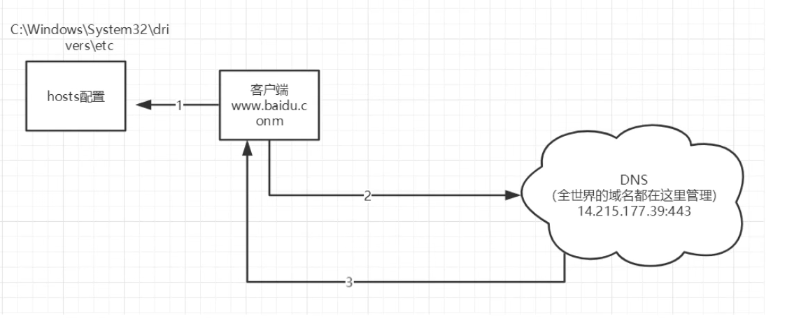

### 1 . java基础文件内容

#### 2. liuhui.com.oop.a1 a2 a3 day1

```java
// 1. a1
Person  Test  简单实例化类

// 2. a2
一个景区根据游人的年龄收取不同价格的门票 根据年龄段收取
Test   Bill  User	简单的面向对象	

// 3. a3
简单的创建学生类数组 添加5个学生  然后根据学生姓名在某个区间内查询这个学生
Student StudentServer Test 

// 4. day 1
1. 插入一个学员的成绩 并且保持降序
2. 插入一个学员的成绩 并且保持升序
3. 冒泡排序
4. Arrays类常用
    
```

#### 3. liuhui.com.oop.作用域问题

```
1. 一个类在两个包都有 怎么解决

2. 测试 public private 默认修饰符 protected 访问权限
```

#### 4. liuhui.com.oop.继承

```
Animal Dog Cat Test 简单的实现继承
```

#### 5.liuhui.com.oop.static内容

```
1.satic 修饰属性, 代码块, 方法问题 各种情况的简单练习
```

#### 6. liuhui.com.oop.static选民投票

```
	模拟实现选民投票过程：
 * 有四个候选人，每个选民只允许投一次票，并且有三分之一的概率不投或者弃权
 * 并且当投票总数达到100时，就停止投票 输出总投票数 以及候选人的票数 以及结果
```

#### 7. liuhui.com.oop.static测试类

```1.
一个类只能new 10次怎么办
```

#### 8. liuhui.com.oop.多态

```
1. 简单的实现了多态   2.向上转型 向下转型  
2. 写了个overload 尝试了下重载  
3. Master 模拟多态
```

#### 9. liuhui.com.oop.抽象类和接口

```
1. 抽象类和接口
Ⅳ个类 usb连接等

2. 抽象类和接口2
用户买机票的接口练习

3. 抽象类和接口3
打印机的一个接口 Ⅳ个类

```

#### 10. liuhui.com.oop.异常

```
6个类 自定义异常等
```


#### 11. liuhui.com.高级特性.集合

```
ArrayList linkedList HashSet HashMap lambda表达式 泛型等等
```


#### 12. liuhui.com.高级特性.IO

```
1. 文件的操作
2. io 字节流  读写   (对象形式不一样)
3. io 字符流  读写	(对象形式不一样)
```

#### 13. liuhui.com.高级特性.反射与注解

```
反射: Person personDemo

注解: 注解小用途, 6个文件
```

#### 14. liuhui.com.高级特性.线程

```
Thread 类
Runable 接口  简单的练习
```

#### 15. liuhui.com.高级特性.枚举包装类

```
八大类型的一些方法  random date 等等
```

#### 16 . liuhui.com.高级特性.Json

```
json的转换 引入 fastJson工具类 导入
```


### 2. Java概念

#### 1.面向对象

##### 1.继承

**继承是Java中实现代码重用的重要手段之一。Java中只支持单根继承，即一个类只能有一个直接父类**

```
		一 .子类访问父类的问题?
 *      
 		1.访问父类构造方法   super();   super(name)
 *      2.访问父类属性   	  super.name;   
 		3.访问父类方法      super.print();

 *      (1)使用super关键字,super代表父类对象
 *      (2)在子类构造方法中调用且必须是第一句
 		(3)不可以访问父类中定义为private的属性和方法
 
 *		二 .继承条件下的构造方法

 *          1. 子类构造方法没有通过super显式调用父类的有参构造方法，也没通过this显式调用自身其他构造方法
 *             注意 :系统默认调用父类的无参构造方法
 
 *          2. 子类构造方法通过super显式调用父类的有参构造方法
 *             注意: 执行父类相应构造方法，而不执行父类无参构造方法
 
 *          3. 子类构造方法通过this显式调用自身的其他构造方法，在相应构造方法中应用以上两条规则
 *
		三 .子类继承父类的什么？
 *          
 *          1. 继承public和protected修饰的属性和方法，不管子类和父类是否在同一个包里
 *          2. 继承默认权限修饰符修饰的属性和方法，但子类和父类必须在同一个包里
 
 *		四 .子类可以继承父类的所有资源吗?
 *          
 *          1. private修饰的成员
 *          2.子类与父类不在同包，并且使用默认访问权限的成员
 *          3.构造方法

```

##### 2. 修饰符 与 作用域问题

```
 一个类在两个包都有 那么就得用   liuhui.com.oop.作用域问题.Student stu2=new liuhui.com.oop.作用域问题.Student()形式
```

```

*  scope/修饰符     当前类中    同一个包中   子类中     任何地方

*  private          √             X        X           X
*  默认修饰符         √             √        X           X
*  protected        √             √        √           X
*  public           √             √        √           √
```

##### 3. static

```
static可以用来修饰

1. 成员变量  静态变量，可以直接通过类名访问
2. 成员方法  静态方法，可以直接通过类名访问
3. 代码块    静态代码块，当Java虚拟机加载类时，就会执行该代码块

JVM加载类时，加载静态代码块
    1. 如果有多个静态块，按顺序加载
    2. 每个静态代码块只会被执行一次


1. static变量（静态变量 或者类变量）
        1.被static修饰的变量在内存中只有一个拷贝，
        2.类内部，可在任何方法内直接访问静态变量，
        3.其他类中，可以直接通过类名访问
        
        
        
2. 实例变量
		1.每创建一个实例，就会为实例变量分配一次内存，实例变量可以在内存中有多个拷贝，互不影响
		
 static变量的作用：
（1）能被类的所有实例共享，可作为实例之间进行交流的共享数据
（2）如果类的所有实例都包含一个相同的常量属性，可把这个属性定义为静态常量类型，从而节省内存空间


static修饰符  
    1. 静态方法：
    	1. 可直接通过类名访问
    	2. 静态方法中不能使用this和super
    
    	3. 只能访问类的 静态变量和静态方法
    	4. 静态方法必须被实现(就是要有方法体)
    
    2. 实例方法
    	1. 可以访问 静态变量、静态方法
    

```

##### 4. 重写 重载 多态 上下转型

```
1. 重写
	子类重写父类方法注意事项

(1) 静态修饰符必须一致
(2) 方法名 参数列表 必须一致
(3) 访问权限不能严于父类
(4) 构造方法不能重写
(5) 父类的私有方法不能被子类覆盖-看不见
(6) 返回值类型必须是父类 或者是其子类
(7) 抛出的异常不能多于父类

2. 重载
 主要是跟返回值类型 无关 


2.重载跟重写 VS

比较项		 位置	  方法名	参数表	    返回值	           访问修饰符
 
方法重写	子类	  相同	相同	     相同或是其子类	 不能比父类更严格

方法重载	同类	  相同	不相同	    无关	            无关


3. 多态  
父类的引用指向子类 实现多态
	形式 
 	// 使用父类作为方法的返回值，也是Java中实现和使用多态的主要方式
    // 使用父类作为方法的形参， 是Java中实现和使用多态的主要方式


4. 向上转型 自动转换
   向下转型 需要强转  (如果需要调用子类特有的方法 必须进行转换)


```

##### 5. 抽象类和接口

```
												抽象类
// 抽象类VS普通类

1. 抽象类不能被实例化
2. 但可以创建一个引用变量，其类型是一个抽象类，指向非抽象的子类实例 Pet dog=new Dog();
3. 普通类可以被实例化

// 抽象方法VS普通方法

1. 有无方法体


二.
抽象类与抽象方法的使用
1. 抽象类中可以没有抽象方法，但包含了抽象方法的类必须被定义为抽象类
2. 如果子类没有实现父类的所有抽象方法，子类必须被定义为抽象类
3. 没有抽象构造方法，也没有抽象静态方法
4. 抽象类中可以有非抽象的构造方法，创建子类的实例时可能调用


												接口

抽象类和抽象法约束了继承了自己的子类必须要实现的方法

问题：子类中需要自己定义的方法无法进行有效的约束
接口：约束实现接口的类需要必须实现的功能。

1. 抽象类多用于实体类的继承处理
2. 接口多用于定义一组需要实现的功能


										接口的使用
										
1. 接口中的成员变量默认都是public static final的，必须显式初始化
2. 接口中的方法默认都是public abstract的
3. 接口没有构造方法，不能被实例化 
4. 一个接口不能实现另一个接口，但可以继承多个其他接口
5.一个子类必须实现接口的抽象方法（implements），除非这个类也是抽象类


									抽象类和接口的区别
相同点:

1. 代表系统的抽象层
2. 都不能被实例化
3. 都能包含抽象方法
4. 用于描述系统提供的服务，不必提供具体实现

不同点

1. 在抽象类中可以为部分方法提供默认实现，而接口中只能包含抽象方法
2. 抽象类便于复用，接口便于代码维护
3. 一个类只能继承一个直接的父类，但可以实现多个接口

									接口和抽象类的使用原则


1. 接口做系统与外界交互的窗口
2. 接口提供服务
3. 接口本身一旦制定，就不允许随意修改
4. 抽象类可完成部分功能实现，还有部分功能可作为系统的扩展点

									面向对象设计原则
									
1. 多用组合，少用继承
2. 针对接口编程
3. 针对扩展开放，针对改变关闭


									接口总结
									
Java中的接口
1. 属性全都是全局静态常量
2. 方法都是全局抽象方法
3. 无构造方法
4. 一个类可以实现多个接口，非抽象类实现接口时必须实现接口中的全部方法
5. 抽象类利于代码复用，接口利于代码维护

```


#### 2 . 常用类

##### 1.Object

```
Object类被子类经常重写的方法

toString()	返回当前对象本身的有关信息，按字符串对象返回
equals()	比较两个对象是否是同一个对象，是则返回true
hashCode()	返回该对象的哈希代码值
getClass()	获取当前对象所属的类信息，返回Class对象

```

##### 2.Arrays

```
Arrays 工具类的使用
        
* 1. boolean equals(array1,array2) 比较两个数组是否相等
* 2. void sort(array)              对数组的元素进行升序排列
* 3. String toString(array)        将一个数组元素转换成字符串
* 4. void fill(array,val)          将数组所有元素赋值为val
* 5. copyOf(array,length)          把数组array复制成一个长度为length的新数组 返回类型与复制数组一致
* 6. int binarySearch(array,val)   查询元素值val在数组中的下标 (要求数组中元素已经按升序排列)
```

##### 3. ArrayList & LinkedList

```
1. ArrayList

boolean add(Object o)	在列表的末尾顺序添加元素，起始索引位置从0开始
void add(int index,Object o)	在指定的索引位置添加元素。索引位置必须介于0和列表中元素个数之间
int size()	返回列表中的元素个数
Object get(int index)	返回指定索引位置处的元素。取出的元素是Object类型，使用前需要进行强制类型转换
boolean contains(Object o)	判断列表中是否存在指定元素
boolean remove(Object o)	从列表中删除元素
Object remove(int index)	从列表中删除指定位置元素，起始索引位置从0开始

Collection接口常用通用方法还有：clear()、isEmpty()、iterator()、toArray()


2. LinkedList
void  addFirst(Object o)	在列表的首部添加元素
void  addLast(Object o)	在列表的末尾添加元素
Object  getFirst()	返回列表中的第一个元素
Object  getLast()	返回列表中的最后一个元素
Object  removeFirst()	删除并返回列表中的第一个元素
Object  removeLast()	删除并返回列表中的最后一个元素
```

##### 4.Map

```
Object put(Object key, Object val)	以“键-值”对的方式进行存储
Object get(Object key)	根据键返回相关联的值，如果不存在指定的键，返回null
Object remove(Object key)	删除由指定的键映射的“键-值对”
int size()	返回元素个数
Set keySet()	返回键的集合
Collection values()	返回值的集合
boolean containsKey(Object key)	如果存在由指定的键映射的“键-值对”，返回true
```


#### 3. 高级特性

##### 1.集合

```
Java集合框架提供了一套性能优良、使用方便的接口和类，它们位于java.util包中

Collection 接口

LIst    	和 		Set																		Map

ArrayList  linkedList  HashSet  TreeSet						 HashMap   TreeMap


具体类算法  Collections 提供了对集合进行排序 遍历等多种算法实现


1. Collection 接口存储一组不唯一 无须的对象

2. List 接口存储一组不唯一，有序（插入顺序）的对象

3. Set 接口存储一组唯一 无序的对象

4. Map接口存储一组键值对象 提供key到Value的映射


// ArrayList 和 LinkedList 比较

1. ArrayList实现了长度可变的数组，在内存中分配连续的空间，遍历元素和随机访问元素的效率比较高

2. LinkedList采用链表存储方式，插入、删除元素时效率比较高
3. 


// Set 

1. Set接口存储一组唯一，无序的对象
   HashSet是Set接口常用的实现类
   Set中存放对象的引用


2. Set接口如何判断加入对象是否已经存在呢？
   采用对象的equals()方法比较两个对象是否相等

3. Set接口不存在get()方法


4. 如何遍历Set集合呢？

方法1：通过迭代器Iterator实现遍历 
获取Iterator ：Collection 接口的iterator()方法
Iterator的方法
boolean hasNext(): 判断是否存在另一个可访问的元素 
Object next(): 返回要访问的下一个元素
方法2：增强型for循环

方法3: lambda 表达式


// 泛型集合

泛型集合可以约束集合内的元素类型 
典型泛型集合ArrayList<E>、HashMap<K,V>
<E>、<K,V>表示该泛型集合中的元素类型
泛型集合中的数据不再转换为Object


// Collections

Collections 算法类

Java集合框架将针对不同数据结构算法的实现都保存在工具类中
Collections类定义了一系列用于操作集合的静态方法


Collections类常用方法

Collections和Collection不同，前者是集合的操作类，后者是集合接口
Collections提供的常用静态方法
sort():排序
binarySearch()：查找
max()\min():查找最大\最小值


Collections类可以对集合进行排序、查找和替换操作
实现一个类的对象之间比较大小，该类要实现Comparable接口
重写compareTo()方法


```

##### 2.IO

```

文件的读写

1. 写入流
1. (字节流) FileInputStream    InputStream

   (字符流) InputStreamReader   Reader 
   
   
                // 缓冲的字符流-
   				//1. 创建 FileInputStream
                InputStream is = new FileInputStream(path);
                //2. 创建 InputStreamReader
                Reader reader = new InputStreamReader(is);
                //3. 创建 BufferedReader
                BufferedReader bd = new BufferedReader(reader);   （配合 StringBuilder）
   
   
2. StringBuffer   sb.append((char) i); 一般只能一个一个存储
   
   StringBuilder  sb.append(str)	
   
   
   
   
2. 输出流

FileOutputStream  (字节流)        		  OutputStream(父类型)   				 write(byte [])

FileWriter(path, isAppend)(字符流)       OutputStreamWriter(父类型)    		 write(str)   

// 字符流 输出
BufferedWriter bw = new BufferedWriter(new FileWriter(path, isAppend))

 对象的写入
// 使用文件输出流创建对象输出
  ObjectOutput oos = new ObjectOutputStream( new FileOutputStream(path) )
  对象 需要序列化   Alt +enter 生成一个序列化


```

##### 3. 反射

```
/**
 * 反射: 框架设计的灵魂
 * * 框架: 半成品软件,可以在框架的基础上进行软件开发，简化编码
 * * 反射: 将类的各个组成部分封装成其他对象,这就是反射机制
 * * 好处:
 * 		1. 可以在程序运行的过程中,操作这些对象
 * 		2. 可以解耦,提高程序的可扩展性
 *		
 *	获取Class对象的方式:
 *		1. source源代码阶段  	Class.forName("全类名");   
 * 		2. Class类对象阶段	 	类名的.class
 *		3. Runtime运行时阶段 	对象.class	getClass()方法在Object类上	
 *		* 结论:同一个字节码文件(*.class)在一次程序运行过程中 只会被加载一次 不论通过哪一种方式获取的Class都是同一个
 */
 
 * Class 对象功能
 	* 获取功能
 		1. 获取成员变量们
        	* Field[] getFields()   获取所有public修饰的成员变量
        	* Field   getField()    获取指定名称的 public修饰的成员变量
        	
        	* Field[] getDeclaredFields()  获取所有成员变量,不考虑修饰符
 			* Field getDeclaredField(String name)
 			
 			
 			
 		2. 获取构造方法们
 			* Constructor<?>[] getConstructors(); 获取所有的public修饰的构造方法
 			* Constructor<T> getConstructor(类<?>... parameterTypes); 
 			
 			* Constructor<?>[] getDeclaredConstructors(); 获取所有的构造方法 不考虑修饰符
 			* Constructor<T>getDeclaredConstructor(类<?>... parameterTypes); 
 		
 		
 		
 		3. 获取成员方法们
 			* Method<?>[] getMethods(); 获取所有的public修饰的成员方法 包括父类的
 			* Method<T> getMethod(string name, 类<?>... parameterTypes); 获取特定成员方法
 			
 			* Method<?>[] getDeclaredMethods(); 获取所有的成员方法 不考虑修饰符
 			* Method<T>getDeclaredMethod(类<?>... parameterTypes);
 		
 		4. 获取类的名字
 			 forName()
 			
 		
 		
 		* Field :成员变量
 			* 操作:
 				1. 设置值
 					* void set(Object obj,Object value)
 				2. 获取值
 					* get(Object obj)
 				3. 忽略访问权限修饰符的安全检查
 					* setAccessible(true): 暴力反射
 					
 		* Constructor: 构造方法
 			* 创建对象
 				* T newInstance(Object... initargs)
 				* 如果使用空参的方式创建对象 操作可以简化:Class对象的newInstance方法
 				* 忽略访问权限修饰符的安全检查 
 					* setAccessible(true): 暴力反射
 		
 		* Method : 方法对象
 			* 执行方法
 				* Object invoke(Object obj,Object...  args)
 			* 获取方法名称
 				* String getName: 获取方法名
 			* 忽略访问权限修饰符的安全检查
            	* setAccessible(true): 暴力反射
                		
```


##### 4. 注解

```
/**
 * 注解: 用文字描述对象的,给程序员看的
 * 定义: (Annotation) 也叫元数据.一种代码级别的说明，与类 接口 枚举在同一个层次,它可以声明在包 类 字段 方法 局部变量 
 *       方法参数等的前面 用来对这些元素进行说明.注释
 *	
 *  * 概念描述
 		* JDK1.5版本周的新特性
 		* 说明程序的
 		* 使用注解: @注解名称
 		
 *  * 作用分类:
 *		* 编写文档: 通过代码里的元数据生成文档(生成文档doc文档)
 * 		* 代码分析: 通过代码里标识的元数据对代码进行分析(使用反射)
 * 		* 编译检查: 通过代码里的元数据让编译器能够实现基本的编译检查
 *
 *	* JDK中预定义的一些注解
 *		* @Override:检测被该注解标注的方法是否继承自父类
 *		* @Deprecated:该注解标注的内容已经过时
 *		* @SuppressWarnings:压制警告
 
  
 	* 自定义注解
 		* 格式:(元注解)
 			* public @interface 注解名称{}
 		* 本质: 注解本质就是 shi一个接口 该接口默认继承自Annotation接口
        	* public interface MyAnno extends java.lang.annotation.Annotation {}
		
        * 属性: 接口中的抽象方法
        	* 要求:
        		1. 属性的返回值有下列取值范围
        			* 基本数据类性
        			* String	
        			* 枚举
        			* 注解
        			* 以上类型的数组
        		2. 定义了属性,在使用是需要给属性赋值的注意事项
        			1. 如果定义了属性时,可以使用default关键字给属性默认初始化值
        			2. 如果只有一个属性需要赋值,并且属性的名称是value,则value可以省略,直接定义值即可
        			3. 数组赋值时,值需要使用{}包裹,如果数组中只有一个值,则{}可以省略
        * 元注解(用于描述注解的注解)
        	* Target: 描述注解能够作用的位置
        		* ElementType 取值
        			* TYPE:作用于类上
        			* METHOD: 作用于方法上
        			* FIELD: 作用域成员变量上
        	* Retention: 描述注解被保留的阶段
        		* Retention(RetentionPolicy.RUNTIME) 运行时后生效
        	* Documented: 描述注解是否被抽取到api文档中
        	* inherited: 描述注解是否被子类继承
        
        			
        			
 	* 在程序使用(解析)注解
 		1. 获取注解定义的位置的对象 (Class,Method,Field)
 		2. 获取指定的注解
 			* getAnnotation(Class)
 		3. 调用注解中的抽象方法获取配置的属性值
 		
 		
 		
 	* 小结:
 		1. 以后大多时候 我们会使用注解 而不是自定义注解
 		2. 注解给谁用
 			1. 编译器
 			2. 给解析程序用
 		3. 注解不是程序的一部分，可以理解为一个标签
 	
 */
```

##### 5. JDBC

```
* 概念 : 数据库连接的操作语言
* JDBC 本质: 官方定义的一套操作所有数据库的规则 即接口 各个数据库厂商去实现这个接口 提供数据库驱动的jar包 ，我们可以使用这套接				口编程,真正执行的是驱动jar中的实现类 


```


### 3. Mysql

#### 1. 安装

##### 1. 复制my.ini文件并修改

```ini
# my.ini配置文件放到各个安装目录下
[mysql]
# 设置mysql客户端默认字符集
default-character-set=utf8 

[mysqld]
#设置端口  有多个数据库时配置需要不一样
port = 3306

# 设置mysql的安装目录 
basedir=D:\Application\mysql-8.0.23-winx64

# 设置mysql数据库的数据的存放目录
datadir=D:\Application\mysql-8.0.23-winx64\data

# 允许最大连接数
max_connections=200

# 服务端使用的字符集默认为8比特编码的latin1字符集
character-set-server=utf8

# 创建新表时将使用的默认存储引擎-用来处理数据的程序INNODB(新)  MYISM（效率很高，功能很少）
default-storage-engine=INNODB

# 调整加密方式为5.x方式
default_authentication_plugin=mysql_native_password
```

##### 2. 初始化并完成安装

```bash
# 通过管理员启动cmd
# 进入安装路径-bin


# 初始化mysql安装配置
# --defaults-file默认配置文件路径  --initialize初始化 --console 将信息打印到控制台
mysqld --defaults-file=D:\Application\mysql-8.0.23-winx64\my.ini --initialize --console

# 复制密码
 Yvr)mrENT684

# 安装mysql到服务
mysqld install mysql --defaults-file=D:\Application\mysql-8.0.23-winx64\my.ini

### 常见命令
# 启动服务
sc start mysql1    

# 停止服务
sc stop mysql1

# 删除服务
sc delete mysql1
```

##### 3 . 简单的操作

**MySQL服务的开启和关闭 以及扩展**

```
net start mysql (服务的名称)  开启服务
net stop  mysql (服务的名称)	 关闭服务

// 删除mysql服务名称 
sc delete 服务名称
// 修改 mysql服务名
mysqld --install 新服务名称 
// mysql服务启动
	cmd ==> services.msc打开服务的窗口
	
mysqld --remove mysql  //删除服务
```

**MySQL的登录与退出**

```
登录: mysql -u用户名 -p密码
退出: exit
```

**数据库的备份与还原**

```
备份: mysqldump -u用户名 -p密码 数据库名> 保存的路径  f://a.sql
还原: 1.登录 2.创建一个数据库 3.使用数据库 4.执行文件(source 文件路径)   
```


#### 2. 操作数据库

```
SQL分类
	1) DDL数据库定义语 
		* 用来定义数据库对象: 数据库 表 列 关键字: create drop alter 等
	2) DML数据操作语言
		* 对数据库中表的数据进行增删改 关键字: insert delete update 等
	3) DQL数据查询语言
		* 用来查询数据库中表的记录 关键字: select where 等
	4) DCL数据库控制语言
		* 用来定义数据库的访问权限和安全级别,以及创建用户 关键字: GRANT REVOKE 等
```

##### 1. DDL 用来定义数据库对象

###### 1. 操作数据库

```

		1.C(Create)创建
			* 创建数据库:
				* create database db;
			* 创建数据库,判断不存在,在创建
				* create database if not exists db;
            * 创建数据库,指定字符集
            	* create database if not exists db character set gbk;
            	
            	
         2.R(Retrieve)查询
         	* 查询所有的数据库名称
         		* show databases;
         	* 查询某个数据库的创建语句
         		* show create database db;
         		
         		
         3.U(Update)修改
         	* 修改数据库的字符集
         		* alter database db character set 字符集名称;
         		
         		
         4.D(Delete)删除
         	* 删除数据库
         		* drop database db;
         	* 判断数据库存在, 存在则删除
         		* drop database if exists db;
         		
         		
         5.使用数据库
         	* 使用数据库
         		* use db;
         	* 查询当前使用的数据名称
         		* select database();
         		
```

###### 2. 操作表

```

		1.C(Create)创建
			* 创建表:
				* create if not exists table tb(
					列名1 数据类型1,
					列名2 数据类型2,
					...
					列名n 数据类型n  * 注意: 最后一列不需要加,
				);
				
				
			* 数据类型:
            	1. int: 整数类型
            		* age int
            	2. double: 小数类型
           			* score double(5,2) 小数点一共有5位 保留两位
            	3. date: 日期类型,只包含年月日 yyyy-MM-dd
            	4. datetime: 日期类型,包含年月日时分秒 yyyy-MM-dd HH:mm:ss
            	5. timestamp: 时间戳类型,包含年月日时分秒 yyyy-MM-dd HH:mm:ss  
            		* 如果将来不给这个字段赋值,或者赋值为null,则默认使用当前的系统时间来自动赋值
            				timestamp DEFAULT(CURRENT_TIMESTAMP)  -- 默认的让获取系统时间
            				
            	6. varchar: 字符串类型
            		* name varchar(20) 最大20个字符
			
			* 复制一份表
            	create table  stu(复制的表) like student;
            	
		
         2.R(Retrieve)查询
         	* 查询表结构
         		* desc tb;
         	* 查询表的创建语句
         		* show create table students;
         		
         	
         3.U(Update)修改
         	* 修改表名称
         		* alter table tb rename to newdb;
         	* 修改表字符集
         		* alter table tb character set 字符集名称;
         	* 添加一列
         		* alter table tb add 列名 类型;
         	* 修改列名称 类型
         		* alter table tb change 列名 新列名 新类型;
				* alter table tb modify 列名 新类型;
         	* 删除列
         		* alter table tb drop 列名;
         		
         		
         4.D(Delete)删除
         	* 删除表
         		* drop table tb;
         	* 判断表是否存在, 存在则删除
         		* drop table if exists db;
         		
```

##### 2. DML: 增删改数据

```sqlite
1. 添加数据:
	* insert into tb(列名1,列名2,...列名n)values(值1,值2...值n);
	* insert into tb(列名1,列名2,...列名n)values(值1,值2...值n),(值1,值2...值n)... // 添加多条
	* 注意:
		1. 列名和值要一一对应
		2.如果表名之后,不定义列名,则默认给所有的列添加
			* insert into tb values(值1,值2,...值3); 即便是有的列有默认值 也不许把位置占了 
		3. 除了数字类型 其他类型都必须用引号引起来 
		
2. 删除数据:
	* delete from tb;  // 有多少记录就删除多少次,效率比较慢
	* delete from tb where(条件);  // 根据条件删除
	* truncate table tb;  // 一次性删除所有数据 并且生成一个新表的结构(推荐使用 效率更高)

3. 修改数据:
	* update  tb set 列名1 = 值2,列名2 = 值2,...(where 条件);
	* 注意: 如果不加 where 则会将表中所有的数据更改
```

##### 3. DQL: 查询语句 

```sql

	1. 排序查询
		* 语法: order by 子句
			* order by 排序字段1 排序方式, 排序字段2,排序方式2 ...
			* 例子: select * from student ORDER BY math DESC,english desc;
		* 排序方式
			* asc : 升序 默认的
			* desc: 降序
		* 注意:
			* 如果有多个排序条件,则当前的值一样时, 才会判断第二个条件

	2. 聚合查询: 将一列数据作为一个整体,进行纵向的计算
		* count: 计算个数
		* Max/Min: 计算最大值与最小值
		* sum:	求和
		* avg:  平局值
		* 注意: 
			1. 所有的聚合函数都是排除了null值的
				* 解决方案:
					1. 选择不为空的列进行计算
					2. ifnull函数  ifnull(exp1,exp2) 如果exp1为null则替换成 exp2
			2. 聚合查询不能跟普通字段混在一起 报错
				* 比如 select count(distinct age) ,name from student;	
	3. 分组查询
		* 语法: group by 分组字段;
		* 注意:
			* 分组查询之后的字段: 要么是分组字段 要么是聚合函数
			* where 和 having 的区别 ?
				* where 在分组之前进行限定,如果不满足条件则不参与分组
				* having 在分组之后进行限定,如果不满足结果则不会被查询出来
				* where 之后不可以跟聚合函数 而having可以
				
	4. 分页查询 
		* 语法: limit 开始的索引,每页查询的条数
		* 公式: 开始的索引 = (当前页码 - 1 ) * 每页条数
		* 例子: 每页显示三条
			* select * from student limit 0,3;
			* select * from student limit 3,3;
			* select * from student limit 6,3;
			
			
			
    5.完整语法:  
    	*  		select 
                    字段名称 
                 from 
                    表名
                 where 
                    条件列表 
                 group by 
                    分组字段 
                 having 
                    分组之后的条件 
                 order by
                    排序
                 limit
                    分页		              
    6. 基础查询:
    	1. 多个字段的查询
    		* select 字段名1,字段名2,字段名3... from 表名
    		* 注意: 查询所有可以使用 * 代替 但是不建议使用
    	2. 去除重复
    		* distinct  
            	* select distinct age from student;        年龄去重
            	* select count(distinct age) from student; 年龄去重之后计算总人数
    	3. 计算列
    		* 一般可以使用四则运算来计算列的值(数值型)
    		* ifnull(exp1,exp2)  如果exp1为null则替换成 exp2
    	4. 起别名
    		* as(也可以省略)
    7. 条件查询
    	1. where 子句后面跟条件
    	2. 运算符: 
    		* <  >  <=  >=  =  [<> != ](不等于)
    		* between ?(包含) and ?(包含) 在什么之间  
    		* in(集合)    (1,2,3) 在 1 2 3 之间的
    		* like 模糊查询
    			* 占位符:
    				* _:单个任意字符
    				* %:多个任意字符
    		* [is null]  or [is not null]      // 为null或者不为null
    		* and 或者 &&
    		* or 或者 ||
    		* not 或者 !

```

##### 4. DCL数据库控制语言

```


```

##### 5. 约束

```sql
    		
    8. 约束
    	* 概念: 对表中的数据进行约束,保证数据的正确性,有效性和完成性
    	* 分类:
    		1. 主键约束: primary key
    		2. 非空约束: not null
    		3. 唯一约束: unique
    		4. 外键约束: foreign key
    		
    	* 非空约束: not null
    		1. 创建表时添加约束
    			create table tb(
    				id int,
    				name varchar(20) not null 
    			);
    		2. 创建完成之后 添加非空约束
    			alter table tb modify name varchar(20) not null;
    			
    		3. 删除name的非空约束 使用修改方式
    			alter table tb modify name varchar(20);
    			
    		* 注意: 如果表中已经有了数据 而且为那一列值为null  那么不能修改为null ,必须把那一列null的数据删除 才能保存
 
    	* 唯一约束: unique (不能重复)
    	
    		* 注意:mysql中 唯一约束限定的值可以有多个null /如果表中已经有重复的数据  则不能保存
    		1. 删除唯一约束 
    			* alter table tb drop index 列名
            2. 在创建表后添加唯一约束
            	* alter table tb modify name varchar(20) unique;
    	
    	* 主键约束 : primay key
    		1. 注意:
    			1. 含义: 非空不唯一
    			2. 一张表只能有一个字段为主键
    			3. 主键就是表中记录的唯一标识
    			
    		2. 删除主键 和 添加主键
    			* ALTER TABLE tb DROP PRIMARY KEY;
    			* alter table tb modify int primary key;
    		3. 主键的自动增长
    			* 如果某一列为数值类型 ,使用auto_increment 可以用来自动增长
    			* 添加自动增长
    	  			* alter table stu modify id int auto_increment;
    			* 删除自动增长
    	  			* alter table stu modify id int;
    	  			
    	  * 外键约束 
    	  	1.创建表时,可以添加外键
    	  		* 语法
    	  			create table tb(
    	  				dep_id;
    	  				constraint 外键名称 foreign key(dep_id) references 引用的表(id)
    	  			)
    	  	2.删除外键约束
            	* ALTER TABLE employee DROP FOREIGN KEY emp_dep_fk ;
            3.添加外键
            	* ALTER TABLE employee add CONSTRAINT emp_dep_fk FOREIGN KEY(dep_id) REFERENCES 		department(id);
            	
            4.级联操作	
            	*添加外键 设置级联更新 级联删除
				ALTER TABLE employee add CONSTRAINT emp_dep_fk FOREIGN KEY(dep_id) REFERENCES department(id)
				ON UPDATE CASCADE ON DELETE CASCADE;
```

##### 6. 表的设计

```
	表的对应关系
			1. 一对一		一个学生对应一个身份证 一个身份证对应一个学生
			2. 一对多(多对一)	一个员工对应一个部门 一个部门对应多个员工
			3. 多对多		一个学生可以学多门课程 一个课程可以有多个学生学习
			
		2. 实现关系
			* 一对多(多对一)
				* 部门和员工
				* 在多的一方建立外键 指向一的一方的主键
			* 多对多
				* 学生和课程
				* 借助第三方表 至少包含两个字段 这两个字段作为第三张表的外键 分别指向两张表的主键
		
```

##### 7. 多表查询

```sql
* 多表查询的分类
	1. 内连接查询
		1. 隐式内连接	
			* 使用where条件消除无用数据
			* select    t1.a,  t2.b    from    t1,t2     where    t1.id = t2.id
		2. 显式内连接
			* select    t1.a,  t2.b    from    t1 [inner]可选 join t2   on     t1.id = t2.id
       	3. 思路:  
       		* 从那些表中查数据
       		* 条件式什么
       		* 查询哪些字段
	2. 外连接查询
		1. 左外连接 查询的式左表所有数据以及其交集部分  (左表跟右表换个位置就相当于右外)
			语法:  select    t1.a,  t2.b    from    t1 left [outer] join t2   on     t1.id = t2.id
		2. 右外连接
			语法:  select    t1.a,  t2.b    from    t1 right [outer] join t2   on     t1.id = t2.id
		
	3. 子查询 (嵌套 根据结果查询)
		* 子查询的结果式单行单列的 可以使用 运算符 > >= < <= =
		* 子查询的结果式多行单列的 可以使用 in
		* 子查询的结果式多行多列的 可以作为一张虚拟表来参与查询
	
```

##### 8. 事务

```
1. 事务的基本介绍
	1. 概念
		* 如果一个包含多个步骤的业务操作 被事务管理 那么这些操作要么同时成功 要么同时失败
	2. 操作
		1. 开启事务: start transaction
		2. 回滚: rollback
		3. 提交: commit
2. 事务的四大特征
3. 事务的隔离级别(了解)

```


### 4. JavaWeb

#### 1. 基本概念

#### 2. web服务器

#### 3. Tomcat
##### 3.1.安装Tomcat

```

```


##### 3.2. Tomcat启动和配置

**启动和关闭**

```
* bin目录下       startup.bat 			shutdown.bat
```

**访问测试: localhsot:8080**

**conf -> server.xml 配置文件**

**可以配置默认端口号:**

* tomcat的默认端口号名称: 8080
* mysql:3306
* http:80
* https:443

```
  <Connector port="8081" protocol="HTTP/1.1"
               connectionTimeout="20000"
               redirectPort="8443" />
```

**可以配置主机名称**

 * 默认主机名称为 localhsot->127.0.0.1
 * .默认网站应用存放的位置为:webapps

```
在windows stystem32为中 搜索drivers ==> ets 把hosts修改为www.liuhui.com
<Host name="www.liuhui.com"  appBase="webapps"
            unpackWARs="true" autoDeploy="true">
```

<h2>高难度面试题</h2>

请你谈谈网站是如何进行访问的

1.输入一个域名: 回车

2.检查本机的 C:\Windows\System32\drivers\etc\hosts配置文件下有没有这个域名的映射

  1. **有: 直接返回对应的ip地址 这个地址中 有我们需要的web程序 可以直接访问**

     ```
     	127.0.0.1       www.liuhui.com
     ```

  2. **没有： 去DNS服务器找 找的就返回 找不到就返回找不到**



  

##### 3.3 发布一个web网站

* 将自己写的网站 放到服务器Tomcat中指定的web应用的文件夹webapps下,

网站应该有的结构

```
-- webapps : Tomcat服务器的web目录
 - RooT
 -liuStudy : 网站的目录名
 - WEB-INF
 	-classes : java程序
 	-lib : web应用所依赖的jar包
 	-web.xml: 网站的配置文件
 - index.html 默认的首页
 -static
 	-css
 	-js
 	-img
```

#### 4.http

##### 4.1 什么是http

HTTP(超文本传输协议) 是一个简单的请求 -相应协议.它通常运行在TCP之上

* 文本 ：html，字符串
* 超文本: 图片 音乐 视频 定位 地图 ......
* 端口:80

HTTPS: 安全的

* 端口:443

##### 4.2 两个时代

* http1.0
  * HTTP/1.0 客户端可以与web服务器连接后,只能获取一个web资源,断开连接
* http2.0
  * http/1.1 客户端可以与web服务器连接后,只能获取多个web资源

##### 4.3  HTTP请求

* 客户端 --发送请求--服务端

<h3> 1. 请求行</h3>

* 请求行中的方式:GET
* 请求方式: Get post HEAD Delete Put tract
  * get 请求能够携带的参数比较少 大小有限制 会在浏览器的url地址栏显示数据内容 不安全 但效率高
  * post 请求能携带的参数没有限制 大小没有限制 不会在浏览器的url地址显示数据内容 安全 但不高校

```http
1. Request URL: https://www.baidu.com/		// 请求地址
2. Request Method: GET						// get方法/post方法
3. Status Code: 200 OK						// 状态码
4. Remote Address: 36.152.44.95:443			// 远程地址
5. Referrer Policy: strict-origin-when-cross-origin	// 一个协议
```

<h3>2. 消息头</h3>

```http
Accept: text/html							// 告诉浏览器 它支持的数据类型
Accept-Encoding: gzip, deflate, br			// 支持的编码格式 GBK UTF-8 GB2312 ISO8559-1
Accept-Language: zh-CN,zh;q=0.9,en;q=0.8	// 告诉浏览器 他的语言环境
Cache-Control: max-age=0					// 缓存控制
Connection: keep-alive						// 告诉浏览器请是否保持连接
```


##### 4.4 HTTP响应

* 服务器 -- 相应 -- 客户端-

```http
Cache-Control: private			缓存控制
Connection: keep-alive			保持连接
Content-Encoding: gzip			编码
Content-Type: text/html;charset=utf-8	类型
X-Ua-Compatible: IE=Edge,chrome=1  浏览器相应兼容性
```

* 相应体

```http
Accept: text/html							// 告诉浏览器 它支持的数据类型
Accept-Encoding: gzip, deflate, br			// 支持的编码格式 GBK UTF-8 GB2312 ISO8559-1
Accept-Language: zh-CN,zh;q=0.9,en;q=0.8	// 告诉浏览器 他的语言环境
Cache-Control: max-age=0					// 缓存控制
Connection: keep-alive						// 告诉浏览器请是否保持连接

HOST :    主机 
Reflush : 告诉浏览器多久刷新一次
Location : 让网页重新定位
```

相应状态码

200: 成功  

3xx:请求重定向 304

*  重定向: 你重新到我给你的新位置 去

4xx: 找不到资源  404

5xx：服务器代码错误 500 	502网关错误

<h3>常见面试题</h3>

当你的浏览器中地址输入url回车 经历了什么?


#### 5. Maven

<hr/>

**我为什么要学习这个技术**

 	1. 在javaweb开发中 需要使用大量的jar包,我们动手去导入
 	2. 如何能够让一个东西自动帮我导入和配置这个jar包 由此MEVEN诞生了

#####  5.1 Meven 项目架构管理工具

我们目前用来就是方便导入Jar包的

Maven的核心思想: **约定大于配置**

 * 有约束 不要去违反

Maven会规定好你应该如何去编写我们的java代码。必须要按照这个规定来:

##### 5.2 下载安装Maven

##### 5.3 Maven环境变量配置

在我们的系统环境变量中

配置如下配置: 		新建

* M2_HOME  			// maven下的bin目录
* MAVEN_HOME      // maven目录
* 在系统的path中配置 %MAVEN_HOME %\bin


mvn -v 配置环境变量之后 是否配置成功


##### 5.4 阿里云镜像

* 镜像： mirrors
  * 作用: 加速我们的下载
* 国内建议使用阿里云镜像
* conf文件夹 ==> setting.xml 中配置

```xml
	<mirror>  
       <id>nexus-aliyun</id>  
       <mirrorOf>central</mirrorOf>    
       <name>Nexus aliyun</name>  
       <url>http://maven.aliyun.com/nexus/content/groups/public</url>  
    </mirror> 
```

##### 5.5 本地仓库

本地仓库 远程仓库:

**建立一个本次仓库**

```java
<localRepository>D:\Application\apache-maven-3.8.4\repo_jar</localRepository>
```

##### 5.6 在IDEA中使用Maven

1. 创建一个maven web项目


2. 安装成功


3. 查看maven仓库中多了什么东西
4. IDEA中的Maven设置
5. IDEA项目创建成功后,最后看一眼Maven的配置


### 5. Spring5框架

```java
内容:
1. spring 框架概述 
2. IOC容器 (控制反转)
   * IOC底层原理
   * IOC接口（BeanFectory）
   * IOC操作Bean管理(基于Xml)
   * IOC操作bean管理(基于注解)
3. AOP
4. JdbcTemplate
5. 事务管理
6. Spring5新特性
 
```

#### 1. IOC

```java
1. 什么是IOC
	* 控制反转 把对象创建和对象之间的调用过程,交给Spring进行管理,
	* 使用IOC目的 为了耦合度降低
2. IOC底层原理
    * xml解析 、工厂模式  、反射
3. IOC接口
    * IOC思想基于IOC容器完成,IOC容器底层就是对象工厂
	* Spring提供了IOC容器实现的两种方式(2个接口) BeanFactory   ApplicationContext
        * BeanFactory： IOC容器基本实现,是Spring内部的使用接口,不提供开发人员使用	
		* ApplicationContext:   接口的子接口,提供更多强大的功能,一般由开发人员进行使用
```


#### 2. IOC的bean管理

```java
1. 什么是bean管理
 * Bean管理指的是两个操作(spring创建对象和Spring注入属性)(xml和注解2个方式) 
 
 	1. 基于xml配置文件方式实现 
        * 创建对象(创建对象的时候默认执行无参构造方法 完成对象的创建)
            id: 唯一标识
            class: 类全路径
        * 注入属性(依赖注入,就是使用属性注入)
            set方式:
            构造函数方式:

	2. 基于注解方式实现  
	   
```

#### 3. xml注入普通类型

```xml
 
1. <!--set方式注入属性-->
    <bean id ="user" class="com.company.User">
        <property name="name" value="张三"/>
        <property name="age" value="18"/>
    </bean>
	
	引入命名空间的方式 xmlns:p="http://www.springframework.org/schema/p" 
    <bean id ="user" class="com.company.User" p:name="张三" p:age="21"/>

2. <!--构造函数的方式注入-->
    <bean id ="user" class="com.company.User">
        <constructor-arg name="name" value="李四"/>
        <constructor-arg name="age" value="18"/>
    </bean>


3. 字面量
(1) null
      <property name="name">
      	<null/>
      </property>

(2) 包含特殊字符
 <property name="name">
 	<value><![CDATA[<<南京>>]]></value>
 </property>


4. 注入属性外部bean
(1) 创建两个类service类和dao类
(2) 在sevice调用dao里面的方法

    public class UserDaoImp implements UserDao {
        @Override
        public void update() {
            System.out.println("userDao执行了");
        }
    }

    public class UserService {
        private UserDao userDao;

        public UserService(UserDao userDao) {
            this.userDao = userDao;
        }

        public void add() {
            System.out.println("service add........");
            userDao.update();
        }
    }

    public class test {
        public static void main(String[] args){
            ApplicationContext applicationContext = new ClassPathXmlApplicationContext("bean1.xml");
            UserService userService = applicationContext.getBean("userService", UserService.class);
            userService.add();

            // service add........
            // userDao执行了
 	 		
        }
    }

  

<!--server和Dao 对象创建-->
<bean id="userService" class="com.company.service.UserService">
    <constructor-arg name="userDao" ref="userDaoImp"/>
</bean>
<bean id="userDaoImp" class="com.company.dao.UserDaoImp"/>


4.2 注入属性 内部bean 和级联赋值
 <bean id="userService" class="com.company.service.UserService">
     <constructor-arg name="userDao">
         <bean class="com.company.dao.UserDaoImp"/>
     </constructor-arg>
 </bean>

```

#### 4. xml注入集合类型

```xml
1. 数组类型	
2. 集合类型
3. map类型
4. set类型

* 在集合之中设置对象类型的值
public class Stu {
    private String[] score;
    private List<String> list;
    private Map<String, String> map;
    private Set<String> sets;
    private List<Course> listSub;

   	...set get方法略
    }
}
<bean id="stu" class="com.company.bean2.Stu">
    	
        <property name="score">
            <array>
                <value>张三</value>
                <value>李四</value>
            </array>
        </property>

          
        <property name="list">
            <list>
                <value>张三1</value>
                <value>李四2</value>
            </list>
        </property>

             
        <property name="map">
            <map>
               <entry key="JAVA" value="java"/>
               <entry key="PHP" value="php"/>
            </map>
        </property>

        <property name="sets">
            <set>
                <value>MySQl</value>
                <value>Redis</value>
            </set>
        </property>
    
    	<!-- 注入集合 值是对象-->
        <property name="listSub">
            <list>
                <ref bean="course1"/>
                <ref bean="course2"/>
            </list>
        </property>

  </bean>

<!-- 创建多个Course对象 -->
<bean id="course1" class="com.company.bean2.Course">
    <property name="cname" value="Spring5框架"/>
</bean>

<bean id="course2" class="com.company.bean2.Course">
    <property name="cname" value="Mybatas框架"/>
</bean>


* 把集合注入部分提取出来
(1) 在spring配置文件中引入名称空间util
        
    xmlns:util="http://www.springframework.org/schema/util"
    http://www.springframework.org/schema/util http://www.springframework.org/schema/util/spring-util.xsd
    
   
(2) 使用util标签完成list集合注入提取
    <property name="list" ref="courseList"/>
        
    <util:list id="courseList">
        <value>123</value>
        <value>456</value>
        <value>789</value>
    </util:list>

```

#### 5. IOC操作 Bean(FactoryBean)和生命周期

```java
1. FactoryBean
    spring有两种bean，1.普通bean 2.工厂bean（factoryBean）
	
	* 普通bean: 在配置文件中配置类型就是返回类型
		<bean id="userDaoImp" class="com.company.dao.UserDaoImp"/>
         ApplicationContext applicationContext = new ClassPathXmlApplicationContext("bean2.xml");
         UserDaoImp userDaoImp = applicationContext.getBean("userDaoImp", UserDaoImp.class);
	
	* 工厂bean: 在配置文件定义bean类型可以和返回类型不一样
		* 第一步 创建类 让这个类作为工厂bean 实现接口FactoryBean
		* 第二步 实现接口里面的方法，在实现的方法中定义返回的bean类型

        public class Course {
            private String cname;
            public String getCname() {
                return this.cname;
            }

            public void setCname(String cname) {
                this.cname = cname;
            }
		}

		// 工厂bean
		public class MyBeanFactory implements FactoryBean<Course> {
            @Override
            public Course getObject() throws Exception {
                Course course = new Course();
                course.setCname("abc");
                return course;
            }
            
            @Override
            public Class<?> getObjectType() {
                return null;
            }
		}
		// xml配置
		<bean id="myBeanFactory" class="com.company.bean2.MyBeanFactory"/>
        // main方法
 		ClassPathXmlApplicationContext context=new ClassPathXmlApplicationContext("bean2.xml");
        Course course = context.getBean("myBeanFactory",Course.class);
		System.out.println(course.getCname())   // abc
	

		
2. bean作用域	
	在spring中 设置创建bean实例是单实例还是多实例 
	* scope属性的设置: singleton单实例 ,prototype多实例  注意:默认是单实例
		<bean 
			id="myBeanFactory"
          	class="com.company.bean2.MyBeanFactory"
          	scope="prototype"
		 />
		
            ApplicationContext applicationContext=new ClassPathXmlApplicationContext("bean2.xml");
            Course course = applicationContext.getBean("myBeanFactory", Course.class);
            Course course2 = applicationContext.getBean("myBeanFactory", Course.class);
            System.out.println(course);
            System.out.println(course2);
			// 地址输出不一样
		
		
	* singleton 加载spring配置文件的时候就创建了对象  
	* prototype 是调用getbean的时候才创建所以是多实例
		
```


#### 6. Bean的生命周期

```java
... 5步 + 2步 
概念: 从对象创建到对象销毁的过程

1. 通过构造器创建的bean实例(无参构造)
2. 为bean的属性设置和其他bean的引用 (调用set方法)
		?? = x	
3. 调用bean的初始化的方法 (需要手动配置初始化的方法)
	    ?? = y		
4. bean就可以使用了(对象获取到了)
5. 当容器关闭的时候调用销毁的方法 (需要手动配置销毁的方法)

   后者处理器的2步
x: 把bean的实例传递给bean前置处理器的方法
y: 把bean的实例传递给bean后置处理器的方法

bean的后置处理器 作用: 全局的bean都会用到,初始化之前(x)和初始化之后(y)
	

// 1.
public class Course {
    private String cname;

    public Course() {
        System.out.println("第一步 执行无参构造创建bean实例");
    }

    public String getCname() {
        return this.cname;
    }

    public void setCname(String cname) {
        this.cname = cname;
        System.out.println("第二步 执行set方法设置值");
    }

    public void initMethod(){
        System.out.println("第三步 调用初始化方法");
    }
    public void destroyMethod(){
        System.out.println("第五步 调用销毁方法");
    }
    
// 2. 写上一个类实现BeanPostProcessor接口  (进入到这个接口中复制两个方法)
public class MyBeanPost implements BeanPostProcessor {
    @Override
    public Object postProcessBeforeInitialization(Object bean, String beanName) throws BeansException {
        System.out.println("前置处理器");
        return bean;
    }

    @Override
    public Object postProcessAfterInitialization(Object bean, String beanName) throws BeansException {
        System.out.println("后置处理器");
        return bean;
    }
}


    
// 3. xml配置
<bean id="course"
    class="com.company.bean2.Course"
    init-method="initMethod"
    destroy-method="destroyMethod">
   			<property name="cname" value="777"/>
</bean>
          
        
        
<!-- 全局处理器: 因为这个bean实现了BeanPostProcessor接口 
     spring自动识别(写了这个bean那么所有配置文件中的bean都会添加这个方法) -->    
    
<bean id="myBeanPost" class="com.company.bean2.MyBeanPost"/>
   
    
// 4.
public static void main(String[] args) {
    ClassPathXmlApplicationContext context=new ClassPathXmlApplicationContext("bean2.xml");
    context.getBean("course",Course.class);
    System.out.println("第四步 获取到bean实例对象");

    // 手动让bean实例销毁
    context.close();
    }
         
     /*
        第一步 执行无参构造创建bean实例
        第二步 执行set方法设置值
        前置处理器(x)
        第三步 调用初始化方法
        后置处理器(y)
        第四步 获取到bean实例对象
        第五步 调用销毁方法
     */
     
    

```

#### 7. IOC操作bean管理(xml自动装配)

```xml
1. 什么是自动装配
	* 根据指定装配规则 (属性名称或者属性类型) spring自动将匹配的属性值进行注入
	* autowire值的设置:
		* byName: 注意注入的bean的id和类中属性名称一致
	    * byType: 根据属性类型注入


```

```java
// 代码演示
public class Dept {
    private String name;
	// ...set get 略
}
public class Emp {
    private String name;
    private Dept dept; // x
	// 略
}
 // autowire="byName" 根据属性名称自动装配  x和y名称要对应
 <bean id="emp" class="com.company.bean2.autowire.Emp" autowire="byName"/>

 // 同理 byType 根据属性类型自动装配 x和y类型要对应(注意 如果有多个相同类型那么它不能识别 比如把y复制一份id改个名)
 //<bean id="emp" class="com.company.bean2.autowire.Emp" autowire="byType"/> 
     
 
 // y
 <bean id="dept" class="com.company.bean2.autowire.Dept">
      <property name="name" value="开发部"/>
 </bean> 


```


#### 8. IOC操作 bean管理 (外部属性文件)

```xml
1. 直接配置数据库信息
	(1) 配置德鲁伊连接池
        <!--配置数据库连接池普通方式-->
        <bean id="dataSource"  class="com.alibaba.druid.pool.DruidDataSource">
            <property name="driverClassName" value="com.mysql.jdbc.Driver"/>
            <property name="url" value="jdbc:mysql://localhost:3306/db"/>
            <property name="username" value="root"/>
            <property name="password" value="root"/>
		</bean>

	(2)引入德鲁伊连接池依赖jar包  druid.jar
		


2. 引入外部属性文件配置数据库连接池(创建jdbc.properties文件)

prop.driverClassName=com.mysql.jdbc.Driver
prop.url=jdbc:mysql://localhost:3306/db
prop.username=root
prop.password=root

// 引入context命名空间

xmlns:context="http://www.springframework.org/schema/context"
http://www.springframework.org/schema/context http://www.springframework.org/schema/context/spring-context.xsd


// 引入外部属性文件
 <context:property-placeholder location="classpath:jdbc.properties"/>
    <!--    配置连接池-->
    <bean id="dataSource" class="com.alibaba.druid.pool.DruidDataSource">
        <property name="driverClassName" value="${prop.driverClassName}"/>
        <property name="url" value="${prop.url}"/>
        <property name="username" value="${prop.username}"/>
        <property name="password" value="${prop.password}"/>
    </bean>
```

#### 9. 基于注解方式的bean管理操作

```java
1. 什么是注解
	* 注解是代码特殊标记 格式: @注解名称(属性名称= 属性值,属性名称= 属性值......)
	* 使用注解的目的，简化xml配置
2. Spring针对bean管理创建对象提供注解
	* @Component   // 一般用在普通的组件 	
	* @Service	   // 一般用在业务逻辑层或者service层
	* @Controller  // 一般用在web层
	* @Repository  // 一般用在dao层
    上面四个注解功能是一样的 都是用来创建bean实例

3. 基于注解方式实现bean操作
	第一步: 引入aop依赖 
		* spring-aop.jar
	第二步: 开启组件扫描
		* 如果扫描多个包,多个包使用,隔开
		* 扫描包上层目录
			例:<context:component-scan base-package="com.company.bean5"/>


4. 开启组件扫描中细节的配置

	use-default-filters="false": 表示现在不使用默认filter 而是用我们自己定义的filter
	context:include-filter, 设置扫描哪些内容
	context:exclude-filter, 设置不扫描哪些内容

// 包中所有的类都扫描
<context:component-scan base-package="com.company.bean5"/>


<context:component-scan base-package="com.company.bean5" use-default-filters="false">
    <!-- 扫描 @Component 所在类-->
    <context:include-filter type="annotation" expression="org.springframework.stereotype.Component"/>
</context:component-scan>


<context:component-scan base-package="com.company.bean5" use-default-filters="false">
    <!-- 不扫描 @Component 所在类 -->
    <context:exclude-filter type="annotation" expression="org.springframework.stereotype.Component"/>
</context:component-scan>


5. 基于注解方式实现属性注入
	* @Autowired	根据属性类型注入
	* @Qualifier	根据属性名称注入
	* @Resource		可根据属性名称 可根据类型注入
	····上三个都是根据对象注入
	* @Value		注入普通类型
    
    
    
     1. @Autowired 是单独的没有value属性(根据类型注入有缺陷)
    
     2. @Qualifier 必须配合@Autowired
             @Autowired
             @Qualifier(value="userDaoImpl")
    
     3. @Resource  								// 根据类型注入  
        @Resource(name = "userDaoImpl")         // 根据名称注入
    	
      注意:@Resource是javax扩展包中的  @Autowired和@Qualifier是Spring包中的 spring建议使用两个的组合
     
     4. @Value
           @Value("abc")  完整写法@Value(value="abc")如果只有一个值那么可以省略value
   		   private String name;
```

**1. 基于注解方式实现对象创建**

```java
  
<!--开启组件扫描 bean5包下的所有注解-->
<context:component-scan base-package="com.company.bean5"/>


public interface UserDao {
    void add();
}

@Repository
public class UserDaoImpl implements UserDao{
    @Override
    public void add() {
        System.out.println("userDaoImp....");
    }
}


@Service // 1.完整写法是@Service(value="userService") 2.这个注解相当于<bean id="userService"/>   
public class UserService {
    
    @Value(value = "abc")
    private String name;

    @Autowired   // 根据类型注入
    @Qualifier(value = "userDaoImpl")   // 根据名称注入
    private UserDao userDao;

    public void add() {
        System.out.println("service add..." + name);
        userDao.add();
    }
    
    
   ApplicationContext applicationContext = new ClassPathXmlApplicationContext("bean5.xml");
   UserService userService = applicationContext.getBean("userService", UserService.class);
   userService.add();
	
    // service add...abc
	// userDaoImp....
```

**2. 纯注解开发**

```java
1. 创建配置类,替代xml文件
@Configuration              // 作为配置类,替代xml配置文件
@ComponentScan(basePackages = {"com.company.bean5"})
public class SpringConfig {
}

... 跟上面一样 省略
    
// 加载配置类
ApplicationContext applicationContext = new AnnotationConfigApplicationContext(SpringConfig.class);
UserService userService = applicationContext.getBean("userService", UserService.class);
userService.add();   
    
```


#### 10. AOP（概念）

```java
 1.什么是AOP
  	1. 面向切面编程，利用aop可以对业务逻辑的各个部分进行隔离,从而使得业务逻辑各个部分之间的耦合度降低,提高程序的可重用性,同时提高开发的效率
  	2. 通俗描述: 不通过修改源代码的方式,在主干功能里面添加新功能
    3. 使用登录例子说明
```


#### 11. Aop底层原理

```
1. Aop底层使用动态代理
	(1) 有两种情况动态代理
	第一种: 有接口的情况下     使用JDK动态代理
	第二种: 没有接口的情况下	使用CGLIB动态代理
```

**1. 创建接口实现类代理对象,增强类中的方法**


**2. 创建子类的代理对象,增强类中的方法**


#### 12. Aop(JDK动态代理)

```java
 java.lang.reflect.Proxy

 static object  newProxyInstance(ClassLoader loader, 类<?>[] interfaces, InvocationHandler h) 
                返回指定接口的代理类的实例，该接口将方法调用分派给指定的调用处理程序。
     
 方法有三个参数:
	1. 类加载器
    2. 增强方法所在的类，这个类实现的接口，支持多个接口
    3. 实现InvocationHandler 接口, 创建代理对象，写增强的方法
 1. JDk动态代理代码
    
```

**1. JDK动态代理代码**

```java
(1) 创建接口,定义方法
    public interface UserDao {
        int add(int a, int b);
        String update(String id);
	}
(2) 创建接口实现类,实现方法
    public class UserDaoImpl implements UserDao {

    @Override
    public int add(int a, int b) {
       	System.out.println("调用了add方法");
        return a+b;
    }

    @Override
    public String update(String id) {
        return id;
    }
}
(3) 使用Proxy类创建接口代理对象
    public class JDKProxy {
        public static void main(String[] args) {
            // 创建接口实现类代理类对象
            Class[] interfaces = {UserDao.class};
            UserDaoImpl userDao = new UserDaoImpl();
            // 返回代理对象
            UserDao dao = (UserDao) Proxy.newProxyInstance(JDKProxy.class.getClassLoader(), interfaces 						  		  ,new UserDaoProxy(userDao));
            dao.add(1,2);

        }
}

	//创建代理对象代码
    @SuppressWarnings("all")
    public class UserDaoProxy implements InvocationHandler {

        // 1.把创建的是谁的对象 把谁传递过来
        private Object obj;

        public UserDaoProxy(Object obj) {
            this.obj = obj;
        }

        // 增强的逻辑
        @Override
        public Object invoke(Object proxy, Method method, Object[] args) throws Throwable {
            // 方法之前
            System.out.println("方法之前执行" + method.getName() + " 创建的参数" + Arrays.toString(args));
            // 当前方法
            Object res = method.invoke(obj, args);
            // 方法之后
            System.out.println("之后执行" + obj);
            return res;
        }
    }

方法之前执行add 创建的参数[1, 2]
调用了add
之后执行com.company.spring5.UserDaoImpl@4b1210ee
```

#### 13 . Aop(操作,术语等)

```java
Aop术语:

1. 连接点
    * 类中哪些方法可以被增强,这些方法就被称为连接点
2. 切入点
   	* 实际被增强的方法，称为切入点
3. 通知(增强)
    * 实际被增强的逻辑部分被称为通知
    * 通知有多种类型	
    1. 前置通知    方法之前执行
    2. 后置通知    方法之后执行
    3. 环绕通知	   方法之前和之后都会执行
    4. 异常通知	   方法出来异常会通知
    5. 最终通知	   类似于java中finally	
            
4. 切面
	* 是一个动作
    * 把通知应用到切入点的过程
    
    
/********************************************************************************************/   
    
Aop操作:

1.Spring框架一般都是基于AspectJ实现Aop操作
	(1)什么是AspectJ
    AspectJ不是Spring组成的一部分,独立Aop框架,一般把AspectJ和Spring框架一起使用,进行Aop操作

2. 基于AspectJ实现Aop操作
	(1)基于xml配置文件实现
    (2)基于注解方式实现
    
3. 引入Aop相关的依赖
    spring-aspectjs.jar
    cglib.jar
    aopalliance.jar
    aspectjweave.jar
    
4. 切入点表达式
    (1) 切入点表达式作用: 知道那个类里面的哪个方法进行增强
    (2) 语法结构
    execution([权限修饰符][返回类型][类全路径][方法名称][出来列表])
    
    举例1. 对com.liuhui.dao.book类里面的add方法增强
    	  execution(* com.liuhui.dao.book.add(..))
    
    举例2. 对com.liuhui.dao.book类里面的所有方法增强
    	  execution(* com.liuhui.dao.book.*(..))	
    
    举例3. 对com.liuhui.dao.包里面所有类,类里面所有方法增强
    	  execution(* com.liuhui.dao.*.*(..))	
```

#### 14. Aop操作 (Aspect注解）

```java
1. 创建类,在类中定义方法
    
2. 编写增强类  
	* 在增强类里面,创建方法,让不同方法代表不同的通知类型 

3. 进行通知的配置
    * 1. 在spring配置文件中,开启注解扫描
 	* 2. 使用注解创建User和UserProxy对象
    * 3. 在增强类上面添加注解@AspectJ (生成类的代理对象)
    * 4. 在spring配置文件中开启生成代理对象    
 
4. 配置不同类型的通知   
	* 在增强类里面,在作为通知方法上面添加通知类型注释,使用切入点表达式配置
    
5. 抽取相同切入点
    @Pointcut("execution(* com.company.spring5.aopanno.User.add(..))")
    public void pointDemo(){
    } 

6. 有多个增强类对同一个方法进行增强 设置增强类的优先级 
    * 在增强类上面添加注释 @Order(数字类型值),数字类型值越小优先级越高
    @order(1)
	public class UserProxy {}
    
      
// 被增强的类
@Component	// 创建对象,这个注解相当于 <bean id="user"/>
public class User {
    public void add(){
        System.out.println("add.");
    }
}

 
// 增强类 1,
@Component
@Aspect     // 生成代理对象
@order(1)
public class UserProxy {
    
    // 抽取相同切入点 
    @Pointcut("execution(* com.company.spring5.aopanno.User.add(..))")
    public void pointDemo(){
    }  
    
    @Before("pointDemo()")  // .. 参数列表
    public void before() {
        System.out.println("before");
    }

    @After(value="pointDemo()")
    public void after(){
        System.out.println("after");
    }

    // 环绕通知
    @Around(value="pointDemo()")
    public void around(ProceedingJoinPoint proceedingJoinPoint) throws Throwable {
        System.out.println("环绕之前");
        // 被增强的方法执行
        System.out.println("环绕中"+proceedingJoinPoint.proceed());
        System.out.println("环绕之后");
    }

    // 返回通知
    @AfterReturning(value="pointDemo()")
    public void AfterReturning(){
        System.out.println("AfterReturning");
    }

    // 异常通知
    @AfterThrowing(value="pointDemo()")
    public void AfterThrowing(){
        System.out.println("AfterThrowing");
    }
}   
 
// 增强类 2
@Component
@Aspect
@Order(2)
public class PersonProxy {
    // 抽取相同切入点
    @Pointcut("execution(* com.company.spring5.aopanno.User.add(..))")
    public void pointDemo() {}
    
    @Before("pointDemo()")
    public void before() {
        System.out.println("before.. person");
    }
}
    
  ApplicationContext applicationContext = new ClassPathXmlApplicationContext("spring5.xml");
  User user = applicationContext.getBean("user", User.class);
  user.add();   
    
        环绕之前
        before
        before..person
        add...
        AfterReturning
        after
        环绕中null
        环绕之后
    
  // spring5.xml
  xmlns:context="http://www.springframework.org/schema/context"
       xmlns:aop="http://www.springframework.org/schema/aop"    
  http://www.springframework.org/schema/context http://www.springframework.org/schema/context/spring-context.xsd
  http://www.springframework.org/schema/aop http://www.springframework.org/schema/aop/spring-aop.xsd  
    
   <!-- 开启注解扫描 -->
   <context:component-scan base-package="com.company.spring5.aopanno"/>  
   
   <!--开启Aspect生成代理对象-->
   <aop:aspectj-autoproxy/>

```

**完全注解开发**

```java
// 创建配置类 不需要xml配置文件
@Configuration
@ComponentScan(basePackages = {"com.company.spring5.aopanno"})      //替代注解扫描
@EnableAspectJAutoProxy(proxyTargetClass = true)                    // Aspect生成代理对象
public class ConfigAop {
    
}


  ApplicationContext applicationContext=new AnnotationConfigApplicationContext(ConfigAop.class);
  User user= applicationContext.getBean("user",User.class);
  user.add();

    环绕之前
    before
    before.. person
    add...
    AfterReturning
    after
    环绕中null
    环绕之后

```

#### 15 jdbcTemplete

```java
1. 什么是jdbcTemplete
    * Spring框架对JDBC进行封装,使用jdbcTemplete方便对数据库的操作
2. 准备工作
	1. 下载包
        1. spring-jdbc
        2. mysql-connection
        3. druid
        4. spring-tx  事务	
        5. spring-orm 整合其他资源的包

	2. 在spring配置中配置数据库连接池
    
        新建jdbc.properties文件
            prop.driverClassName=com.mysql.cj.jdbc.Driver
            prop.url=jdbc:mysql://localhost:3306/db?				       autoReconnect=true&useUnicode=true&createDatabaseIfNotExist=true&characterEncoding=utf8&useSSL=true&serverTimezone=UTC		
            prop.username=root
            prop.password=root
                
                
        //注解扫描
        <context:component-scan base-package="com.jdbc"/>
		// 引入外部属性文件
        <context:property-placeholder location="classpath:jdbc.properties"/>
        // 配置连接池
        <bean id="dataSource" class="com.alibaba.druid.pool.DruidDataSource">
            <property name="driverClassName" value="${prop.driverClassName}"/>
            <property name="url" value="${prop.url}"/>
            <property name="username" value="${prop.username}"/>
            <property name="password" value="${prop.password}"/>
        </bean>  
	
	3. 配置Jdbctemplate模板对象,注入dataSource
        <!--配置jdbcTemplate对象 注入DataSource-->
            
        <bean id="jdbcTemplate" class="org.springframework.jdbc.core.JdbcTemplate">
            <!--注入dataSource-->
            <property name="dataSource" ref="dataSource"/>
        </bean>

	4.创建service类
        @Service
        @SuppressWarnings("all")
        public class UserService {
            // 注入Dao
            @Autowired
            @Qualifier("bookDaoImpl")
            private UserDao userDao;
        }
	

    5. 创建dao 注入jdbcTemplate对象
        @Repository
        @SuppressWarnings("all")
        public class UserDaoImpl implements UesrDao{

            // 注入jdbcTemplate
            @Autowired
            @Qualifier("jdbcTemplate")
            private JdbcTemplate jdbcTemplate;
        }

	6. 创建一个实体类 (实体类用entity这个包)
        public class User {

            private int uid;
            private String userName;
            private String password;
           
            get set 略...
        }
	
	7.编写 dao 和service
        1.在dao进行数据库增删改查操作
        2.调用JDbcTemplate对象里的update方法实现添加操作
        

```

#### 16. JdbcTemplate(增删改查)

```sql

1. 增
    		String sql = "insert into tab_user(name,username,password)values(?,?,?)";
            Object[] obj = {user.getName(), user.getUserName(), user.getPassword()};
            int update = jdbcTemplate.update(sql, obj);  // 这个参数是个可变参数
            
2. 删
    		String sql = "delete from tab_user where username =?";
        	int del = jdbcTemplate.update(sql, username);
3. 改
    		String sql="update tab_user set username=?,password=? where uid=?";
            Object [] obj={user.getUserName(),user.getPassword(),user.getUid()};
            int update=jdbcTemplate.update(sql,obj);
4.查询
    		1. 返回某个值,比如查询表中有多少条记录
    		  String sql="select count(*) from tab_user";
       		  return jdbcTemplate.queryForObject(sql,Integer.class);  // 第二个参数是返回值类型的class
    			
			2. 返回对象 根据id查询user信息
              String sql = "select * from tab_user where uid=?";
              return jdbcTemplate.queryForObject(sql, new BeanPropertyRowMapper<User>(User.class), id);
			
			3. 返回集合，分页查询
              String sql = "select * from tab_user";
        	  return jdbcTemplate.query(sql,new BeanPropertyRowMapper<>(User.class));
        	  
        	  分页查询:limit 页数 条数
        	  select * from student limit 0,3
        	  
        	  
5. 批量操作 表中有多条数据的
			  String sql = "insert into tab_user(username,password)values(?,?)";
        	  int[] num = jdbcTemplate.batchUpdate(sql, objects);
        	  System.out.println(Arrays.toString(num));
                          
```

#### 17. jdbc事务

```xml
1. 事务概念
    * 事务是数据库操作的基本单元,逻辑上一组操作,要么都成功要么都失败,如果有一个失败那么整个操作都失败
    * 经典场景,银行转账
2. 事务的四个特性(ACID)
    1. 原子性  要么都成功 要么失败
    2. 一致性	操作之前跟操作之后总量不变
    3. 隔离性  多事务操作之下不会产生影响
    4. 持久性  持久化存储
    
3. 事务操作(Spring 事务管理介绍)
    1. 事务添加到JavaEE三层结构中Service层(业务逻辑层)
    2. 在Spring进行事务管理操作
     	* 有两种方式: 编程式事务管理和声明式事务管理 (使用)
 	3. 声明式事务管理
    	(1) 基于注解方式(使用)
        (2) 基于xml配置文件方式
    4. 在Spring进行声明式事务管理，底层使用AOP原理
    5. Spring事务管理API
    	(1) 提供了一个接口，代表事务管理器 整个接口针对不同的框架提供不同的实现类

        <!--创建事务管理器-->
		<bean id="transactionManager"
              class="org.springframework.jdbc.datasource.DataSourceTransactionManager"> 				
        	<!-- 注入数据源-->
        	<property name="dataSource" ref="dataSource"/>
    	</bean>
    	<!--开启事务注解-->
    	<tx:annotation-driven transaction-manager="transactionManager"/>
         
		参考bean3.xml
    
		(2) 在service 类上面(或者service里面方法上面)添加事务注解
            @Transactional
            public class UserService {}
			(1) 在类上面添加，表示整个类里面所有的方法都添加事务
			(2) 在方法上面添加，表示只有整个方法添加事务


```

**1. 声明式事务参数配置**

```java
1. 在service类上面添加注释@Transactional在整个注解里面配置事务相关的参数
   * progagation : 事务传播行为
		(1) 多事务方法之间进行调用,整个过程中事务式如何进行管理的 
   * ioslation : 事务隔离级别
		(1) 事务有个特性 隔离性，多事务操作之间不产生影响,不考虑隔离性产生跟多问题
		(2) 三个读取的问题: 脏读 ,不可重复读, 虚(幻)读
			* 脏读: 一个未提交的事务 读取到另一个未提交事务的数据
			* 不可重复读取: 一个未提交事务读取到另一个提交事务修改的数据
			* 虚读: 一个未提交的事务读取到另一个提交事务添加的数据
			
			// 解决方案:通过设置事务的隔离性就能解决事务 三个读取的问题
   * timeout : 超时时间
		* 事务需要在一定的时间内提交，如果不提交那么就会回滚 ,
		* 事务默认是-1 表示是不超时，设置时间是以秒为单位      
   * readOnly : 是否只读	
        * 默认值是false,表示可以进行增删该查的操作
        * 如果设置成true,表示只能进行查询操作
   * rollbackFor :回滚
        * 设置出现哪些异常进行事务回滚
   * norollbackFor:不归滚
        * 设置出现哪些异常不进行事务回滚
       
       @Transactional(propagation = Propagation.REQUIRED,isolation = Isolation.SERIALIZABLE,timeout = 10,readOnly = true)
       public class UserService{} 
```

**2. 事务传播行为 7种类**


**3. 事务的隔离级别**


#### 18. JDBC完全注解开发

```java
1. 

```


